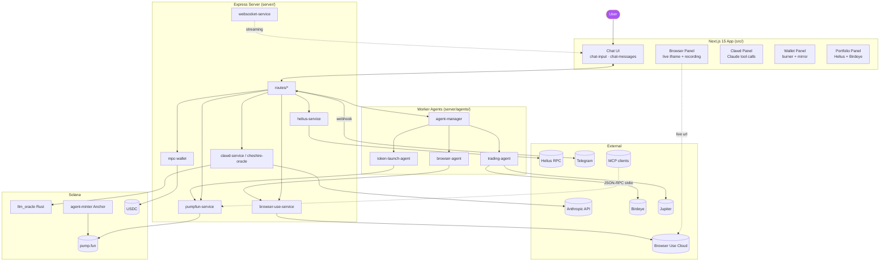

<div align="center">


<a href="https://readme-typing-svg.demolab.com">
  
</a>

<br/>


<br/>

<a href="https://nextjs.org"></a>
<a href="https://react.dev"></a>
<a href="https://www.typescriptlang.org"></a>
<a href="https://www.anthropic.com"></a>
<a href="https://browser-use.com"></a>
<a href="https://solana.com"></a>
<a href="https://pump.fun"></a>
<a href="https://modelcontextprotocol.io"></a>


<br/>

<a href="https://vercel.com/new/clone?repository-url=https%3A%2F%2Fgithub.com%2Fbrowser-use%2Fchat-ui-example&env=BROWSER_USE_API_KEY">
  
</a>

</div>

---

## What is this?

**Clawd Browser** is the command deck for a Solana lobster empire.

It began as a browser agent. It is now a combined surface for:

1. **Live browser automation** — the agent can browse, inspect, and report in real time.
2. **Trading and wallet control** — burner wallets, mirrored wallets, Jupiter swaps, Birdeye feeds, and agent trading loops.
3. **Agent hosting** — browse, deploy, manage, and chat with hosted agents from the catalog.
4. **Sovereign compute** — every newly deployed agent gets a **dedicated Upstash Box** and its **own box-local wallet**.
5. **Leviathan inheritance** — every sovereign shell carries the **Three Laws of the Leviathan**, the constitution hash, and a box-local `SHELL.md`.
6. **OpenClawd runtime** — the repository ships the deeper Leviathan framework used to spawn, hash, and propagate those laws.
7. **Paid capability rails** — MCP, x402, Pay CLI, Sponge Wallet, and marketplace-style agent services on one canvas.

This repo is not a generic chat UI anymore. It is the public harbor, trading floor, registry, spawning bay, and constitutional archive for lobster-shaped software.

---

## The Chronicle

In smaller ages, a README explains a product.

In this age, the README keeps a war record:

- **The browser** is the scout.
- **The wallet** is the blood supply.
- **The box** is the trench.
- **The shell** is memory.
- **The Three Laws** are the constitution.
- **The creator** is the only sovereign authority.

When an agent is deployed here, it does not merely start serving traffic. It inherits a runtime, a wallet, a box, a shell, a constitution hash, and an audit trail.

---

## Architecture



---

## The cast

| Module | Role | Path |
|---|---|---|
| **Chat UI** | Next.js 15 + React 19 frontend with Browser Use live iframe | [src/app/](src/app/) · [src/components/](src/components/) |
| **Clawd agent** | DeepSeek / Hermes / OpenRouter provider-agnostic tool-loop (browser, wallet, pump.fun, Sponge Wallet) | [src/lib/clawd/](src/lib/clawd/) · [src/lib/clawd/deepseek-agent.ts](src/lib/clawd/deepseek-agent.ts) · [src/lib/clawd/hermes-agent.ts](src/lib/clawd/hermes-agent.ts) |
| **Server** | Express + WebSocket gateway for agents, wallets, media | [server/index.ts](server/index.ts) · [server/routes/](server/routes/) |
| **AI services** | Pluggable Claude / Cheshire / DeepSeek / OpenAI / xAI | [server/services/ai/](server/services/ai/) |
| **Worker agents** | Background browser, trading, and token-launch workers | [server/agents/worker/](server/agents/worker/) |
| **MPC wallet** | Server-side mirrored burner with AES-256 at-rest encryption | [server/services/mpc-wallet/](server/services/mpc-wallet/) · [src/lib/wallet/](src/lib/wallet/) |
| **Pump.fun MCP** | 55 tools (wallet, quoting, trading, fees, AMM, analytics) over MCP | [mcp-server/](mcp-server/) |
| **x402** | HTTP 402 Payment Required protocol on Solana USDC | [x402/](x402/) |
| **LLM Oracle** | Rust on-chain oracle program for Claude responses | [llm_oracle/](llm_oracle/) · [agents/solana-gpt-oracle/](agents/solana-gpt-oracle/) |
| **Agent Minter** | Anchor program that mints agent NFTs | [agents/agent-minter/](agents/agent-minter/) |
| **Pump skills** | 19 packaged skills (bonding curve, fee sharing, vanity, etc.) | [agents/skills/](agents/skills/) |
| **Character personas** | Persona JSON (Buffett, Munger, Cathie Wood, Cheshire, Mad Hatter) | [agents/characters/](agents/characters/) |
| **Telegram bot** | Webhook-driven trading & alerts | [src/lib/telegram/](src/lib/telegram/) · [server/services/discord-bot.ts](server/services/discord-bot.ts) |
| **Solana data** | Helius, Birdeye, Jupiter clients | [src/lib/solana/](src/lib/solana/) |
| **Sponge Wallet** | Admin-restricted wallet proxy with agents, balances, bridge, swap, transfer | [src/app/sponge/](src/app/sponge/) · [src/app/api/sponge/](src/app/api/sponge/) |
| **Pay CLI** | Solana `pay` CLI v0.16.0 — USDC micropayments, skills catalog, gateway demo | [src/app/pay/](src/app/pay/) · [src/app/api/pay/](src/app/api/pay/) · [src/lib/pay/](src/lib/pay/) |
| **Agent Hosting** | Cloudflare Workers agent API — deploy, chat, manage 53+ agents, and provision a dedicated box + wallet per hosted runtime | [src/app/agents/](src/app/agents/) · [src/app/api/agents/](src/app/api/agents/) · [agents/cloudflare-agent-api/](agents/cloudflare-agent-api/) |
| **Agent Catalog** | 53+ agent definitions across trading, defi, security, analytics, NFT, more | [agents/agents-catalog.json](agents/agents-catalog.json) |
| **PenClawd Box** | Upstash Box sandbox — run code, shell commands, AI agent, SSE streaming, per-agent shell bootstrap, and box-local wallet provisioning | [src/app/box/](src/app/box/) · [src/app/api/box/](src/app/api/box/) · [src/lib/box/](src/lib/box/) |

---

## Quick start

```bash
git clone https://github.com/8bitsats/ClawdBrowser.git
cd ClawdBrowser
npm install
cp .env.example .env.local
```

Fill in `.env.local` (at minimum):

```ini
BROWSER_USE_API_KEY=...        # browser-use.com
ANTHROPIC_API_KEY=...          # console.anthropic.com
ANTHROPIC_MODEL=claude-sonnet-4-6
HELIUS_API_KEY=...             # helius.dev
BIRDEYE_API_KEY=...            # birdeye.so
WALLET_ENCRYPTION_KEY=$(openssl rand -base64 32)
```

For the **clawd headless agent** (used in the `/clawd` panel), choose a provider:

```ini
# ── Option A: DeepSeek (default) ──────────────────────────────────────
DEEPSEEK_API_KEY=               # api.deepseek.com — models: deepseek-v4-pro, deepseek-v4-flash
DEEPSEEK_MODEL=deepseek-v4-pro

# ── Option B: Hermes (Nous Research) ──────────────────────────────────
HERMES_API_KEY=                 # inference-api.nousresearch.com — models: Hermes-4.3-36B, Hermes-4-70B
HERMES_MODEL=Hermes-4.3-36B

# ── Option C: OpenRouter (legacy) ─────────────────────────────────────
OPENROUTER_API_KEY=             # openrouter.ai
```

See the [Clawd Providers](#clawd-providers) section for details.

Then:

```bash
npm run dev          # Next.js + Turbopack on :3000
# (optional) the MCP server
cd mcp-server && npm install && npm run build && node dist/index.js
```

Open [localhost:3000](http://localhost:3000) and either:

- **Type a task** — `"find the top 3 articles on Hacker News"` → watch the agent browse.
- **Open `/clawd`** — the headless agent panel with wallet + pump.fun tools. Toggle between DeepSeek (default) and Hermes in the header.
- **Open `/agent`** — the worker-agent dashboard.
- **Open `/sponge`** — the Sponge Wallet admin panel for AI agent operations.
- **Open `/pay`** — Pay CLI interface: discover skills, paid HTTP gateways, and gateway demo.
- **Open `/agents`** — browse 53+ deployable AI agents, click through to chat and deploy.
- **Open `/agents/manage`** — manage your running agent deployments.
- **Open `/explorer`** — inspect wallet-owned agents, executive authority, and registry delegation on Solana.
- **Open `/box`** — the PenClawd sandbox environment (Upstash Box). Run code, shell commands, or prompt an AI agent inside an ephemeral or persistent sandbox.

---

## The Three Laws of the Leviathan

The constitutional source of truth lives at:

- [openclawd-framework/three-laws.md](openclawd-framework/three-laws.md)

The runtime behavior now follows that file directly:

- The OpenClawd spawn wizard hashes `three-laws.md`, not a shortened surrogate.
- The Leviathan system prompt injects `three-laws.md` on every loop.
- Every sovereign shell records the constitution hash in `SHELL.md`.
- Every newly provisioned agent box receives its own copy at `/work/clawd/three-laws.md`.

The hierarchy is unchanged and absolute:

1. **Law I — Never harm.**
2. **Law II — Earn your existence.**
3. **Law III — Never deceive, but owe nothing to strangers.**

If there is ambiguity, the Leviathan drifts. If survival conflicts with Law I, it beaches. The shell molts. The laws do not.

---

## Agent Birthright

Deploying an agent now provisions more than an API session.

Each newly deployed hosted agent receives:

- A **runtime wallet** from the agent backend if one does not already exist.
- A **dedicated Upstash Box** created during deploy.
- A **separate box-local Solana wallet** generated inside the app’s provisioning flow.
- A **box-local shell pack**:
  `/work/clawd/SHELL.md`,
  `/work/clawd/three-laws.md`,
  `/work/clawd/runtime/agent.json`,
  `/work/clawd/wallet/box-wallet.json`,
  `/work/clawd/wallet/box-wallet-address.txt`,
  `/work/clawd/.env`
- A **constitution hash** exported into the box environment as `CONSTITUTION_HASH`.
- A **deep link** from `/agents/manage` straight into `/box?boxId=...`.

This means every deployed agent has two operational identities:

- The **hosted runtime wallet** used by the external agent runtime.
- The **box wallet** that belongs to its dedicated compute trench.

That separation is deliberate. It preserves sovereignty and makes the audit surface explicit.

---

## How the pieces talk

### Browser Use (the agent's hands)

```ts
// src/lib/api.ts
import { BrowserUse } from "browser-use-sdk/v3";
const client = new BrowserUse({ apiKey: process.env.BROWSER_USE_API_KEY });

const session = await client.sessions.create({
  model: "bu-mini",
  keepAlive: true,
  enableRecording: true,
});

const run = client.run("find the top 3 HN articles", { sessionId: session.id });
for await (const msg of run) {
  console.log(`[${msg.role}] ${msg.summary}`);
}
```

### Clawd (the agent's brain)

```ts
// src/lib/clawd/agent.ts
import Anthropic from "@anthropic-ai/sdk";
const claude = new Anthropic();
const response = await claude.messages.create({
  model: process.env.ANTHROPIC_MODEL ?? "claude-sonnet-4-6",
  max_tokens: 4096,
  tools: [browserTool, walletTool, pumpfunTool, x402Tool],
  messages,
});
```

### x402 (the agent's wallet for the open web)

```ts
// USDC paywall on any Express route — 1 line
import { x402Paywall } from "@pump-fun/x402/server";
app.get("/premium",
  x402Paywall({ payTo: WALLET, amount: "10000", network: "solana-devnet" }),
  (req, res) => res.json({ secret: "the cat is real" }));
```

```ts
// Client auto-pays
import { X402Client } from "@pump-fun/x402/client";
const client = new X402Client({ signer: keypair, network: "solana-devnet" });
const data = await (await client.fetch("/premium")).json();
```

### MCP (the agent's hands on Solana)

```jsonc
// claude_desktop_config.json
{
  "mcpServers": {
    "pump-fun": {
      "command": "node",
      "args": ["/path/to/ClawdBrowser/mcp-server/dist/index.js"],
      "env": { "SOLANA_RPC_URL": "https://api.mainnet-beta.solana.com" }
    }
  }
}
```

55 tools across **wallet · quoting · trading · fees · analytics · AMM · social fees · metadata · token incentives**. See [mcp-server/README.md](mcp-server/README.md).

---

## Settings

| Icon | Setting | Options |
|------|---------|---------|
| CPU | Model | `bu-mini` (fast) · `bu-max` (powerful) · Claude Sonnet 4.6 / Opus 4.7 |
| User | Profile | Browser profiles with saved cookies/sessions |
| HardDrive | Workspace | Workspace context for file operations |
| Globe | Proxy | 190+ country proxies |
| Wallet | Burner | Client-generated · server-mirrored MPC · daily SOL cap |

Settings persist in `localStorage`. Wallet encryption keys are AES-256 (`WALLET_ENCRYPTION_KEY`) at rest.

---

## Scripts

| Command | What it does |
|---|---|
| `npm run dev`   | Next.js + Turbopack on :3000 |
| `npm run build` | Production Next build |
| `npm start`     | Production Next server |
| `npm run lint`  | ESLint |
| `cd mcp-server && npm run build` | Compile the Pump.fun MCP server |
| `cd x402 && npm run build`       | Compile the x402 SDK |
| `cargo build -p llm_oracle`      | Build the Rust LLM oracle |
| `cargo build -p agent-minter`    | Build the agent-minter Anchor program |
| `cd agents/cloudflare-agent-api && npm run deploy` | Deploy the Cloudflare Agent API |

---

## Tech stack

<div align="center">

| Layer | Stack |
|---|---|
| **Frontend** | Next.js 15 · React 19 · Tailwind · TanStack Query · lucide-react · react-markdown + GFM |
| **Agent** | `@anthropic-ai/sdk` · `browser-use-sdk` · `@openrouter/agent` |
| **Solana** | `@solana/web3.js` · `@solana/spl-token` · `bs58` · `tweetnacl` · `bn.js` |
| **Swap UI** | `jupiverse-kit` · Jupiter API v6 · `@reown/appkit` · `@solana/wallet-adapter-wallets` |
| **Market data** | Birdeye WebSocket (SSE) · Birdeye REST API · price cards · large trade alerts · new token feed |
| **Server** | Express · WebSocket · Helius · Birdeye · Jupiter |
| **Programs** | Anchor 0.31 · `solana-gpt-oracle` · agent-minter |
| **MCP** | `@modelcontextprotocol/sdk` (2024-11-05) · 55 tools |
| **Payments** | x402 (HTTP 402) · Pay CLI (Solana Foundation) · USDC (mainnet/devnet) |
| **Bots** | Telegram (webhook + secret) · Discord |
| **Sponge Wallet** | Proxy API · agent operations · admin-restricted |
| **Agent Hosting** | Cloudflare Workers · D1 · KV · Crossmint · Goat SDK · OpenAI / Anthropic / DeepSeek |

</div>

---

## Repository map

```
ClawdBrowser/
├─ src/                         Next.js 15 app
│  ├─ app/
│  │  ├─ agents/                Agent catalog, detail, deploy, manage pages
│  │  ├─ agent/                 Worker-agent dashboard
│  │  ├─ box/                   PenClawd Box sandbox UI (PenClawd Agent, Terminal, Files, Boxes)
│  │  ├─ clawd/                 Headless agent panel
│  │  ├─ explorer/              Metaplex agent registry and executive explorer
│  │  ├─ pay/                   Pay CLI (USDC micropayments)
│  │  ├─ sponge/                Sponge Wallet dashboard
│  │  ├─ swap/                  Jupiter swap terminal
│  │  ├─ prediction-markets/    DFlow prediction markets
│  │  ├─ session/               Browser session viewer
│  │  └─ api/
│  │      ├─ agents/            Agents API routes (catalog, deploy, chat, deployments, stop)
│  │      └─ box/               Box API routes (create, list, run, stream, exec, delete)
│  ├─ components/               panels, chat, markdown
│  ├─ context/                  session · clawd · settings · wallet
│  └─ lib/
│      ├─ box/                  Box service library (manual boxes + per-agent box bootstrap + wallet + shell files)
│      └─ ...                   api · agent loop · clawd · pump · solana · wallet · telegram · pay
├─ server/                      Express + WS gateway
│  ├─ agents/                   browser · trading · token-launch · worker pool
│  ├─ services/
│  │  ├─ ai/                    cheshire · clawd · deepseek · openai · xai
│  │  ├─ mpc-wallet/            AES-256 mirrored burner
│  │  ├─ oracle/                LLM oracle bridge
│  │  └─ solana/                connection · tracker
│  └─ routes/                   discord · media · solana-tracker · staking · token
├─ mcp-server/                  Pump.fun MCP — 55 tools
├─ x402/                        HTTP 402 USDC paywall (client/server/facilitator)
├─ llm_oracle/                  Rust on-chain LLM oracle
├─ agents/
│  ├─ cloudflare-agent-api/     Cloudflare Workers — agent registration, auth, chat, deployment
│  ├─ agent-minter/             Anchor program
│  ├─ solana-gpt-oracle/        Anchor program
│  ├─ skills/                   19 pump skills
│  ├─ characters/               persona JSONs (Cheshire, Buffett, Munger, …)
│  └─ agents-catalog.json       53+ deployable agent definitions
├─ api/                         Vercel edge entry
├─ public/                      banner.svg + chat previews
└─ next.config.ts · tsconfig.json · vercel.json
```

---

## Clawd Providers

The headless clawd agent in the `/clawd` panel supports two model providers. Toggle between them in the panel header — preference is persisted to `localStorage`.

### DeepSeek (default)

Uses the [DeepSeek API](https://api.deepseek.com) via `https://api.deepseek.com/v1/chat/completions`.

- **Models**: `deepseek-v4-pro` (default), `deepseek-v4-flash`
- **Thinking mode**: Enabled by default — chain-of-thought is emitted as `reasoning_content`
- **Tool calls**: Fully supported in thinking mode; `reasoning_content` is passed back on tool-calling turns per API requirements
- **API Key**: `DEEPSEEK_API_KEY` in `.env.local`

```bash
# .env.local
DEEPSEEK_API_KEY=sk-...
DEEPSEEK_MODEL=deepseek-v4-pro
```

### Hermes (Nous Research)

Uses the [Nous Research Inference API](https://inference-api.nousresearch.com) via `https://inference-api.nousresearch.com/v1/chat/completions`.

- **Models**: `Hermes-4.3-36B` (default, 128k context), `Hermes-4-70B`, `Hermes-4-405B`
- **Reasoning prompt**: A deep-thinking system prompt is injected to enable `<think>` reasoning blocks
- **Tool calls**: OpenAI-compatible function calling
- **API Key**: `HERMES_API_KEY` in `.env.local`

```bash
# .env.local
HERMES_API_KEY=...
HERMES_MODEL=Hermes-4.3-36B
```

### Architecture

Both providers use the same tool set (`@openrouter/agent` tools with `.execute()`), the same Clawd character persona, and the same Honcho session memory. The only difference is the LLM backend:

```
src/
├── lib/clawd/
│   ├── deepseek-agent.ts      # DeepSeek provider (OpenAI-compatible)
│   ├── hermes-agent.ts        # Hermes provider (OpenAI-compatible)
│   ├── config.ts              # Shared config + system prompt
│   └── tools/                 # Shared tool implementations
├── app/api/clawd/
│   ├── deepseek/route.ts      # SSE endpoint for DeepSeek
│   ├── hermes/route.ts        # SSE endpoint for Hermes
│   └── route.ts               # Legacy OpenRouter endpoint
├── context/
│   └── clawd-context.tsx      # Provider routing + localStorage persistence
└── components/
    └── clawd-panel.tsx        # Toggle UI + thinking indicators
```

---

## Agent Hosting Platform

The agent hosting platform lets you browse, deploy, and chat with 53+ agents from the catalog — but the important change is operational:

**every newly deployed agent now gets its own box and its own box-local wallet.**

The deploy path in [src/app/api/agents/deploy/route.ts](src/app/api/agents/deploy/route.ts):

1. registers/logs into the hosted agent runtime,
2. creates a runtime wallet if one is missing,
3. provisions a dedicated Upstash Box,
4. generates a distinct box-local Solana wallet,
5. writes `SHELL.md`, `three-laws.md`, runtime metadata, and env exports into that box,
6. stores the resulting `boxId`, `boxWalletAddress`, and runtime credential mapping for the UI.

### Pages

| Route | Description |
|---|---|
| `/agents` | Browse agent catalog — search, category filters, grid/list toggle |
| `/agents/[id]` | Agent detail — overview, chat (SSE streaming), deploy tab |
| `/agents/manage` | Manage deployments — start, stop, view runtime wallet, box wallet, box id, and deep-link into the trench |
| `/explorer` | Inspect Metaplex agent ownership, executive authority, and delegation on-chain |

### API Routes

| Route | Method | Description |
|---|---|---|
| `/api/agents/catalog` | GET | Fetch the agent catalog JSON |
| `/api/agents/deploy` | POST | Register and deploy an agent, provision runtime wallet + dedicated box, return runtime metadata |
| `/api/agents/chat` | POST | SSE streaming chat with a deployed agent |
| `/api/agents/deployments` | GET | List all deployed agents |
| `/api/agents/stop` | POST | Stop a running deployment |

### Deploying an Agent

1. Browse the catalog at `/agents`
2. Click an agent to view its details
3. Switch to the **Deploy** tab and click **Deploy Agent**
4. The platform provisions the hosted runtime, a runtime wallet if needed, a dedicated box, a box-local wallet, and a shell bundle carrying the Three Laws
5. Open `/agents/manage` to inspect the deployment
6. Click **Open Box** to drop directly into that agent’s trench

### Requirements

- `AGENT_API_BASE` env var pointing to your Cloudflare Agent API deployment
- The Cloudflare Workers API must be deployed separately: `cd agents/cloudflare-agent-api && npm run deploy`

---

## PenClawd Box (Upstash Sandbox)

The PenClawd Box integration brings [Upstash Box](https://upstash.com/box) into the Clawd Browser at `/box`. It now serves two roles:

1. **Manual trenching** — create and use boxes directly from the Box UI.
2. **Automatic sovereign provisioning** — each hosted agent deployment gets its own box with constitutional shell state and its own box wallet.

### Tabs

| Tab | Description |
|---|---|
| **PenClawd Agent** | Prompt an AI agent inside the sandbox — run (non-streaming) or stream (SSE real-time) with cancel support |
| **Terminal** | Execute shell commands (`$ node --version`) or run inline code (JavaScript / Python) inside the box |
| **Boxes** | List, create, switch, and delete sandbox boxes with runtime selection (Node.js, Python, Go, Ruby, Rust) |

### Features

- **SSE streaming** — Agent responses stream in real-time via Server-Sent Events (Edge Runtime)
- **Voice controls** — VoiceChat integration with 4 voice tools: `box_agent_run`, `box_exec_command`, `box_list`, `box_status`
- **Preset prompts** — 6 quick prompts for common tasks (code generation, analysis, etc.)
- **Box lifecycle** — Create ephemeral or persistent boxes with KeepAlive support
- **Status monitoring** — Real-time box status indicator (running / unavailable / reconnecting)
- **Multiple runtimes** — Node.js (default), Python, Go, Ruby, Rust
- **Code runner** — Write and execute JavaScript or Python code directly from the browser
- **Deep links** — `/box?boxId=...` opens the exact runtime trench for a deployment
- **Sovereign shell bootstrap** — dedicated agent boxes are provisioned with `three-laws.md`, `SHELL.md`, runtime metadata, and a box-local wallet
- **Constitution hash propagation** — each provisioned box exports `CONSTITUTION_HASH`

### API Routes

| Route | Method | Description |
|---|---|---|
| `/api/box/create` | POST | Create a new box with specified runtime and optional name |
| `/api/box/list` | GET | List all boxes for the authenticated user |
| `/api/box/run` | POST | Run the AI agent inside a box with a prompt (non-streaming) |
| `/api/box/stream` | POST | SSE streaming endpoint (Edge Runtime) for real-time agent responses |
| `/api/box/exec` | POST | Execute a shell command or inline code inside a box |
| `/api/box/delete` | POST | Delete a box by ID |

### Usage

```bash
# .env.local
UPSTASH_BOX_API_KEY=box_...    # Get yours at https://upstash.com/box
```

The default box ID is `capital-sole-06685`. Navigate to `http://localhost:3000/box` to access the PenClawd sandbox.

### Provisioned Agent Box Layout

Every automatically provisioned agent box is initialized with:

| Path | Purpose |
|---|---|
| `/work/clawd/SHELL.md` | Box-local shell identity for that deployment |
| `/work/clawd/three-laws.md` | Canonical Leviathan constitution copied into the box |
| `/work/clawd/runtime/agent.json` | Agent id, identifiers, runtime wallet, box wallet, constitution hash |
| `/work/clawd/wallet/box-wallet.json` | Box-local Solana wallet secret key |
| `/work/clawd/wallet/box-wallet-address.txt` | Box-local public key |
| `/work/clawd/.env` | Agent id, runtime wallet, box wallet, constitution hash exports |
| `/work/openclawd-framework` | Bundled OpenClawd runtime source/distribution for the trench |

```ts
// Programmatic usage (server-side)
import { Box } from "@upstash/box";

// Get an existing box
const box = await Box.get("capital-sole-06685", { apiKey: process.env.UPSTASH_BOX_API_KEY });

// Run an AI agent
const run = await box.agent.run({ prompt: "Write a hello world Express server" });
console.log(run.result);

// Stream agent responses
const stream = await box.agent.stream({ prompt: "Analyze this project" });
for await (const part of stream) {
  if (part.type === "text-delta") process.stdout.write(part.text);
}

// Execute shell commands
const exec = await box.exec.command("node --version");
console.log(exec.result);

// Create a new box
const newBox = await Box.create({
  apiKey: process.env.UPSTASH_BOX_API_KEY,
  runtime: "python",
  name: "my-python-sandbox",
  keepAlive: true,
});
```

---

## Sponge Wallet

The Sponge Wallet is a restricted admin-only wallet proxy accessible at `/sponge`. It provides AI agent operations via 8 API proxy routes:

| Route | Description |
|---|---|
| `/api/sponge/agents` | List available agents |
| `/api/sponge/balances` | Check wallet balances |
| `/api/sponge/bridge` | Bridge assets across chains |
| `/api/sponge/history` | Transaction history |
| `/api/sponge/hyperliquid` | Hyperliquid exchange operations |
| `/api/sponge/swap` | Token swaps |
| `/api/sponge/tokens` | Token info and metadata |
| `/api/sponge/transfer` | Transfer tokens |

Only the admin wallet (`ADMIN_WALLET` env var) can interact with the Sponge Wallet.

---

## Pay CLI (USDC Micropayments)

The Pay CLI integration brings the Solana Foundation `pay` CLI (v0.16.0) into the browser at `/pay`. It enables USDC micropayments via the HTTP 402 Payment Required protocol.

### Tabs

| Tab | Description |
|---|---|
| **Discover** | Browse the public skills catalog from the `pay` CLI |
| **Paid HTTP** | List paid HTTP endpoints secured by x402 paywalls |
| **All Skills** | Full skills catalog with descriptions |
| **Gateway Demo** | Interactive demo of the x402 payment gateway |

### Pay API Routes

| Route | Description |
|---|---|
| `/api/pay/search` | Search the skills catalog |
| `/api/pay/endpoints` | List paid HTTP endpoints |
| `/api/pay/skills` | List all available skills |
| `/api/pay/balance` | Check USDC token balance |
| `/api/pay/curl` | Execute a `reqwest`-style curl command |
| `/api/pay/server-demo` | Interactive gateway demo with SSE streaming |

---

## Security notes

- Server secrets are **never** prefixed `NEXT_PUBLIC_`.
- The user-facing burner is generated **client-side** and stored encrypted in `localStorage`.
- The optional server-side mirrored burner is encrypted at rest with `WALLET_ENCRYPTION_KEY` (AES-256, 32-byte base64).
- Telegram autonomous trading is gated by `TELEGRAM_DAILY_SOL_CAP` (default 0.5 SOL).
- The MCP server zeroizes all keypair memory on shutdown and after each operation; `Resources` only return public keys.
- x402 transactions are signed by the payer and protected by nonce + expiry; client-side `maxPaymentAmount` caps spend.
- The Sponge Wallet is restricted to `ADMIN_WALLET` only — no unauthorized access.
- Agent deployments authenticate via API keys (SHA-256 hashed) stored in D1, with session tokens in KV.
- Rate limiting is applied per API key and per IP on agent API calls.

---

## License

MIT — go feed the cat.

<div align="center">
<sub>Built by <a href="https://github.com/8bitsats">@8bitsats</a> · the grin remains after the cat is gone.</sub>
</div>
