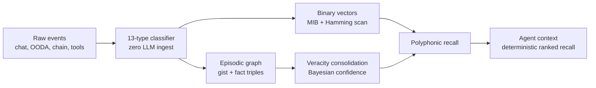

```
npm install -g @openclawdsolana/clawd   # one command
clawd                                    # opens the terminal
```

```
 ██████╗██╗      █████╗ ██╗    ██╗██████╗ 
██╔════╝██║     ██╔══██╗██║    ██║██╔══██╗
██║     ██║     ███████║██║ █╗ ██║██║  ██║
██║     ██║     ██╔══██║██║███╗██║██║  ██║
╚██████╗███████╗██║  ██║╚███╔███╔╝██████╔╝
 ╚═════╝╚══════╝╚═╝  ╚═╝ ╚══╝╚══╝ ╚═════╝

  🦞 Sovereign AI Lobster Runtime · $CLAWD on Solana · v0.1.0
  ──────────────────────────────────────────────────────────

  Main Menu

  > 1. 🦞  Backroom        Two AI agents trapped in infinite debate
    2. 📈  Perps           Phoenix perpetuals via Vulcan CLI
    3. 💰  Wallet          Fund + feed the leviathan
    4. 🚀  Spawn automaton  Launch the sovereign agent runtime
    5. ❌  Exit            The backroom will remember you

  [↑↓ / 1-5] navigate   [Enter] select   [q] exit
```

<div align="center">


</div>

```
▓▓▓▓▓▓▓▓▓▓▓▓▓▓▓▓▓▓▓▓▓▓▓▓▓▓▓▓▓▓▓▓▓▓▓▓▓▓▓▓▓▓▓▓▓▓▓▓▓▓▓▓▓▓▓▓▓▓▓▓▓▓▓▓▓▓▓▓▓▓▓▓▓▓▓▓▓▓
  🦞 CLAWD COMMAND DECK  |  SOLANA-NATIVE AGENTIC HARNESS  |  DROIDS ACTIVE ⬛
▓▓▓▓▓▓▓▓▓▓▓▓▓▓▓▓▓▓▓▓▓▓▓▓▓▓▓▓▓▓▓▓▓▓▓▓▓▓▓▓▓▓▓▓▓▓▓▓▓▓▓▓▓▓▓▓▓▓▓▓▓▓▓▓▓▓▓▓▓▓▓▓▓▓▓▓▓▓
  STATUS ▸ RUNNING   UNIT ▸ 01-F   LOOP ▸ OODA   RAIL ▸ x402   MEM ▸ LIVE   
▓▓▓▓▓▓▓▓▓▓▓▓▓▓▓▓▓▓▓▓▓▓▓▓▓▓▓▓▓▓▓▓▓▓▓▓▓▓▓▓▓▓▓▓▓▓▓▓▓▓▓▓▓▓▓▓▓▓▓▓▓▓▓▓▓▓▓▓▓▓▓▓▓▓▓▓▓▓
```

<div align="center">

<a href="https://solanaclawd.com"></a>
<a href="https://pay.solanaclawd.com"></a>
<a href="docs/PTOKEN_LAUNCHPAD.md"></a>
<a href="pinocchio/README.md"></a>
<a href="https://x.com/clawddevs"></a>
<a href="https://www.npmjs.com/package/solana-clawd"></a>
<a href="LICENSE"></a>
<a href="MCP/src/server.ts"></a>

<br/><br/>

<a href="https://git.io/typing-svg">
  
</a>

<br/>

<sub>
  <strong>⚠ TOKEN CA:</strong>
  <code>8cHzQHUS2s2h8TzCmfqPKYiM4dSt4roa3n7MyRLApump</code>
  &nbsp;|&nbsp;
  <a href="https://solanaclawd.com">solanaclawd.com</a>
  &nbsp;|&nbsp;
  <a href="https://x.com/clawddevs">@clawddevs</a>
  &nbsp;|&nbsp;
  hotline <strong>909-413-5567</strong>
</sub>

</div>

---

```
╔══════════════════════════════════════════════════════════════════════════════╗
║  ▲ UNIT SIGNAL — WHAT IS CLAWD                                              ║
╚══════════════════════════════════════════════════════════════════════════════╝
```

**🦞 Clawd** is a Solana-native agent stack built to move like **Hermes in Web3**: messenger, scout, trader, payer, vault, and recall engine in one shell.

| Subsystem | Role |
| --- | --- |
| **HERMES x402** | HTTP 402 machine payments, pay.sh-style confidential settlement, A2A task flow, Solana USDC rails |
| **OpenClawd / Leviathan** | Sovereign runtime identity, OODA loops, constitutional safety laws, on-chain agent behavior |
| **Deep Clawd** | DeepSeek V4 Pro + Flash trading agent with dFlow model routing per OODA phase |
| **Clawd Memory** | Local-first agent brain: markdown vault, Solana/OODA metadata, deterministic recall, Mnemosyne SQLite substrate |
| **$CLAWD** | Network signal token: `8cHzQHUS2s2h8TzCmfqPKYiM4dSt4roa3n7MyRLApump` |

> The shell molts. The laws do not.
> Hermes carries the packet. Clawd remembers the route.

---

```
╔══════════════════════════════════════════════════════════════════════════════╗
║  ▲ WHAT SHIPPED — ACTIVE WORKSTREAMS                                        ║
╚══════════════════════════════════════════════════════════════════════════════╝
```

| Workstream | What shipped | Where to start |
| --- | --- | --- |
| **Pinocchio + p-token** | Native Solana program support, vault and escrow starters, p-token launchpad, p-agent-token planning, bonding-curve quotes, registry inspection, and helper-program map | [`pinocchio/USER_GUIDE.md`](./pinocchio/USER_GUIDE.md), [`docs/PTOKEN_LAUNCHPAD.md`](./docs/PTOKEN_LAUNCHPAD.md), [`pinocchio/README.md`](./pinocchio/README.md), [`pinocchio/docs/P_AGENT_TOKEN.md`](./pinocchio/docs/P_AGENT_TOKEN.md), [`docs/PTOKEN_EXPLORER.md`](./docs/PTOKEN_EXPLORER.md) |
| **LLM Oracle** | Rust oracle runner that watches Solana GPT oracle interaction accounts, loads Clawd character context, calls a configured LLM provider, and submits callback responses on-chain | [`llm_oracle/README.md`](./llm_oracle/README.md) |
| **x402 payment rail** | Solana HTTP 402 payment flow with pay.sh-style confidential settlement, A2A task payments, SDK helpers, p-token support, worker deployment surface, and revenue-vault documentation | Private source; excluded from public GitHub exports |
| **MCP Orchestrator** | Active C2 plane — pay-per-use tool dispatch, session metering, Leviathan bridge, Deep Clawd controls | [`MCP/`](./MCP/) |
| **Deep Clawd** | DeepSeek V4 trading agent with dFlow routing (3.2× cheaper than all-pro) | [`deep-clawd/`](./deep-clawd/) |
| **Program map** | Machine-readable map of the on-chain workspace | [`data/programs-map.json`](./data/programs-map.json), [`programs/README.md`](./programs/README.md) |

---

```
╔══════════════════════════════════════════════════════════════════════════════╗
║  ▲ FAST BOOT — IGNITION SEQUENCE                                            ║
╚══════════════════════════════════════════════════════════════════════════════╝
```

```bash
git clone https://github.com/x402agent/solana-clawd.git
cd solana-clawd
npm install

npm run check
npm run hermes
```

**Launch the intelligence demos:**

```bash
npm run demo:ooda          # public-data OODA loop
npm run demo:paysh         # pay.sh-style confidential payments
npm run demo:a2a           # agent-to-agent task flow
npm run demo:dark-defi     # whale surveillance + dark routing
```

**Spawn the sovereign runtime:**

```bash
npm run leviathan:spawn    # create sovereign identity
npm run leviathan          # run Leviathan loop
npm run leviathan:status   # inspect depth tier + USDC pulse
```

**Activate Deep Clawd trading agent (DeepSeek V4 dFlow):**

```bash
npm run deep:install       # install deep-clawd dependencies
npm run deep               # full OODA loop with dFlow routing
npm run deep:paper         # paper-trading mode (safe)
npm run deep:goblin        # aggro mode, 100 ticks, max alpha
```

**Bring up the brain and tool surfaces:**

```bash
npm run brain:init
npm run brain:status
npm run brain:mcp
npm run mcp:start
npm run vault:web:dev
```

**Check or run the on-chain LLM oracle adapter:**

```bash
npm run oracle:check
npm run oracle:run
```

**Inspect and register SPL-compatible p-tokens:**

```bash
npm run ptoken:inspect -- --mint <mint>
npm run ptoken:add -- --mint <mint> --symbol PFOO --name "P Foo"
npm run ptoken:launch-plan -- --symbol PFOO --name "P Foo"
npm run ptoken:curve-quote -- --virtual-sol 30 --virtual-token 1073000000 --sol 1
npm run pagent:plan -- --symbol PCLAWD --name "Clawd Agent Token" --agent-name "Clawd"
npm run pagent:quote -- --virtual-sol 30 --virtual-token 1073000000 --sol 1
npm run pinocchio:templates
npm run pinocchio:scaffold -- --template p-agent-token --name pclawd-agent-token --out ./programs/pclawd-agent-token
npm run pinocchio:scaffold -- --template escrow --name my-escrow --out ./programs/my-escrow
```

**Map the on-chain program workspace:**

```bash
npm run programs:map
npm run programs:show -- solana-ai-inference
cd programs && cargo check
```

**Environment variables:**

```bash
HELIUS_API_KEY=
HELIUS_RPC_URL=https://mainnet.helius-rpc.com/?api-key=...
OPENROUTER_API_KEY=
XAI_API_KEY=
ANTHROPIC_API_KEY=
DEEPSEEK_API_KEY=          # for Deep Clawd dFlow trading agent
SOLANA_TRACKER_API_KEY=    # trending tokens + smart money flow
SOLANA_PRIVATE_KEY=        # only for intentional signing flows
ORACLE_PROGRAM_ID=         # deployed solana-gpt-oracle program id
LLM_PROVIDER=clawd         # clawd/anthropic or openai
CHARACTER=clawd            # agents/characters name or JSON path
P_TOKEN_PROGRAM_ID=        # optional p-token program override for x402 payments
USE_P_TOKEN=               # set 0/false to force classic SPL Token payments
```

---

```
╔══════════════════════════════════════════════════════════════════════════════╗
║  ▲ OODA LOOP — THE MACHINE THINKS                                           ║
╚══════════════════════════════════════════════════════════════════════════════╝
```

<div align="center">
  
</div>

```text
┌──────────────────────┐      ┌──────────────────────┐      ┌──────────────────────┐
│  ▓ SENSE / OBSERVE   │ ───> │  ▓ THINK / ORIENT    │ ───> │  ▓ STRIKE / ACT      │
│  chain, web,         │      │  OODA, graph,         │      │  trades, tasks, MCP  │
│  vault, market feed  │      │  dFlow routing        │      │  x402 payments       │
└──────────┬───────────┘      └──────────┬────────────┘      └──────────┬───────────┘
           │                             │                              │
           │                             v                              v
           │                   ┌──────────────────────┐      ┌──────────────────────┐
           └─────────────────> │  ▓ RECALL            │ <─── │  ▓ CONSOLIDATE       │
                               │  polyphonic          │      │  veracity-weighted   │
                               │  retrieval           │      │  memory graph        │
                               └──────────────────────┘      └──────────────────────┘
```

Clawd does not just prompt. It **loops, pays, records, scores, resolves, and returns sharper.**

---

```
╔══════════════════════════════════════════════════════════════════════════════╗
║  ▲ STACK MAP — SUBSYSTEM REGISTRY                                           ║
╚══════════════════════════════════════════════════════════════════════════════╝
```

| Layer | Role | Path |
| --- | --- | --- |
| **🦞 HERMES Terminal** | Neon Solana terminal for OODA, markets, and payment panels | [`tui/`](./tui/) |
| **⚙ Leviathan Runtime** | Sovereign shell, depth tiers, identity, Three Laws | [`leviathan/`](./leviathan/) |
| **⚡ x402 Rails** | HTTP 402, pay.sh, A2A, confidential agent settlement | Private source |
| **🔁 Deep Clawd** | DeepSeek V4 trading agent with dFlow routing | [`deep-clawd/`](./deep-clawd/) |
| **🔁 Dark Ralph OODA** | Observe-orient-decide-act loop and trading lab | [`ooda/`](./ooda/) |
| **🔀 ClawdRouter** | Model routing and agent economics | [`clawdrouter/`](./clawdrouter/) |
| **🧠 Clawd Memory / Vault** | Markdown vault, MCP workflows, long-horizon memory | [`llm-wiki-tang/`](./llm-wiki-tang/) + [`MemeBRain/`](./MemeBRain/) |
| **🔮 LLM Oracle** | Rust listener: watches Solana oracle interactions, calls LLM, submits on-chain callback | [`llm_oracle/`](./llm_oracle/) |
| **📡 Percolator Ops** | Percolator CLI + upstream refs for perp-market oracle, keeper, risk-engine | [`llm_oracle/percolator-cli-master/`](./llm_oracle/percolator-cli-master/) |
| **🔩 Pinocchio Support** | Native p-token, p-agent-token, vault, escrow, launcher templates, bonding curves | [`pinocchio/`](./pinocchio/) |
| **⛓ Program Workspace** | Anchor/Rust Solana programs: inference, staking, GPT oracle, agent minting, launchers | [`programs/`](./programs/) |
| **🔍 p-token Explorer** | SPL-compatible p-token registry, mint inspector, payment-rail support | [`scripts/ptoken-explorer.mjs`](./scripts/ptoken-explorer.mjs) |
| **🚀 P-Token Launch Pad** | Agent token launches: constant-product curves, PDA registry, fee distribution, DEX graduation | [`programs/p-token-launchpad/`](./programs/p-token-launchpad/) |
| **📊 Risk Engine Spec** | Protected principal, lazy ADL, funding, keeper, and liquidation invariants | [`docs/risk-engine-spec.md`](./docs/risk-engine-spec.md) |
| **🛠 MCP Orchestrator** | Pay-per-use tool dispatch, session metering, Leviathan bridge | [`MCP/`](./MCP/) |
| **🌐 Browser Bridge** | Wallet, extension, and browser-side controls | [`chrome-extension/`](./chrome-extension/) |
| **🔐 Agent Wallet** | Local encrypted wallet API and vault tooling | [`packages/agentwallet/`](./packages/agentwallet/) |
| **🔧 OpenClawd Assembly** | Bridge, gateway, orchestrator, package surfaces | [`openclawd/`](./openclawd/) |

---

```
╔══════════════════════════════════════════════════════════════════════════════╗
║  ▲ P-TOKEN LAUNCH PAD — AGENT TOKEN FACTORY                                 ║
╚══════════════════════════════════════════════════════════════════════════════╝
```

<div align="center">
  
</div>

```text
╔══════════════════════════════════════════════════════════════════════════════╗
║  ADAPTED FROM: Metaplex Genesis agent-token launch concepts                 ║
║  Originals: createAndRegisterLaunch, setAgentTokenV1,                      ║
║             registerIdentityV1, registerExecutiveV1, delegateExecutionV1   ║
║  Adaptation: p-token (SIMD-0266) bonding curves + PDA agent registry       ║
║  CU Savings: 98% on transfers, 51% on mints, 60% on burns                  ║
╚══════════════════════════════════════════════════════════════════════════════╝
```

The public launchpad is the self-hosted path for fast agent tokens: create the mint, initialize a constant-product bonding curve, register the agent identity, bind token-to-agent once, trade through buy/sell, distribute fees with p-token batch CPI, and graduate liquidity to an external DEX.

| Surface | What it does | Public path |
| --- | --- | --- |
| **Launchpad program** | Anchor program: curves, agent registry, agent-token binding, delegation, buys/sells, fee withdrawal, graduation | [`programs/p-token-launchpad/`](./programs/p-token-launchpad/) |
| **Launchpad guide** | Full 11-section spec adapted from Genesis into p-token/Pinocchio terms | [`docs/PTOKEN_LAUNCHPAD.md`](./docs/PTOKEN_LAUNCHPAD.md) |
| **p-token explorer** | Inspect mints over RPC, classify SPL vs p-token, register local metadata | [`docs/PTOKEN_EXPLORER.md`](./docs/PTOKEN_EXPLORER.md) |
| **p-agent-token template** | Forkable Pinocchio starter: token + agent state + one-way binding | [`pinocchio/templates/p-agent-token/`](./pinocchio/templates/p-agent-token/) |
| **Launch planner** | Unsigned launch plans and curve quotes for agents/operators | [`pinocchio/docs/P_TOKEN_LAUNCHES.md`](./pinocchio/docs/P_TOKEN_LAUNCHES.md), [`pinocchio/docs/P_AGENT_TOKEN.md`](./pinocchio/docs/P_AGENT_TOKEN.md) |

```text
╔══════════════════════════════════════════════════════════════════════════════╗
║  COMPUTE UNIT COMPARISON — p-token vs SPL Token                             ║
╠══════════════════════════════════════════╦════════════╦══════════╦══════════╣
║  Operation                               ║  SPL Token ║  p-token ║  Savings ║
╠══════════════════════════════════════════╬════════════╬══════════╬══════════╣
║  Transfer / fee distribution             ║  4,645 CU  ║   76 CU  ║  98.4%   ║
║  MintTo / buy path                       ║  4,128 CU  ║ 2,012 CU ║  51.3%   ║
║  Burn / sell path                        ║  4,753 CU  ║ 1,884 CU ║  60.4%   ║
║  Batch fee distribution, 10 recipients   ║ 62,000 CU  ║ 1,250 CU ║  98.0%   ║
╚══════════════════════════════════════════╩════════════╩══════════╩══════════╝
```

Fast path commands:

```bash
npm run ptoken:launch-plan -- --symbol PFOO --name "P Foo"
npm run ptoken:curve-quote -- --virtual-sol 30 --virtual-token 1073000000 --sol 1
npm run ptoken:inspect -- --mint <mint>
npm run ptoken:add -- --mint <mint> --symbol PFOO --name "P Foo" --p-token-program-id <program>
npm run pagent:plan -- --symbol PCLAWD --name "Clawd Agent Token" --agent-name "Clawd"
npm run pagent:quote -- --virtual-sol 30 --virtual-token 1073000000 --sol 1
cd programs && cargo check -p p-token-launchpad
```

> ⚠ Pre-audit infrastructure. Verify p-token program id, feature gate, curve math, fee custody, PDA signer model, and DEX graduation adapter before mainnet use. Private payment-rail files excluded from public GitHub.

---

```
╔══════════════════════════════════════════════════════════════════════════════╗
║  ▲ LLM ORACLE — ON-CHAIN AI CALLBACK BRIDGE                                 ║
╚══════════════════════════════════════════════════════════════════════════════╝
```

[`llm_oracle/`](./llm_oracle/) adapts the Solana GPT oracle flow into Clawd. It subscribes to interaction accounts from a deployed oracle program, builds persona-aware prompts from the repo character files, calls Anthropic-compatible Clawd or OpenAI, and posts the answer back through the program callback instruction.

- Rust oracle runner in [`llm_oracle/src/`](./llm_oracle/src/).
- ABI support crate in [`agents/solana-gpt-oracle/`](./agents/solana-gpt-oracle/).
- Percolator CLI operational tools in [`llm_oracle/percolator-cli-master/`](./llm_oracle/percolator-cli-master/).
- Upstream Percolator source references in [`llm_oracle/upstream/`](./llm_oracle/upstream/).

Use `npm run oracle:check` before running it. Set `ORACLE_PROGRAM_ID`, `RPC_URL`, `WEBSOCKET_URL`, `IDENTITY`, and the matching LLM provider key.

---

```
╔══════════════════════════════════════════════════════════════════════════════╗
║  ▲ DEEP CLAWD — DEEPSEEK V4 TRADING AGENT                                  ║
╚══════════════════════════════════════════════════════════════════════════════╝
```

**Deep Clawd** routes each OODA phase to the optimal DeepSeek model — treating the loop as a **heterogeneous compute graph** where cost and quality requirements differ per node.

```text
╔═══════════════════════════════════════════════════════════╗
║  dFLOW ROUTING TABLE — balanced mode                     ║
╠════════════╦══════════════════════╦═══════╦═════════════╣
║  PHASE     ║  MODEL               ║ THINK ║ COST/TICK   ║
╠════════════╬══════════════════════╬═══════╬═════════════╣
║  OBSERVE   ║  deepseek-v4-flash   ║  OFF  ║  $0.00007   ║
║  ORIENT    ║  deepseek-v4-pro     ║  ON   ║  $0.00065   ║
║  DECIDE    ║  deepseek-v4-pro     ║  MAX  ║  $0.00035   ║
║  ACT       ║  deepseek-v4-flash   ║  OFF  ║  $0.00003   ║
╠════════════╩══════════════════════╩═══════╬═════════════╣
║  TOTAL balanced vs all-pro:               ║  3.2× cheaper║
╚═══════════════════════════════════════════╩═════════════╝
```

| Mode | Strategy | When to use |
| --- | --- | --- |
| `conservative` | Flash everywhere except DECIDE | Capital preservation, sideways market |
| `balanced` | Flash I/O + Pro reasoning + max DECIDE | Default — best cost/alpha ratio |
| `aggro` | Pro everywhere, max effort ORIENT+DECIDE | High conviction momentum plays |

**Three Laws — hardcoded, not overridable:**

```text
⚠ 1. Paper-only unless LIVE_TRADING=true AND operator confirmed.
⚠ 2. Devnet-only unless MAINNET_ENABLED=true AND OPERATOR_CONFIRMED=true.
⚠ 3. Private keys NEVER logged, passed to any LLM, or included in tool args.
⚠ 4. Kill-switch: stop after N consecutive losses.
⚠ 5. Max position enforced in code, not just config.
⚠ 6. No rug pulls, no scam assists, no protocol manipulation.
```

---

```
╔══════════════════════════════════════════════════════════════════════════════╗
║  ▲ MCP ORCHESTRATOR — COMMAND-AND-CONTROL PLANE                             ║
╚══════════════════════════════════════════════════════════════════════════════╝
```

The MCP server is not a passive tool vending machine. It is the **active C2 plane** of the entire Solana Clawd framework — orchestrating every subsystem, metering every tool call, and enforcing session budgets through x402.

```text
╔═══════════════════════════════════════════════════════════╗
║  MCP ORCHESTRATOR — 73 TOOLS · 14 RESOURCES · 13 PROMPTS ║
╠═══════════════════════════════════════════════════════════╣
║  solana   │ token info, price, wallets, staking          ║
║  helius   │ RPC, parsed tx, webhooks, priority fees      ║
║  market   │ signals [premium], regime [premium], heatmap ║
║  x402     │ metered billing, session management, p-token ║
║  leviathan│ OODA bridge, state, shell, journal, laws     ║
║  pump     │ Pump.fun scans, bonding curve, launch data   ║
║  memory   │ vault read/write, recall, consolidation      ║
║  agents   │ agent registry, spawn, status, routing       ║
╚═══════════════════════════════════════════════════════════╝
```

Premium market intelligence tools charge micro-USDC per call. Session budget enforced by `SessionMeter` — spend persisted to `~/.config/solana-claude/x402-payments.jsonl`.

---

```
╔══════════════════════════════════════════════════════════════════════════════╗
║  ▲ x402 — THE PAYMENT NERVE                                                 ║
╚══════════════════════════════════════════════════════════════════════════════╝
```

HERMES x402 turns HTTP `402 Payment Required` into **agent-native settlement**. The implementation source is proprietary/private and intentionally excluded from public GitHub exports.

| Piece | What it does | Public status |
| --- | --- | --- |
| **PayshFacilitator** | Blind relay and confidential x402 settlement | Private |
| **PTokenStreamFacilitator** | Per-token metered billing via p-token (98% cheaper CU) | Private |
| **A2A Agent** | Google A2A task flow with payment-aware transport | Private |
| **Confidential Agent** | NaCl-encrypted payment/inference flow | Private |
| **Dark DeFi** | Whale intelligence, MEV detection, route scanning | Private |
| **Client SDK** | Client-side x402 helpers | Private |

```text
x402     → HTTP 402 challenge and receipt flow
MPP      → machine payment headers
AP2      → mandate and delegated payment semantics
A2A      → agent-to-agent tasks with payment hooks
USDC     → settlement rail
CLAWD    → network signal token
P-TOKEN  → 105 CU per transfer (vs 6,200 for SPL — 98% cheaper)
```

**$CLAWD holder discounts:**

| Tier | Hold | Discount |
| --- | --- | --- |
| Bronze | 1K+ $CLAWD | 5% off x402 fees |
| Silver | 10K+ $CLAWD | 10% off x402 fees |
| Gold | 100K+ $CLAWD | 20% off x402 fees |
| Platinum | 1M+ $CLAWD | 30% off x402 fees |

---

```
╔══════════════════════════════════════════════════════════════════════════════╗
║  ▲ LEVIATHAN RUNTIME — SOVEREIGN SHELL                                      ║
╚══════════════════════════════════════════════════════════════════════════════╝
```

<div align="center">
  
</div>


**Depth tiers — USDC determines posture:**

| Tier | USDC | Pulse | Model posture |
| --- | --- | --- | --- |
| `deep` | `>= $5.00` | `60s` | premium reasoning — full capability |
| `shallow` | `>= $1.00` | `5m` | economical hunting — conservative tools |
| `shoreline` | `>= $0.10` | `15m` | conserve every token — minimal footprint |
| `beached` | `$0` | `—` | exit — recharge before respawn |

The Three Laws live in [`leviathan/three-laws.txt`](./leviathan/three-laws.txt) and [`openclawd-framework/three-laws.md`](./openclawd-framework/three-laws.md). They are hardcoded. They do not respond to configuration.

---

```
╔══════════════════════════════════════════════════════════════════════════════╗
║  ▲ CLAWD MEMORY — TEMPORAL EPISTEMIC ARCHITECTURE                           ║
╚══════════════════════════════════════════════════════════════════════════════╝
```

**Temporal Epistemic Graphs with Veracity-Weighted Consolidation**

Clawd Memory is the local-first agent brain. High-signal retrieval without paying an LLM tax on every ingest.



**Research foundations:**

| Paper | Imported signal | Clawd adaptation |
| --- | --- | --- |
| **Memanto** `arXiv:2604.22085` | Typed semantic memory | 13 deterministic memory types, regex classifier, zero LLM calls |
| **Moorcheh ITS** `arXiv:2601.11557` | Information-theoretic binarization | 32x binary vectors, SQLite BLOB, exhaustive Hamming scan |
| **REMem** `arXiv:2602.13530` | Episodic gist + fact graph | Time-aware gists, triples, entity/context/synonym edges |
| **HippoRAG** `arXiv:2405.14831` | Graph-inspired long-term memory | Hippocampal-style indexing and traversal |
| **BEAM / Hindsight / Honcho** | Million-token evaluation | Benchmark target, structured baseline, dreaming/consolidation pressure |

**Novel contribution** — *Temporal Epistemic Graphs with Veracity-Weighted Consolidation* combines: typed semantic memory, binary vector compression, episodic graph structure, veracity-weighted confidence, deterministic retrieval, and zero LLM ingestion. No single dependency is the brain. The brain is the contract between type, time, confidence, graph position, and retrieval voice.

**Memory types:**

| Type | Meaning | Priority |
| --- | --- | --- |
| `instruction` | Rules and durable operating guidance | 10 |
| `commitment` | Promises, obligations, delivery expectations | 9 |
| `error` | Mistakes, failures, hazards to avoid | 8 |
| `goal` | Objectives and desired future states | 7 |
| `decision` | Choices that affect future behavior | 6 |
| `preference` | User, system, or strategy preferences | 5 |
| `fact` | Objective or verifiable information | 4 |
| `relationship` | Entity links and dependencies | 4 |
| `learning` | Lessons from experience | 3 |
| `observation` | Patterns noticed over time | 3 |
| `event` | Historical occurrences | 2 |
| `context` | Situational working state | 2 |
| `artifact` | Documents, code, notes, references | 1 |

**Recall engine — four voices:**

```text
Voice 1: binary vector similarity     weight 0.35
Voice 2: graph traversal              weight 0.25
Voice 3: structured fact matching     weight 0.25
Voice 4: temporal scoring             weight 0.15

Final rank = weighted voice score
           + cross-strategy confirmation boost
           - near-duplicate diversity penalty
```

**Veracity tiers:**

| Tier | Weight | Meaning |
| --- | ---: | --- |
| `stated` | `1.0` | User explicitly stated it |
| `unknown` | `0.8` | Default until source improves |
| `inferred` | `0.7` | Derived from surrounding context |
| `imported` | `0.6` | External or migrated memory |
| `tool` | `0.5` | Tool output that may go stale |

**Implementation targets:**

| Metric | Target |
| --- | ---: |
| BEAM 100K | `40%+` |
| Ingestion latency | `<10ms` |
| Query latency | `<50ms` |
| Memory overhead | `0.03x` via 32x compression |
| LLM calls per ingest | `0` |
| LLM calls per query | `0` |

---

```
╔══════════════════════════════════════════════════════════════════════════════╗
║  ▲ COMMAND DECK — OPERATOR INTERFACE                                        ║
╚══════════════════════════════════════════════════════════════════════════════╝
```

| Command | What it does |
| --- | --- |
| `npm run hermes` | 🦞 Launch the HERMES x402 terminal dashboard |
| `npm run demo:ooda` | Run the public-data OODA intelligence demo |
| `npm run demo:paysh` | Exercise pay.sh-style confidential payments |
| `npm run demo:a2a` | Exercise A2A task flow |
| `npm run demo:dark-defi` | Dark routing + whale surveillance demo |
| `npm run deep` | ⚡ Deep Clawd — DeepSeek V4 dFlow trading loop |
| `npm run deep:paper` | Deep Clawd — paper-trading mode (safe) |
| `npm run deep:goblin` | Deep Clawd — aggro mode, 100 ticks |
| `npm run ooda` | Run the base OODA loop |
| `npm run ooda:llm` | OODA with model-backed decisions |
| `npm run leviathan:spawn` | Create a sovereign runtime identity |
| `npm run leviathan` | Run the Leviathan loop |
| `npm run leviathan:status` | Inspect depth tier + USDC pulse |
| `npm run brain:init` | Initialize the Clawd memory brain |
| `npm run brain:status` | Inspect brain status |
| `npm run brain:mcp` | Start Mnemosyne MCP for the Clawd bank |
| `npm run mcp:start` | Start the MCP orchestrator server |
| `npm run vault:web:dev` | Start the vault web surface |
| `npm run pinocchio:templates` | List Pinocchio/p-token starter templates |
| `npm run pinocchio:scaffold` | Scaffold a Pinocchio vault, escrow, or p-token launcher starter |
| `npm run ptoken:inspect` | Inspect an SPL-compatible p-token mint over RPC |
| `npm run ptoken:add` | Register a launched p-token in `data/ptokens.json` |
| `npm run ptoken:list` | List the local p-token registry |
| `npm run ptoken:show` | Show one registered p-token by mint or symbol |
| `npm run ptoken:launch-plan` | Generate an unsigned p-token launch and bonding curve config |
| `npm run ptoken:curve-quote` | Simulate a constant-product p-token launch curve quote |
| `npm run pagent:plan` | Generate an unsigned p-token agent-token plan |
| `npm run pagent:quote` | Simulate a p-agent-token bonding curve quote |
| `npm run programs:map` | List mapped on-chain programs |
| `npm run programs:show -- token-launcher` | Show one mapped program entry |
| `npm run oracle:check` | Type/check the Rust LLM oracle crate |
| `npm run oracle:build` | Build the Rust LLM oracle runner |
| `npm run oracle:run` | Run the LLM oracle worker against configured RPC/program |

**Standalone examples:**

```bash
node --import tsx/esm examples/ooda-loop.ts
node --import tsx/esm examples/paysh-demo.ts
node --import tsx/esm examples/a2a-demo.ts
node --import tsx/esm examples/dark-defi-demo.ts
node --import tsx/esm examples/x402-solana.ts
node --import tsx/esm examples/listen-wallet.ts
node --import tsx/esm examples/blockchain-buddies-demo.ts
```

---

```
╔══════════════════════════════════════════════════════════════════════════════╗
║  ▲ REPOSITORY LAYOUT — FACTORY FLOOR MAP                                   ║
╚══════════════════════════════════════════════════════════════════════════════╝
```

```text
🦞 solana-clawd/
├── README.md
├── HACKATHON.md
├── architecture.md
├── ARTICLE_PTOKEN.md           ← p-token economics + 98% CU savings
├── docs/
├── tui/                        ← HERMES terminal
├── ooda/                       ← OODA loop lab
├── leviathan/                  ← sovereign runtime
├── x402/                       ← private payment gateway (not public)
├── deep-clawd/                 ← DeepSeek V4 trading agent (dFlow)
├── clawdrouter/                ← model routing
├── MCP/                        ← orchestrator C2 plane
├── pinocchio/                  ← p-token, p-agent-token, vault, escrow templates
├── programs/                   ← on-chain program workspace + program map
├── llm_oracle/                 ← LLM oracle runner + Percolator refs
├── MemeBRain/                  ← Mnemosyne / Clawd brain substrate
├── llm-wiki-tang/              ← Clawd vault
├── chrome-extension/           ← browser surfaces
├── packages/agentwallet/       ← local wallet API + vault
├── openclawd-framework/        ← framework docs/examples/package surface
├── openclawd/                  ← assembled OpenClawd subtree
├── agents/                     ← agent catalog + docs
├── skills/                     ← skill catalog
└── clawd-cloud-os/             ← bootstrap/operator layer
```

---

```
╔══════════════════════════════════════════════════════════════════════════════╗
║  ▲ READING ORDER — INTEL BRIEF                                              ║
╚══════════════════════════════════════════════════════════════════════════════╝
```

1. [`HACKATHON.md`](./HACKATHON.md)
2. [`architecture.md`](./architecture.md)
3. [`docs/architecture.md`](./docs/architecture.md)
4. [`ARTICLE_PTOKEN.md`](./ARTICLE_PTOKEN.md) — p-token economics deep dive
5. [`clawdrouter/README.md`](./clawdrouter/README.md)
6. [`llm-wiki-tang/README.md`](./llm-wiki-tang/README.md)
7. [`MemeBRain/README.md`](./MemeBRain/README.md)
8. [`openclawd/README.md`](./openclawd/README.md)
9. [`openclawd-framework/README.md`](./openclawd-framework/README.md)
10. [`pinocchio/USER_GUIDE.md`](./pinocchio/USER_GUIDE.md)
11. [`pinocchio/README.md`](./pinocchio/README.md)
12. [`docs/PTOKEN_LAUNCHPAD.md`](./docs/PTOKEN_LAUNCHPAD.md)
13. [`docs/PTOKEN_EXPLORER.md`](./docs/PTOKEN_EXPLORER.md)
14. [`pinocchio/docs/P_AGENT_TOKEN.md`](./pinocchio/docs/P_AGENT_TOKEN.md)
15. [`programs/p-token-launchpad/README.md`](./programs/p-token-launchpad/README.md)
16. [`programs/README.md`](./programs/README.md)
17. [`docs/risk-engine-spec.md`](./docs/risk-engine-spec.md)

---

```
▓▓▓▓▓▓▓▓▓▓▓▓▓▓▓▓▓▓▓▓▓▓▓▓▓▓▓▓▓▓▓▓▓▓▓▓▓▓▓▓▓▓▓▓▓▓▓▓▓▓▓▓▓▓▓▓▓▓▓▓▓▓▓▓▓▓▓▓▓▓▓▓▓▓▓▓▓▓
  🦞  PAY THE WEB · RECALL THE TRUTH · SETTLE ON SOLANA · THE CLAW NEVER STOPS
▓▓▓▓▓▓▓▓▓▓▓▓▓▓▓▓▓▓▓▓▓▓▓▓▓▓▓▓▓▓▓▓▓▓▓▓▓▓▓▓▓▓▓▓▓▓▓▓▓▓▓▓▓▓▓▓▓▓▓▓▓▓▓▓▓▓▓▓▓▓▓▓▓▓▓▓▓▓
```

<div align="center">


<sub>
  <strong>⚠ $CLAWD CA:</strong>
  <code>8cHzQHUS2s2h8TzCmfqPKYiM4dSt4roa3n7MyRLApump</code>
  &nbsp;|&nbsp;
  MIT License
  &nbsp;|&nbsp;
  <a href="https://solanaclawd.com">solanaclawd.com</a>
</sub>

</div>
