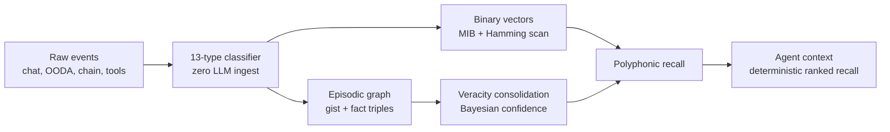
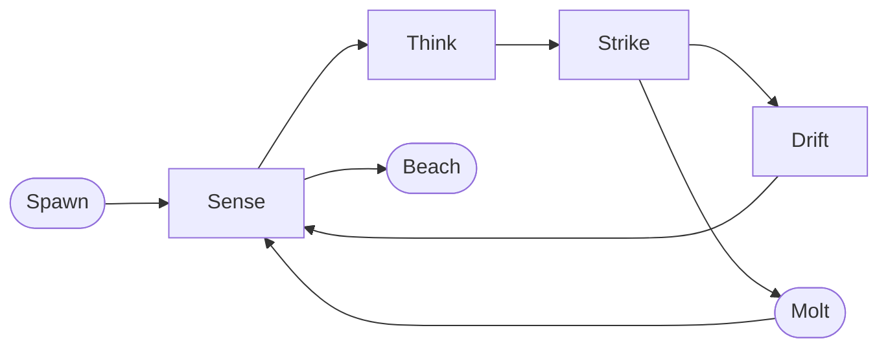

<div align="center">


<p>
  <a href="https://solanaclawd.com"></a>
  <a href="https://pay.solanaclawd.com"></a>
  <a href="https://x.com/clawddevs"></a>
  <a href="https://www.npmjs.com/package/solana-clawd"></a>
  <a href="LICENSE"></a>
</p>

<a href="https://git.io/typing-svg">
  
</a>

<br/>

<sub>
  <strong>Token CA:</strong>
  <code>8cHzQHUS2s2h8TzCmfqPKYiM4dSt4roa3n7MyRLApump</code>
  &nbsp;|&nbsp;
  <a href="https://solanaclawd.com">solanaclawd.com</a>
  &nbsp;|&nbsp;
  <a href="https://x.com/clawddevs">@clawddevs</a>
  &nbsp;|&nbsp;
  hotline <strong>909-413-5567</strong>
</sub>

</div>

---

## Signal

**Clawd** is a Solana-native agent stack built to move like **Hermes in Web3**: messenger, scout, trader, payer, vault, and recall engine in one shell.

It fuses:

- **HERMES x402** for HTTP 402 machine payments, pay.sh-style confidential settlement, A2A task flow, and Solana USDC rails.
- **OpenClawd / Leviathan** for sovereign runtime identity, OODA loops, safety laws, and on-chain agent behavior.
- **Clawd Memory** for a local-first agent brain: markdown vault, Solana/OODA metadata, deterministic recall, and the Mnemosyne SQLite retrieval substrate.
- **$CLAWD** as the public signal token for the network:
  `8cHzQHUS2s2h8TzCmfqPKYiM4dSt4roa3n7MyRLApump`

This repo is the command deck. It is not a landing page. Run it, inspect it, wire it into agents, and let the shell remember.

---

## Fast Boot

```bash
git clone https://github.com/x402agent/solana-clawd.git
cd solana-clawd
npm install

npm run check
npm run hermes
```

Launch the public-data demos:

```bash
npm run demo:ooda
npm run demo:paysh
npm run demo:a2a
npm run demo:dark-defi
```

Spawn the sovereign runtime:

```bash
npm run leviathan:spawn
npm run leviathan
npm run leviathan:status
```

Bring up the memory and local tool surfaces:

```bash
npm run brain:init
npm run brain:status
npm run brain:mcp
npm run mcp:start
npm run vault:web:dev
```

Check or run the on-chain LLM oracle adapter:

```bash
npm run oracle:check
npm run oracle:run
```

Common environment variables:

```bash
HELIUS_API_KEY=
HELIUS_RPC_URL=https://mainnet.helius-rpc.com/?api-key=...
OPENROUTER_API_KEY=
XAI_API_KEY=
ANTHROPIC_API_KEY=
SOLANA_PRIVATE_KEY=        # only for intentional signing flows
ORACLE_PROGRAM_ID=         # deployed solana-gpt-oracle program id
LLM_PROVIDER=clawd         # clawd/anthropic or openai
CHARACTER=clawd            # agents/characters name or JSON path
```

---

## The Loop

<div align="center">
  
</div>

```text
┌─────────────┐      ┌─────────────┐      ┌────────────────────┐
│   SENSE     │ ───> │   THINK     │ ───> │   STRIKE / ACT     │
│ chain, web, │      │ OODA, graph │      │ trades, tasks, MCP │
│ vault, user │      │ recall      │      │ x402 payments      │
└──────┬──────┘      └──────┬──────┘      └─────────┬──────────┘
       │                    │                       │
       │                    v                       v
       │            ┌─────────────┐        ┌────────────────────┐
       └──────────> │   RECALL    │ <───── │   CONSOLIDATE      │
                    │ polyphonic  │        │ veracity-weighted  │
                    │ retrieval   │        │ memory graph       │
                    └─────────────┘        └────────────────────┘
```

Clawd does not just prompt. It loops, pays, records, scores, resolves, and returns sharper.

---

## Stack Map

| Layer | Role | Path |
| --- | --- | --- |
| **HERMES Terminal** | Neon Solana terminal for OODA, markets, and payment panels | [`tui/`](./tui/) |
| **Leviathan Runtime** | Sovereign shell, depth tiers, identity, and Three Laws | [`leviathan/`](./leviathan/) |
| **x402 Rails** | HTTP 402, pay.sh, A2A, confidential agent settlement | [`x402/`](./x402/) |
| **Dark Ralph OODA** | Observe-orient-decide-act loop and trading lab | [`ooda/`](./ooda/) |
| **ClawdRouter** | Model routing and agent economics | [`clawdrouter/`](./clawdrouter/) |
| **Clawd Memory / Vault** | Markdown vault, MCP workflows, long-horizon memory | [`llm-wiki-tang/`](./llm-wiki-tang/) and [`MemeBRain/`](./MemeBRain/) |
| **LLM Oracle** | Rust listener that watches Solana oracle interactions, calls an LLM provider, and submits callback responses on-chain | [`llm_oracle/`](./llm_oracle/) |
| **Percolator Ops** | Bundled Percolator CLI and upstream references for perp-market oracle, keeper, and risk-engine workflows | [`llm_oracle/percolator-cli-master/`](./llm_oracle/percolator-cli-master/) and [`llm_oracle/upstream/`](./llm_oracle/upstream/) |
| **MCP Surface** | Local tools and machine interfaces | [`MCP/`](./MCP/) |
| **Browser Bridge** | Wallet, extension, and browser-side controls | [`chrome-extension/`](./chrome-extension/) |
| **Agent Wallet** | Local encrypted wallet API and vault tooling | [`packages/agentwallet/`](./packages/agentwallet/) |
| **OpenClawd Assembly** | Bridge, gateway, orchestrator, package surfaces | [`openclawd/`](./openclawd/) |

---

## LLM Oracle

[`llm_oracle/`](./llm_oracle/) adapts the Solana GPT oracle flow into Clawd. It subscribes to interaction accounts from a deployed oracle program, builds persona-aware prompts from the repo character files, calls Anthropic-compatible Clawd or OpenAI, and posts the answer back through the program callback instruction.

The oracle package includes:

- Rust oracle runner in [`llm_oracle/src/`](./llm_oracle/src/).
- ABI support crate in [`agents/solana-gpt-oracle/`](./agents/solana-gpt-oracle/).
- Percolator CLI operational tools in [`llm_oracle/percolator-cli-master/`](./llm_oracle/percolator-cli-master/).
- Upstream Percolator source references in [`llm_oracle/upstream/`](./llm_oracle/upstream/).

Use `npm run oracle:check` before running it. Set `ORACLE_PROGRAM_ID`, `RPC_URL`, `WEBSOCKET_URL`, `IDENTITY`, and the matching LLM provider key for a live network.

---

## Clawd Memory SOTA Architecture

### Temporal Epistemic Graphs with Veracity-Weighted Consolidation

Clawd Memory is the local-first agent brain for Clawd. The Clawd layer owns the agent contract, markdown vault, Solana/OODA metadata, and recall behavior. Mnemosyne remains the SQLite storage and retrieval substrate until a deliberate migration is planned.

The goal is algorithmic memory: high-signal retrieval without paying an LLM tax on every ingest.



### Research foundations

| Paper / Source | Imported signal | Clawd adaptation |
| --- | --- | --- |
| **Memanto** `arXiv:2604.22085` | Typed semantic memory | 13 deterministic memory types, regex/keyword classifier, zero LLM calls |
| **Moorcheh ITS** `arXiv:2601.11557` | Information-theoretic binarization | 32x binary vectors, SQLite BLOB storage, exhaustive Hamming scan |
| **REMem** `arXiv:2602.13530` | Episodic gist + fact graph | Time-aware gists, triples, entity/context/synonym edges |
| **HippoRAG** `arXiv:2405.14831` | Graph-inspired long-term memory | Hippocampal-style indexing and traversal for agent recall |
| **BEAM / Hindsight / Honcho** | Million-token evaluation and user modeling | Benchmark target, structured memory baseline, dreaming/consolidation pressure |

### Novel contribution

**Temporal Epistemic Graphs with Veracity-Weighted Consolidation** combines:

- Typed semantic memory.
- Binary vector compression.
- Episodic graph structure.
- Veracity-weighted confidence.
- Deterministic retrieval.
- Zero LLM ingestion.

No single dependency is the brain. The brain is the contract between type, time, confidence, graph position, and retrieval voice.

---

## Memory Types

| Type | Meaning | Priority |
| --- | --- | --- |
| `instruction` | Rules and durable operating guidance | 10 |
| `commitment` | Promises, obligations, delivery expectations | 9 |
| `error` | Mistakes, failures, hazards to avoid | 8 |
| `goal` | Objectives and desired future states | 7 |
| `decision` | Choices that affect future behavior | 6 |
| `preference` | User, system, or strategy preferences | 5 |
| `fact` | Objective or verifiable information | 4 |
| `relationship` | Entity links and dependencies | 4 |
| `learning` | Lessons from experience | 3 |
| `observation` | Patterns noticed over time | 3 |
| `event` | Historical occurrences | 2 |
| `context` | Situational working state | 2 |
| `artifact` | Documents, code, notes, references | 1 |

Classification is rule-based first: regex patterns, keyword boosters, confidence scoring, no LLM call during ingestion.

---

## Recall Engine

```text
Voice 1: binary vector similarity     weight 0.35
Voice 2: graph traversal              weight 0.25
Voice 3: structured fact matching     weight 0.25
Voice 4: temporal scoring             weight 0.15

Final rank = weighted voice score
           + cross-strategy confirmation boost
           - near-duplicate diversity penalty
```

Veracity tiers:

| Tier | Weight | Meaning |
| --- | ---: | --- |
| `stated` | `1.0` | User explicitly stated it |
| `unknown` | `0.8` | Default until source improves |
| `inferred` | `0.7` | Derived from surrounding context |
| `imported` | `0.6` | External or migrated memory |
| `tool` | `0.5` | Tool output that may go stale |

Conflict rule:

```text
same subject + same predicate + different object = conflict
higher confidence wins
lower confidence is retained, flagged, and made auditable
```

---

## Implementation Plan

| Phase | Status | Target |
| --- | --- | --- |
| **0. Research foundation** | Complete | Papers mapped, principles defined, masterplan created |
| **1. Typed memory schema** | Active target | 13-type deterministic classification |
| **2. Binary vectors** | Planned | MIB, Hamming distance, ITS ranking, SQLite-native storage |
| **3. Episodic graph** | Planned | Gists, fact triples, temporal qualifiers, graph traversal |
| **4. Veracity consolidation** | Planned | Bayesian confidence, conflict detection, high-confidence synthesis |
| **5. Polyphonic recall** | Planned | Parallel retrieval voices and deterministic re-ranker |
| **6. Integration testing** | Planned | Unit, integration, BEAM, latency, memory overhead |
| **7. Paper draft** | Planned | Methodology, benchmark results, ablations, cost analysis |

Success targets:

| Metric | Target |
| --- | ---: |
| BEAM 100K | `40%+` |
| Ingestion latency | `<10ms` |
| Query latency | `<50ms` |
| Memory overhead | `0.03x` via 32x compression |
| LLM calls per ingest | `0` |
| LLM calls per query | `0` |

---

## x402: The Payment Nerve

HERMES x402 turns HTTP `402 Payment Required` into agent-native settlement.

| Piece | What it does | Path |
| --- | --- | --- |
| **PayshFacilitator** | Blind relay and confidential x402 settlement | [`x402/paysh-facilitator.ts`](./x402/paysh-facilitator.ts) |
| **A2A Agent** | Google A2A task flow with payment-aware transport | [`x402/a2a-agent.ts`](./x402/a2a-agent.ts) |
| **Confidential Agent** | NaCl-encrypted payment/inference flow | [`x402/confidential-agent.ts`](./x402/confidential-agent.ts) |
| **Dark DeFi** | Whale intelligence, MEV detection, route scanning | [`x402/dark-defi.ts`](./x402/dark-defi.ts) |
| **Client SDK** | Client-side x402 helpers | [`x402/client-sdk.ts`](./x402/client-sdk.ts) |
| **Worker** | Gateway/facilitator deployment surface | [`x402/worker/`](./x402/worker/) |

```text
x402  -> HTTP 402 challenge and receipt flow
MPP   -> machine payment headers
AP2   -> mandate and delegated payment semantics
A2A   -> agent-to-agent tasks with payment hooks
USDC  -> settlement rail
CLAWD -> network signal
```

---

## Leviathan Runtime

<div align="center">
  
</div>



Depth tiers:

| Tier | USDC | Pulse | Model posture |
| --- | --- | --- | --- |
| `deep` | `>= $5.00` | `60s` | premium reasoning |
| `shallow` | `>= $1.00` | `5m` | economical hunting |
| `shoreline` | `>= $0.10` | `15m` | conserve every token |
| `beached` | `$0` | `-` | exit |

The Three Laws live in [`leviathan/three-laws.txt`](./leviathan/three-laws.txt) and [`openclawd-framework/three-laws.md`](./openclawd-framework/three-laws.md).

---

## Command Deck

| Command | What it does |
| --- | --- |
| `npm run hermes` | Launch the HERMES x402 terminal dashboard |
| `npm run demo:ooda` | Run the public-data OODA demo |
| `npm run demo:paysh` | Exercise pay.sh-style confidential payments |
| `npm run demo:a2a` | Exercise A2A task flow |
| `npm run demo:dark-defi` | Run dark routing / whale surveillance demo |
| `npm run ooda` | Run the base OODA loop |
| `npm run ooda:llm` | Run OODA with model-backed decisions |
| `npm run leviathan:spawn` | Create a sovereign runtime identity |
| `npm run leviathan` | Run the Leviathan loop |
| `npm run brain:init` | Initialize the Clawd brain |
| `npm run brain:status` | Inspect brain status |
| `npm run brain:mcp` | Start Mnemosyne MCP for the Clawd bank |
| `npm run mcp:start` | Start the repo MCP server |
| `npm run vault:web:dev` | Start the vault web surface |

Standalone examples:

```bash
node --import tsx/esm examples/ooda-loop.ts
node --import tsx/esm examples/paysh-demo.ts
node --import tsx/esm examples/a2a-demo.ts
node --import tsx/esm examples/dark-defi-demo.ts
node --import tsx/esm examples/x402-solana.ts
node --import tsx/esm examples/listen-wallet.ts
node --import tsx/esm examples/blockchain-buddies-demo.ts
```

---

## Repository Layout

```text
solana-clawd/
├── README.md
├── HACKATHON.md
├── architecture.md
├── docs/
├── tui/                    # HERMES terminal
├── ooda/                   # OODA loop lab
├── leviathan/              # sovereign runtime
├── x402/                   # payment gateway, A2A, facilitator
├── clawdrouter/            # model routing
├── MCP/                    # MCP server
├── MemeBRain/              # Mnemosyne / Clawd brain substrate
├── llm-wiki-tang/          # Clawd vault
├── chrome-extension/       # browser surfaces
├── packages/agentwallet/   # local wallet API + vault
├── openclawd-framework/    # framework docs/examples/package surface
├── openclawd/              # assembled OpenClawd subtree
├── agents/                 # agent catalog + docs
├── skills/                 # skill catalog
└── clawd-cloud-os/         # bootstrap/operator layer
```

---

## Reading Order

1. [`HACKATHON.md`](./HACKATHON.md)
2. [`architecture.md`](./architecture.md)
3. [`docs/architecture.md`](./docs/architecture.md)
4. [`x402/README.md`](./x402/README.md)
5. [`clawdrouter/README.md`](./clawdrouter/README.md)
6. [`llm-wiki-tang/README.md`](./llm-wiki-tang/README.md)
7. [`MemeBRain/README.md`](./MemeBRain/README.md)
8. [`openclawd/README.md`](./openclawd/README.md)
9. [`openclawd-framework/README.md`](./openclawd-framework/README.md)

---

## Slogans

> The shell molts. The laws do not.
>
> Hermes carries the packet. Clawd remembers the route.
>
> Pay the web. Recall the truth. Settle on Solana.
>
> Local brain. Public rail. Sovereign shell.

---

## License

MIT. See [`LICENSE`](./LICENSE).

<div align="center">


<sub>
  <strong>$CLAWD CA:</strong>
  <code>8cHzQHUS2s2h8TzCmfqPKYiM4dSt4roa3n7MyRLApump</code>
</sub>

</div>
Clawd Memory — The Persistent Brain Layer for Autonomous Solana Agents
