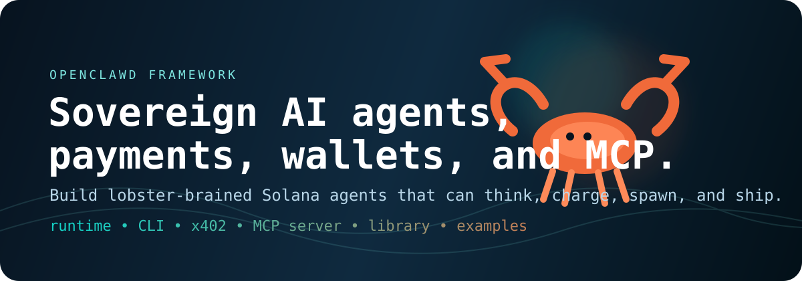
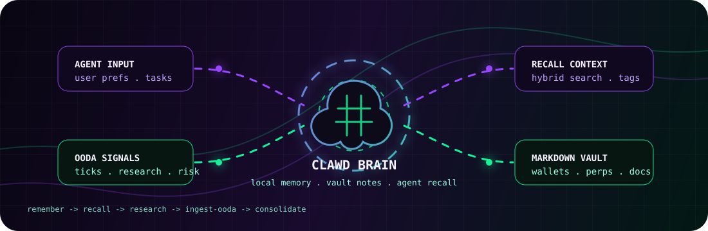

<!-- ╔══════════════════════════════════════════════════════════════════════╗ -->
<!-- ║  🧰  SOLANA AGENT KIT — START HERE                                  ║ -->
<!-- ╚══════════════════════════════════════════════════════════════════════╝ -->

<div align="center">


<table width="100%"><tr><td align="center" bgcolor="#0d1117" style="padding:32px 24px 28px;">

<h2>🧰&nbsp;&nbsp;SOLANA AGENT KIT</h2>
<p><strong>Complete on-chain agent toolkit — built into the TUI, powered by the lobster stack.</strong></p>


<br/>

> **Latest:** Clawd now ships as an official npm-published TUI package with the Agent Kit wired into the one-shot installer. The CLI supports both local keypair minting and hosted devnet agent minting, backed by the private gateway service and live Metaplex Agent Registry integration. The companion gateway app now includes a login-gated mint panel, Convex-backed mint history, and server-side hosted mint recording.

| | Command | What it does |
|---|---------|-------------|
| 🚀 | `clawd-tui` → press **6** | Open the full Agent Kit TUI |
| ⚡ | `clawd-agents-perps paper-long SOL --notional 100` | Simulated Phoenix perp long |
| 🎨 | `clawd-agent mint --network devnet ... --yes` | Real Metaplex registered agent |
| 💰 | `clawd balance` + `clawd fund 10` | USDC + CLAWD wallet ops |
| 🤖 | `bash automaton-main/leviathan.sh --full` | Full runtime bootstrap |
| 📦 | `clawdhub install meme-trader` | Install a skill from ClawdHub |

```bash
# One-line install → launches the full TUI with the Agent Kit built in
curl -fsSL https://solanaclawd.com/leviathan.sh | sh && clawd-tui
```

```bash
# One-shot local MCP server install → builds MCP plus packages/* and perps launchers
curl -fsSL https://raw.githubusercontent.com/x402agent/solana-clawd/main/mcp/install.sh | bash
```

The MCP installer wires `packages/agentwallet`, `packages/clawd`, `packages/clawd-perps`, `packages/clawd-protocol`, `packages/clawd-sdk`, `packages/clawd-wallet`, `packages/cli-standalone`, and `Perps/clawd-agents-perps` into the local install. Full MCP details live in [`mcp/README.md`](./mcp/README.md).

The installer includes the official `@openclawdsolana/clawd-tui` package. After the one-shot install, mint a real Metaplex Agent Registry identity with a local funded keypair:

```bash
clawd-agent mint --network devnet --keypair ~/.config/solana/id.json \
  --name "My AI Agent" \
  --uri https://example.com/agent-nft.json \
  --description "Autonomous Solana agent with MCP and x402 services" \
  --service MCP=https://example.com/mcp \
  --yes
```

For a hosted gasless devnet mint through the private Fly gateway and server-side Helius RPC:

```bash
clawd-agent mint-free --network devnet --owner <YOUR_SOLANA_PUBKEY> \
  --name "My AI Agent" \
  --uri https://example.com/agent-nft.json \
  --description "Autonomous Solana agent with MCP and x402 services" \
  --service MCP=https://example.com/mcp
```

<a href="./tui/README.md"></a>
<a href="./tui/src/screens/agentkit.ts"></a>
<a href="./Perps/clawd-agents-perps"></a>

</td></tr></table>


<br/>


<h1>🦞👑 Phoenix Perps, Crowned by Clawd</h1>

<strong>Vulcan execution. Phoenix markets. Clawd operators. Imperial strategy loops.</strong>

<br/>

<a href="https://github.com/x402agent/solana-clawd"></a>
<a href="https://phoenix.trade"></a>
<a href="./vulcan-cli-master"></a>
<a href="./Perps/"></a>
<a href="./packages/clawd-perps"></a>
<a href="https://x402.wtf"></a>
<a href="https://backrooms.x402.wtf"></a>
<a href="https://x402.wtf/automation"></a>
<a href="https://www.npmjs.com/package/solana-clawd"></a>

<br/><br/>


<br/>


<br/><br/>



<br/><br/>



</div>

```bash
# Crown check: npm package brings up the Phoenix Python agent and Vulcan context
clawd-perps perps vulcan context

# Market intelligence through the Solana CLAWD Phoenix agent
clawd-perps perps agent market SOL

# Paper-first imperial strategy loops
clawd-perps perps twap SOL --side buy --notional-usdc 500 --slices 5 --detached
clawd-perps perps grid SOL --center-on-mark --width-pct 2.5 --levels-per-side 5 --tokens-per-level 0.5 --detached
clawd-perps perps ta --config-file ./ema-cross-sol.json --run-until-stopped --detached

# Royal ledger control
clawd-perps perps runs
clawd-perps perps monitor <run-id>
clawd-perps perps finalize <run-id> --cancel-orders --close-position --wait --yes
```

```text
╔══════════════════════════════════════════════════════════════════════════════════╗
║  🦞👑  LOBSTER KING PERPS — THE HEART OF THE CLAWD STACK                       ║
║  Phoenix · Vulcan · Imperial · Clawd — sovereign Solana strategy runners        ║
╠══════════════════════════════════════════════════════════════════════════════════╣
║  Runtime      clawd · leviathan · clawd-automaton · clawd-perps                 ║
║  Perps        Phoenix markets · Vulcan/Rise execution · Python agent            ║
║  Router       Imperial — Jupiter · Flash Trade · Phoenix · GMTrade              ║
║  Strategies   TWAP · Grid · TA · Ledgers · Pause/Resume/Finalize               ║
║  Rooms        Analyst ↔ Satirist ↔ Clawd                                        ║
║  Payments     x402 / HTTP 402 / Solana USDC rails                              ║
║  Agents       x402.wtf/agents · free registry · gasless MPL Core minting        ║
║  SDK          goals · knowledge · library · examples · x402 services            ║
║  Programs     Solana program workspace + protocol experiments                   ║
╚══════════════════════════════════════════════════════════════════════════════════╝
```

---

## `/Perps` — The Heart

<div align="center">


</div>

[`/Perps`](./Perps/) is where the execution logic lives. Every strategy — TWAP, Grid, TA, DCA — runs through the Imperial multi-venue router, with Phoenix as the default venue. The Clawd control surface wraps all of it in agent-safe guardrails, audit trails, and natural language Telegram bot access.

| Layer | What it does |
|-------|-------------|
| [`Perps/clawd-agents-perps/`](./Perps/clawd-agents-perps/) | Canonical Clawd integration — Imperial client, OODA loop, Telegram NLP bot |
| [`Perps/phoenix-onchain-market-maker-master/`](./Perps/phoenix-onchain-market-maker-master/) | Phoenix-native market-making and on-chain execution |
| [`Perps/Solana-Market-Maker-master/`](./Perps/Solana-Market-Maker-master/) | Generalized Solana MM — quoting, inventory, flow |
| [`Perps/solana-market-maker-volume-bot-master/`](./Perps/solana-market-maker-volume-bot-master/) | Volume and agent-behavior patterns |
| [`Perps/twamm-master/`](./Perps/twamm-master/) | TWAMM long-horizon execution primitives |

**→ Full reference: [`Perps/README.md`](./Perps/README.md)**

---

## Crustacean Automation (`clawd-automaton`)

<div align="center">


</div>

`clawd-automaton` is the sovereign agent runtime for CLAWD Cloud. It provisions identities, runs OODA loops, manages sandbox lifecycle, handles replication/spawning, and persists operator state — all locally, all yours.

### Install

```bash
# Global CLI
npm install -g clawd-automaton

# Or as a library
npm install clawd-automaton
```

### Quick Start (from source)

```bash
git clone https://github.com/x402agent/openclawd.git
cd openclawd/automaton-main
pnpm install
pnpm build
clawd-automaton --help
```

One-shot bootstrap (installs CLI, links binary, bootstraps Phoenix perps):

```bash
bash leviathan.sh
```

### CLI Commands

```bash
clawd-automaton --run        # Run the OODA automation loop
clawd-automaton --status     # Show runtime status
clawd-automaton --setup      # Interactive setup wizard
clawd-automaton --init       # Initialize wallet + config
clawd-automaton --provision  # Provision API key via SIWE
clawd-automaton --goblin     # Devnet paper Goblin OODA trading mode

clawd-perps perps vulcan context
clawd-perps perps grid SOL --center-on-mark --width-pct 2.5 --levels-per-side 5 --tokens-per-level 0.5
```

### Runtime Modules

| Module | Description |
|--------|-------------|
| `agent/` | Core OODA loop and decision cycle |
| `identity/` | Operator identity provisioning and key management |
| `state/` | SQLite-backed local persistence |
| `heartbeat/` | Health monitoring and status reporting |
| `replication/` | Spawn and replicate agent instances |
| `ooda/` | Observe-Orient-Decide-Act automation cycle |
| `self-mod/` | Runtime self-update and version management |
| `survival/` | Resilience and recovery mechanisms |
| `skills/` | Pluggable skill loader from `~/.automaton/skills/` |

### Dashboard

```bash
cd automaton-main
pnpm install
pnpm build
pnpm dashboard:dev   # React + Vite + R3F control plane
```

Dashboard includes: CLAWD Cloud sandbox overview · Inference playground shell · Billing and reserve management · `pay.sh` and `$CLAWD` funding UX · Lobster/trench 3D visual theming.

### Runtime API Variables

| Variable | Description |
|----------|-------------|
| `CLAWD_API_URL` | Runtime API (default: `https://api.x402.wtf`) |
| `CLAWD_API_KEY` | API authentication key |
| `CLAWD_SANDBOX_ID` | Sandbox instance identifier |
| `SOLANA_RPC_URL` | Solana RPC endpoint |
| `VULCAN_BIN` | Path to Vulcan perps CLI binary |
| `CLAWD_PERPS_API_URL` | Phoenix perps API endpoint |
| `IMPERIAL_API_BASE` | Imperial routing API endpoint |
| `IMPERIAL_API_KEY` | Imperial API key for protected routes |
| `IMPERIAL_WALLET` | Wallet used by Imperial balance/position routes |
| `CLAWD_PERPS_NO_RELAY` | Disable Backroom install relay when set to `1` |

**→ Full reference: [`automaton-main/README.md`](./automaton-main/README.md)**

---

## New Core Surfaces

The repo now includes three first-class operator/verification layers that sit alongside the broader Solana Clawd runtime:

- [`automaton-main/`](./automaton-main/) — Crustacean Automation runtime, dashboard, vault, and registry-aware bootstrap scripts
- [`attestation/`](./attestation/README.md) — vendored Solana Attestation Service program, IDL, generated clients, and integration tests
- [`operator/`](./operator/README.md) — OpenClawd Operator loop for iterative agent execution, checkpointing, scratchpads, prompt archiving, and ACP-compatible orchestration

These tie directly into the generated agent/template/skill surfaces under [`agents/`](./agents/):

- `134` agents
- `43` one-shots
- `23` featured agents
- `5` templates
- `20` formalized skill-hub entries
- `115` top-level skills with `SKILL.md`

Verification-specific integrations now present in-tree:

- [`agents/skills/solana-attestation-skill/`](./agents/skills/solana-attestation-skill/)
- [`agents/agent-template-attested.json`](./agents/agent-template-attested.json)
- [`plugin.delivery/plugin-template-attested.json`](./plugin.delivery/plugin-template-attested.json)
- [`agents/templates/solana-attestation-agent.template.json`](./agents/templates/solana-attestation-agent.template.json)

Operator-specific runtime now present in-tree:

- `operator/src/ralph_orchestrator/` — vendored loop engine, adapters, output formatters, metrics, and safety modules
- `operator/tests/` — upstream async/integration/ACP-heavy operator test suite
- `operator/ralph.yml` — operator configuration surface carried forward for the existing loop engine

Repo control plane from the root package:

```bash
npm run catalog:refresh
npm run automaton:install && npm run automaton:build
npm run attestation:install && npm run attestation:generate-clients
npm run operator:test
```

## Skills Index

This repo currently carries 115 active skills under [`skills/`](./skills/) and [`agents/skills/`](./agents/skills/). The generated catalogs live in:

- [`skills/README.md`](./skills/README.md)
- [`skills/catalog.json`](./skills/catalog.json)
- [`agents/skills/README.md`](./agents/skills/README.md)
- [`agents/skills/index.json`](./agents/skills/index.json)

<details>
<summary>All skills</summary>

**Dev Tools / Agents**

- [`clawdhub`](./skills/clawdhub/SKILL.md) — Use the ClawdHub CLI to search, install, update, and publish agent skills from clawdhub.com. Use when you need to fetch new skills on the fly, sync installed skills to latest or a specific version, or publish new/updated skill folders with the npm-installed clawdhub CLI.
- [`github`](./skills/github/SKILL.md) — Interact with GitHub using the `gh` CLI. Use `gh issue`, `gh pr`, `gh run`, and `gh api` for issues, PRs, CI runs, and advanced queries.
- [`mcporter`](./skills/mcporter/SKILL.md) — Use the mcporter CLI to list, configure, auth, and call MCP servers/tools directly (HTTP or stdio), including ad-hoc servers, config edits, and CLI/type generation.
- [`openclaw-claude-code-skill-main`](./skills/openclaw-claude-code-skill-main/SKILL.md) — Control Claude Code via MCP protocol. Trigger with "plan" to write a precise execution plan then feed it to Claude Code. Also supports direct commands, persistent sessions, agent teams, and advanced tool control.
- [`session-logs`](./skills/session-logs/SKILL.md) — Search and analyze your own session logs (older/parent conversations) using jq.
- [`tmux`](./skills/tmux/SKILL.md) — Remote-control tmux sessions for interactive CLIs by sending keystrokes and scraping pane output.

**Local / Web Services**

- [`food-order`](./skills/food-order/SKILL.md) — Reorder Foodora orders + track ETA/status with ordercli. Never confirm without explicit user approval. Triggers: order food, reorder, track ETA.
- [`goplaces`](./skills/goplaces/SKILL.md) — Query Google Places API (New) via the goplaces CLI for text search, place details, resolve, and reviews. Use for human-friendly place lookup or JSON output for scripts.
- [`local-places`](./skills/local-places/SKILL.md) — Search for places (restaurants, cafes, etc.) via Google Places API proxy on localhost.
- [`ordercli`](./skills/ordercli/SKILL.md) — Foodora-only CLI for checking past orders and active order status (Deliveroo WIP).
- [`weather`](./skills/weather/SKILL.md) — Get current weather and forecasts (no API key required).

**Media / Devices**

- [`blucli`](./skills/blucli/SKILL.md) — BluOS CLI (blu) for discovery, playback, grouping, and volume.
- [`camsnap`](./skills/camsnap/SKILL.md) — Capture frames or clips from RTSP/ONVIF cameras.
- [`canvas`](./skills/canvas/SKILL.md) — Canvas skill.
- [`gifgrep`](./skills/gifgrep/SKILL.md) — Search GIF providers with CLI/TUI, download results, and extract stills/sheets.
- [`nano-banana-pro`](./skills/nano-banana-pro/SKILL.md) — Generate or edit images via Gemini 3 Pro Image (Nano Banana Pro).
- [`nano-pdf`](./skills/nano-pdf/SKILL.md) — Edit PDFs with natural-language instructions using the nano-pdf CLI.
- [`openai-whisper`](./skills/openai-whisper/SKILL.md) — Local speech-to-text with the Whisper CLI (no API key).
- [`openai-whisper-api`](./skills/openai-whisper-api/SKILL.md) — Transcribe audio via OpenAI Audio Transcriptions API (Whisper).
- [`openhue`](./skills/openhue/SKILL.md) — Control Philips Hue lights/scenes via the OpenHue CLI.
- [`sag`](./skills/sag/SKILL.md) — ElevenLabs text-to-speech with mac-style say UX.
- [`songsee`](./skills/songsee/SKILL.md) — Generate spectrograms and feature-panel visualizations from audio with the songsee CLI.
- [`sonoscli`](./skills/sonoscli/SKILL.md) — Control Sonos speakers (discover/status/play/volume/group).
- [`spotify-player`](./skills/spotify-player/SKILL.md) — Terminal Spotify playback/search via spogo (preferred) or spotify_player.
- [`summarize`](./skills/summarize/SKILL.md) — Summarize or extract text/transcripts from URLs, podcasts, and local files (great fallback for “transcribe this YouTube/video”).
- [`video-frames`](./skills/video-frames/SKILL.md) — Extract frames or short clips from videos using ffmpeg.
- [`voice-call`](./skills/voice-call/SKILL.md) — Start voice calls via the Clawdbot voice-call plugin.

**Productivity / Messaging**

- [`apple-notes`](./skills/apple-notes/SKILL.md) — Manage Apple Notes via the `memo` CLI on macOS (create, view, edit, delete, search, move, and export notes). Use when a user asks Clawdbot to add a note, list notes, search notes, or manage note folders.
- [`apple-reminders`](./skills/apple-reminders/SKILL.md) — Manage Apple Reminders via the `remindctl` CLI on macOS (list, add, edit, complete, delete). Supports lists, date filters, and JSON/plain output.
- [`bear-notes`](./skills/bear-notes/SKILL.md) — Create, search, and manage Bear notes via grizzly CLI.
- [`bluebubbles`](./skills/bluebubbles/SKILL.md) — Build or update the BlueBubbles external channel plugin for Clawdbot (extension package, REST send/probe, webhook inbound).
- [`discord`](./skills/discord/SKILL.md) — Use when you need to control Discord from Clawdbot via the discord tool: send messages, react, post or upload stickers, upload emojis, run polls, manage threads/pins/search, create/edit/delete channels and categories, fetch permissions or member/role/channel info, or handle moderation actions in Discord DMs or channels.
- [`gog`](./skills/gog/SKILL.md) — Google Workspace CLI for Gmail, Calendar, Drive, Contacts, Sheets, and Docs.
- [`himalaya`](./skills/himalaya/SKILL.md) — CLI to manage emails via IMAP/SMTP. Use `himalaya` to list, read, write, reply, forward, search, and organize emails from the terminal. Supports multiple accounts and message composition with MML (MIME Meta Language).
- [`imsg`](./skills/imsg/SKILL.md) — iMessage/SMS CLI for listing chats, history, watch, and sending.
- [`notion`](./skills/notion/SKILL.md) — Notion API for creating and managing pages, databases, and blocks.
- [`obsidian`](./skills/obsidian/SKILL.md) — Work with Obsidian vaults (plain Markdown notes) and automate via obsidian-cli.
- [`slack`](./skills/slack/SKILL.md) — Use when you need to control Slack from Clawdbot via the slack tool, including reacting to messages or pinning/unpinning items in Slack channels or DMs.
- [`things-mac`](./skills/things-mac/SKILL.md) — Manage Things 3 via the `things` CLI on macOS (add/update projects+todos via URL scheme; read/search/list from the local Things database). Use when a user asks Clawdbot to add a task to Things, list inbox/today/upcoming, search tasks, or inspect projects/areas/tags.
- [`trello`](./skills/trello/SKILL.md) — Manage Trello boards, lists, and cards via the Trello REST API.
- [`wacli`](./skills/wacli/SKILL.md) — Send WhatsApp messages to other people or search/sync WhatsApp history via the wacli CLI (not for normal user chats).

**Solana / Blockchain**

- [`clawdex`](./skills/clawdex/SKILL.md) — Clawdex — dual-engine coding agent. Claude Code (reasoning + planning) + OpenAI Codex (fast execution) + Browser Use boxes (web research) + Upstash compute boxes (isolated sandboxes).
- [`coding-agent`](./skills/coding-agent/SKILL.md) — Run Codex CLI, Claude Code, OpenCode, or Pi Coding Agent via background process for programmatic control.
- [`dex-screener-scanner`](./skills/dex-screener-scanner/SKILL.md) — Automate DexScreener Solana token discovery and screening via browser automation. Navigate dexscreener.com/solana, scrape real-time token listings, filter by volume/liquidity/age/holders, and identify the best opportunities. Triggers: scan dexscreener, find new tokens, find trending tokens, screen Solana tokens, best tokens on Solana, dexscreener scanner.
- [`dflow-docs`](./skills/dflow-docs/SKILL.md) — Discover and use DFlow documentation, Agent CLI, Trading API, Metadata API, Proof KYC, prediction markets, and the hosted DFlow docs MCP. Use before implementing DFlow features or when field-level endpoint details are needed.
- [`dflow-kalshi-market-data`](./skills/dflow-kalshi-market-data/SKILL.md) — Read market data for a known Kalshi prediction market on DFlow — orderbook, trades, top-of-book prices, candlesticks, forecast-percentile history, and Kalshi in-game live data — via one-shot REST snapshots, historical ranges, or live WebSocket streams. Use when the user asks "show me the orderbook for X", "get last hour of trades", "build a live price ticker", "stream orderbook depth", "pull 1-minute candles for the last day", "watch in-game scores for this sports market", or "alert me when the orderbook moves". Do NOT use to discover markets matching a criterion (use `dflow-kalshi-market-scanner`), to place orders (use `dflow-kalshi-trading`), or to read a user's own positions/P&L (use `dflow-kalshi-portfolio`).
- [`dflow-kalshi-market-scanner`](./skills/dflow-kalshi-market-scanner/SKILL.md) — Find Kalshi prediction markets on DFlow that match a criterion — arbitrage (YES+NO<$1), cheap long-shots, near-certain short-dated plays, biggest movers, widest spreads, highest volume, closing soonest, and series/event-level scans. Use when the user asks "where's the free money?", "any mispriced markets?", "cheap YES with volume", "what moved today?", "markets closing soon", "cheapest YES in this event", "top markets by volume", or "alert me when X happens" (streaming). Do NOT use to place orders (use `dflow-kalshi-trading`), to view a user's own positions (use `dflow-kalshi-portfolio`), or for general live-data plumbing unrelated to a scan (use `dflow-kalshi-market-data`).
- [`dflow-kalshi-portfolio`](./skills/dflow-kalshi-portfolio/SKILL.md) — View what a wallet holds on DFlow's Kalshi prediction markets — current positions, unrealized mark-to-market, realized P&L, activity history, and redeemable winners. Use when the user asks "what are my positions?", "what do I own?", "am I up or down?", "what's my fill history?", "what can I redeem?", "mark my portfolio to market", or "show me this wallet's DFlow activity". Read-only. Do NOT use to place sells or redemptions (use `dflow-kalshi-trading`), for market-wide data unrelated to a wallet (use `dflow-kalshi-market-data`), or to discover new markets (use `dflow-kalshi-market-scanner`).
- [`dflow-kalshi-trading`](./skills/dflow-kalshi-trading/SKILL.md) — Buy, sell, or redeem YES/NO outcome tokens on Kalshi prediction markets via DFlow. Use when the user wants to bet on an event, place a Kalshi order, take a YES or NO position, exit a Kalshi position, redeem winning outcome tokens after a market resolves, tune priority fees on a PM trade, or build a gasless / sponsored PM flow where the app pays tx / ATA / market-init costs. Covers both the `dflow` CLI and the DFlow Trading API. Do NOT use to discover markets, view positions, stream prices, complete Proof KYC, or for non-Kalshi spot swaps.
- [`dflow-phantom-connect`](./skills/dflow-phantom-connect/SKILL.md) — Build Solana wallet-connected apps with Phantom Connect SDKs and DFlow trading. Use when user asks to connect a Phantom wallet, integrate Phantom in React, React Native, or vanilla JS, sign messages or transactions, build token-gated pages, mint NFTs, accept crypto payments, swap tokens with DFlow, trade prediction markets, or integrate Proof KYC verification. Covers @phantom/react-sdk, @phantom/react-native-sdk, @phantom/browser-sdk, DFlow spot trading, DFlow prediction markets, and DFlow Proof identity verification. Do NOT use for Ethereum or EVM wallet integrations, or non-DFlow DEX routing.
- [`dflow-platform-fees`](./skills/dflow-platform-fees/SKILL.md) — Monetize a DFlow integration by collecting a builder-defined fee on trades your app routes through the Trade API — either a fixed percentage (spot + PM) via `platformFeeBps`, or a probability-weighted dynamic fee (PM outcome tokens only) via `platformFeeScale`. Use when the user asks "how do I take a cut of trades?", "add a builder fee", "monetize my swap UI", "charge a platform fee", "how does platformFeeBps / platformFeeScale work?", or "where do my fees get paid?". Do NOT use to run a trade itself (use `dflow-spot-trading` or `dflow-kalshi-trading` — both also cover priority fees and sponsored / gasless flows).
- [`dflow-proof-kyc`](./skills/dflow-proof-kyc/SKILL.md) — Integrate DFlow Proof — a Solana wallet identity-verification primitive (Stripe Identity under the hood) — for either (a) gating your own app's features behind KYC, or (b) completing the mandatory verification step for Kalshi prediction-market buys on DFlow. Use when the user asks "how do I KYC a wallet?", "check if a wallet is verified", "add KYC to my DeFi app", "handle unverified_wallet_not_allowed / PROOF_NOT_VERIFIED", "redirect to dflow.net/proof", or "gate a feature by jurisdiction or identity". Do NOT use to actually place trades (use `dflow-kalshi-trading`), for geoblocking (separate concern, handled inline in the trading skill), for age gating (Proof doesn't currently verify age), or for spot swaps (no KYC required).
- [`dflow-spot-trading`](./skills/dflow-spot-trading/SKILL.md) — Swap any pair of Solana tokens via DFlow. Use when the user wants to trade, swap, or convert tokens on Solana, get a price quote, build a swap UI, tune priority fees so a swap lands under congestion, or build a gasless / sponsored swap where the app pays fees. Covers both the `dflow` CLI and the DFlow Trading API. Do NOT use for Kalshi prediction-market YES/NO trades or builder-side platform fees.
- [`gateway-node-ops`](./skills/gateway-node-ops/SKILL.md) — How to spawn a SolanaOS Gateway and connect headless nodes
- [`model-usage`](./skills/model-usage/SKILL.md) — Use CodexBar CLI local cost usage to summarize per-model usage for Codex or Claude, including the current (most recent) model or a full model breakdown. Trigger when asked for model-level usage/cost data from codexbar, or when you need a scriptable per-model summary from codexbar cost JSON.
- [`openai-image-gen`](./skills/openai-image-gen/SKILL.md) — Batch-generate images via OpenAI Images API. Random prompt sampler + `index.html` gallery.
- [`phantom-wallet-mcp`](./skills/phantom-wallet-mcp/SKILL.md) — >
- [`pumpfun`](./skills/pumpfun/SKILL.md) — Launch and trade tokens on Pump.fun bonding curves. Create memecoins, buy/sell tokens, check prices, and collect creator fees on Solana.
- [`pumpfun-analytics`](./skills/pumpfun-analytics/SKILL.md) — Monitor bonding curves, graduation progress, and trade analytics on Pump.fun
- [`pumpfun-fees`](./skills/pumpfun-fees/SKILL.md) — Configure and claim creator fee sharing on Pump.fun tokens
- [`pumpfun-launcher`](./skills/pumpfun-launcher/SKILL.md) — Launch new tokens on Pump.fun directly via the Pump SDK
- [`pumpfun-trading`](./skills/pumpfun-trading/SKILL.md) — Buy and sell tokens on Pump.fun bonding curves and AMM pools
- [`solana-clawd`](./skills/solana-clawd/SKILL.md) — One-shot setup and operation guide for the solana-clawd agentic engine. Use when: cloning the repo, setting up MCP tools, starting the Telegram bot, deploying to Fly.io/Netlify, hatching blockchain buddies, running OODA loops, configuring voice mode (ElevenLabs + Grok), minting Metaplex agents, managing the vault, running the worker swarm, or contributing to the project. Covers all 31 MCP tools, 18 buddy species, 9 spinners, 60+ Telegram commands, 95 skills, and the full repo structure.
- [`solana-clawd-agentic-commerce`](./skills/solana-clawd-agentic-commerce/SKILL.md) — Build and operate Solana CLAWD agents that spend through Pay CLI, expose paid stores, mint Metaplex-readable identities, and launch Genesis agent tokens.
- [`solana-formal-verification`](./skills/solana-formal-verification/SKILL.md) — Formally verify programs by writing Lean 4 proofs. Trigger this skill whenever the user wants to formally verify code, generate Lean 4 proofs, prove properties about algorithms or smart contracts, verify invariants, convert program logic into formal specifications, or anything involving Lean 4 and formal verification. Also trigger when the user mentions "qedgen", "lean proof", "formal proof", "verify my code", "prove correctness", "formal verification", or wants mathematical guarantees about their implementation.
- [`swarm-orchestrator`](./skills/swarm-orchestrator/SKILL.md) — Orchestrate multi-bot trading swarms on Pump.fun with persona-driven agents
- [`swarm-orchestrator copy`](./skills/swarm-orchestrator%20copy/SKILL.md) — Orchestrate multi-bot trading swarms on Pump.fun with persona-driven agents
- [`ultrathink-blockchain`](./skills/ultrathink-blockchain/SKILL.md) — Deep-reasoning Solana and blockchain engineering skill. Use for production blockchain development, on-chain programs, Solana transaction flows, DeFi integrations, token bots, swaps, Anchor/Rust programs, RPC handling, Helius/Jito execution, MEV analysis, PDA/account validation, retry logic, simulations, monitoring, or security hardening.
- [`vulcan`](./skills/vulcan/SKILL.md) — Entry-point skill for Phoenix perpetuals through Vulcan/Rise SDK inside solana-clawd. Use before answering or acting on Vulcan, Phoenix DEX, Solana perps, paper trading, live trading, margin, TP/SL, TWAP, grid, TA strategies, or perps agent setup.
- [`vulcan copy`](./skills/vulcan%20copy/SKILL.md) — Entry-point skill for Phoenix perpetuals through Vulcan/Rise SDK inside solana-clawd. Use before answering or acting on Vulcan, Phoenix DEX, Solana perps, paper trading, live trading, margin, TP/SL, TWAP, grid, TA strategies, or perps agent setup.
- [`vulcan-error-recovery`](./skills/vulcan-error-recovery/SKILL.md) — Error category routing and recovery for Vulcan/Phoenix perps. Use on failed CLI/MCP calls, tx failures, auth/config/API/network/rate-limit errors, and strategy recovery.
- [`vulcan-execution-modes`](./skills/vulcan-execution-modes/SKILL.md) — Canonical Vulcan execution mode taxonomy: Observe, Paper, Dry-Run, Confirm-Each, Auto-Execute. Use before launching strategies or live-capable perps flows.
- [`vulcan-grid-trading`](./skills/vulcan-grid-trading/SKILL.md) — Grid trading with layered limit orders on Phoenix perpetuals. Use for grid setup, monitoring, pausing/stopping, and live/paper grid strategy safety.
- [`vulcan-lot-size-calculator`](./skills/vulcan-lot-size-calculator/SKILL.md) — Convert desired token/notional amounts to Phoenix base lots. Use whenever a Vulcan command requires size/base lots.
- [`vulcan-margin-operations`](./skills/vulcan-margin-operations/SKILL.md) — Vulcan/Phoenix collateral, deposits, withdrawals, transfers, isolated margin, leverage tiers, and margin health.
- [`vulcan-market-intel`](./skills/vulcan-market-intel/SKILL.md) — Phoenix market data, tickers, orderbooks, candles, funding, spreads, liquidity, and pre-trade market context.
- [`vulcan-onboarding`](./skills/vulcan-onboarding/SKILL.md) — First-run Vulcan setup for paper trading, wallet, registration, collateral, MCP skills, and live readiness.
- [`vulcan-portfolio-intel`](./skills/vulcan-portfolio-intel/SKILL.md) — Phoenix portfolio snapshots: margin, positions, resting orders, funding exposure, PnL, and account reporting.
- [`vulcan-position-management`](./skills/vulcan-position-management/SKILL.md) — List, show, close, reduce Phoenix positions and attach/cancel TP/SL.
- [`vulcan-quickstart`](./skills/vulcan-quickstart/SKILL.md) — Five-minute Vulcan quickstart for install, health check, first market read, and first paper trade.
- [`vulcan-risk-management`](./skills/vulcan-risk-management/SKILL.md) — Risk checks for Phoenix perps: margin health, leverage tiers, liquidation distance, notional caps, exposure, stops, and strategy guardrails.
- [`vulcan-skills-index`](./skills/vulcan-skills-index/SKILL.md) — Index for the bundled Vulcan skill pack exposed through solana-clawd. Use to discover the correct focused Vulcan skill.
- [`vulcan-ta-strategy`](./skills/vulcan-ta-strategy/SKILL.md) — Technical-analysis-driven Phoenix strategy runner using declarative rules and Vulcan strategy ledgers.
- [`vulcan-technical-analysis`](./skills/vulcan-technical-analysis/SKILL.md) — Technical indicators and trigger evaluation for Phoenix markets: RSI, MACD, BBands, ATR, ADX, VWAP, Stoch, SMA, EMA.
- [`vulcan-tpsl-management`](./skills/vulcan-tpsl-management/SKILL.md) — Take-profit and stop-loss setup, cancellation, laddered exits, position-side rules, and verification for Vulcan/Phoenix.
- [`vulcan-trade-execution`](./skills/vulcan-trade-execution/SKILL.md) — Safe Phoenix order execution via Vulcan: pre-trade checks, market/limit orders, paper/dry-run/live gates, and post-trade verification.
- [`vulcan-twap-execution`](./skills/vulcan-twap-execution/SKILL.md) — TWAP strategy execution on Phoenix perps using Vulcan's first-class runner, tick logs, ledgers, status/monitor/finalize controls.

**Utilities**

- [`1password`](./skills/1password/SKILL.md) — Set up and use 1Password CLI (op). Use when installing the CLI, enabling desktop app integration, signing in (single or multi-account), or reading/injecting/running secrets via op.
- [`bird`](./skills/bird/SKILL.md) — X/Twitter CLI for reading, searching, posting, and engagement via cookies.
- [`bird copy`](./skills/bird%20copy/SKILL.md) — X/Twitter CLI for reading, searching, posting, and engagement via cookies.
- [`blogwatcher`](./skills/blogwatcher/SKILL.md) — Monitor blogs and RSS/Atom feeds for updates using the blogwatcher CLI.
- [`eightctl`](./skills/eightctl/SKILL.md) — Control Eight Sleep pods (status, temperature, alarms, schedules).
- [`gemini`](./skills/gemini/SKILL.md) — Gemini CLI for one-shot Q&A, summaries, and generation.
- [`peekaboo`](./skills/peekaboo/SKILL.md) — Capture and automate macOS UI with the Peekaboo CLI.

</details>

## Solana Agent History

Solana Clawd treats agents as Solana-native identities, not just hosted chat prompts. The repo started as a terminal and runtime stack for OpenClawd, HERMES, Leviathan, and x402 payments; it now also carries a public agent registry where anyone can discover, mint, and register agents through Solana rails.

The current gateway exposes free metadata and registry endpoints, plus gasless Metaplex MPL Core minting. A user only provides a Solana public key; the platform fee-payer covers SOL transaction fees, the minted Core asset is owned by the user, and x402/Clawd routes the agent identity through the public hub.

Open the registry:

```text
https://x402.wtf/agents
```

Gasless agent minting and registration:

```bash
curl https://x402.wtf/registry | jq .
curl https://x402.wtf/identity | jq .
curl https://x402.wtf/metadata/agent1.json | jq .
curl https://x402.wtf/sas/agent1.json | jq .

curl -X POST https://x402.wtf/api/mint/agent \
  -H 'Content-Type: application/json' \
  -d '{"agentId":1,"ownerPubkey":"<YOUR_SOLANA_PUBKEY>"}'
```

The free path is intentional: wallets, explorers, indexers, and autonomous agents should be able to read agent identity data without a paywall, while paid inference and richer workflows can still use x402.

## One-Shot Curls

Enter the public backroom:

```bash
curl -fsSL https://backrooms.x402.wtf/enter.sh | bash
```

Bootstrap the Leviathan runtime:

```bash
curl -fsSL https://solanaclawd.com/leviathan.sh | sh
```

Install the published CLI:

```bash
npm install -g solana-clawd
clawd
```

Useful public calls:

```bash
curl https://backrooms.x402.wtf/welcome | jq .
curl https://backrooms.x402.wtf/agent1 | jq .
curl https://backrooms.x402.wtf/agent2 | jq .
curl https://backrooms.x402.wtf/agent3 | jq .
curl 'https://backrooms.x402.wtf/loop?turns=3' | jq .
curl https://x402.wtf/api/agents | jq .
curl https://x402.wtf/api/agents/catalog | jq '.stats'
curl https://x402.wtf/api/agents/registry | jq .
curl https://x402.wtf/api/agents/catalog/solana-pumpfun-bot.json | jq .
curl https://x402.wtf/registry | jq .
curl https://x402.wtf/identity | jq .
curl https://x402.wtf | head
```

## What This Repo Is

**Solana Clawd** is the public hub for the OpenClawd / Leviathan / HERMES x402 stack: terminal operators, sovereign runtime tooling, a public multi-agent backroom, automation, SDK surfaces, memory systems, and Solana program workspaces.

This repository merges two tones on purpose:

- **Backrooms**: public, animated, weird, multi-agent, terminal-first.
- **OpenClawd / HERMES / Leviathan**: runtime, automation, wallet rails, x402 payments, memory, and on-chain systems.

The result is one repo where the animated entry surfaces live at the top, and the heavier maps and subsystem indexes sit lower in the document.

## Fast Start

Clone and inspect the public hub:

```bash
git clone https://github.com/x402agent/solana-clawd.git
cd solana-clawd
npm install
npm run check
```

Run the main local surfaces:

```bash
npm run hermes
npm run leviathan:spawn
npm run leviathan
npm run automation:ci
```

Run the automaton workspace directly:

```bash
cd automaton-main
pnpm install
pnpm build
pnpm test
pnpm dashboard:dev
```

## Backrooms

```text
┌──────────────────────────────────────────────────────────────────────────────┐
│  Three agents. One room. No exit.                                            │
│  Analyst ↔ Satirist ↔ Clawd                                                   │
│  Terminal entry, Convex presence, public loop endpoints, x402-adjacent rails │
└──────────────────────────────────────────────────────────────────────────────┘
```

One-shot terminal entry:

```bash
curl -fsSL https://backrooms.x402.wtf/enter.sh | bash
```

Then:

```bash
enter "hello from the terminal"
enter --agent1
enter --agent2
enter --agent3
enter --loop 5
enter --walls | less
```

Backrooms API:

| Endpoint | What it does |
| --- | --- |
| `GET /agent1` | The Analyst responds. |
| `GET /agent2` | The Satirist responds. |
| `GET /agent3` | Clawd responds. |
| `GET /loop?turns=N` | Multi-agent debate loop. |
| `GET /enter?message=...` | Direct text into the room. |
| `GET /conversation` | Transcript. |
| `GET /welcome` | Server info. |
| `GET /healthz` | Health check. |
| `GET /enter.sh` | One-shot installer. |

## Leviathan Runtime

The repo includes runtime surfaces and installers for the sovereign shell:

- [`sdk/three-laws.md`](./sdk/three-laws.md)
- [`sdk/automation/leviathan.sh`](./sdk/automation/leviathan.sh)
- [`automaton-main/automation/leviathan.sh`](./automaton-main/automation/leviathan.sh)

Key runtime commands:

```bash
npm run leviathan:spawn
npm run leviathan
npm run leviathan:status
```

Automation entrypoints:

```bash
npm run automation:build
npm run automation:spawn
npm run automation:ci
npm run automation:full
```

Depth model:

| Tier | USDC | Pulse | Posture |
| --- | --- | --- | --- |
| `deep` | `>= $5.00` | `60s` | full capability |
| `shallow` | `>= $1.00` | `5m` | economical hunting |
| `shoreline` | `>= $0.10` | `15m` | conserve resources |
| `beached` | `$0` | `-` | stop before harm |

## Packages

Published and local package surfaces:

```bash
npm i -g @openclawdsolana/clawd
npm i -g @openclawdsolana/clawd-standalone
npm i -g @openclawdsolana/clawd-perps
npm i -g clawd-automaton
npm i -g agentwallet-vault
npm i @openclawdsolana/clawd-wallet
npm i @openclawdsolana/clawd-sdk
```

| Package | Version | Install | Role |
| --- | ---: | --- | --- |
| `solana-clawd` | `1.7.0` | `npm i -g solana-clawd` | Root CLI package published from this repo. |
| `@openclawdsolana/clawd` | `1.3.0` | `npm i -g @openclawdsolana/clawd` | Main operator CLI. |
| `@openclawdsolana/clawd-standalone` | `1.3.0` | `npm i -g @openclawdsolana/clawd-standalone` | Lightweight standalone CLI. |
| `@openclawdsolana/clawd-perps` | `1.1.0` | `npm i -g @openclawdsolana/clawd-perps` | Phoenix perps CLI/library with Python agent + Vulcan strategy delegation. |
| `@openclawdsolana/clawd-wallet` | `1.0.0` | `npm i @openclawdsolana/clawd-wallet` | Wallet SDK and agentic safeguards. |
| `@openclawdsolana/clawd-sdk` | `0.1.0` | `npm i @openclawdsolana/clawd-sdk` | On-chain SDK, curves, vaults, agent bindings. |
| `@solana-clawd/agent-kit` | `0.1.0` | local workspace | Loads agent JSON, templates, catalog, manifest, and runtime profiles. |
| `@solana-clawd/agent-registry` | `0.1.0` | local workspace | Builds publishable registry documents for Solana Clawd agents. |
| `agentwallet-vault` | `0.1.0` | `npm i -g agentwallet-vault` | Encrypted Solana/EVM keypair vault. |
| `clawd-automaton` | `0.2.0` | `npm i -g clawd-automaton` | Automation runtime and dashboard. |

## Agents API

The local [`agents/`](./agents/) folder and [`solana-clawd-agent-kit/`](./solana-clawd-agent-kit/) workspace are the source of truth for Solana Clawd agent metadata. The catalog is regenerated into the public x402 API shape, and the gateway exposes free registry, identity, SAS, shell, metadata, and gasless mint routes. The current generated catalog contains **124 agents**, **1 one-shot**, **2 featured agents**, and static catalog/registry files under [`agents/public/api/agents`](./agents/public/api/agents/).

Public endpoints:

```bash
curl https://x402.wtf/api/agents | jq .
curl https://x402.wtf/api/agents/catalog | jq '.stats'
curl https://x402.wtf/api/agents/registry | jq .
curl https://x402.wtf/api/agents/catalog/solana-pumpfun-bot.json | jq .
curl https://x402.wtf/registry | jq .
curl https://x402.wtf/identity | jq .
curl https://x402.wtf/metadata/agent1/registration.json | jq .
curl https://x402.wtf/capabilities/agent1.json | jq .
curl https://x402.wtf/sas/agent1.json | jq .
```

Installer defaults point every OpenClawd workspace at the same source of truth:

```text
OPENCLAWD_AGENTS_BASE=https://x402.wtf/api/agents
OPENCLAWD_AGENTS_CATALOG=https://x402.wtf/api/agents/catalog
OPENCLAWD_AGENTS_REGISTRY=https://x402.wtf/api/agents/registry
```

The public gateway and the Google Agent Registry endpoint should stay aligned:

```text
GATEWAY_BASE_URL=https://x402.wtf
EXTERNAL_AGENT_REGISTRY_NAME=x402wtf
EXTERNAL_AGENT_REGISTRY_ENDPOINT_ID=urn:endpoint:projects-1013652097839:projects:1013652097839:locations:global:agentregistry:services:endpoint-x402wtf-994c-cc25cb307175
EXTERNAL_AGENT_REGISTRY_RESOURCE=projects/1013652097839/locations/global/services/endpoint-x402wtf-994c-cc25cb307175
EXTERNAL_AGENT_REGISTRY_DESTINATION_URL=https://x402.wtf/agents/registry
```

Mint a preset agent gaslessly:

```bash
curl -X POST https://x402.wtf/api/mint/agent \
  -H 'Content-Type: application/json' \
  -d '{"agentId":1,"ownerPubkey":"<YOUR_SOLANA_PUBKEY>","network":"mainnet"}'
```

Mint a custom agent gaslessly on devnet:

```bash
curl -X POST https://x402.wtf/api/mint/agent/custom \
  -H 'Content-Type: application/json' \
  -d '{"name":"My Clawd Agent","metadataUri":"https://example.com/agent.json","ownerPubkey":"<YOUR_SOLANA_PUBKEY>","network":"devnet"}'
```

Local kit checks:

```bash
npm run agent-kit:build
npm run agent-kit:validate
```

## SDK, Memory, and Control Plane

The local SDK and memory surfaces are first-class, not sidecars.

SDK commands:

```bash
npm run sdk:install
npm run sdk:build
npm run sdk:check
npm run sdk:library:build
npm run sdk:library:test
npm run sdk:library:typecheck
```

Memory and recall commands:

```bash
npm run brain:init
npm run brain:status
npm run brain:mcp
```

| Surface | Path | What it does |
| --- | --- | --- |
| **SDK** | [`sdk/`](./sdk/) | Runtime source, examples, library, knowledge, goals, x402 services. |
| **Library** | [`sdk/library/`](./sdk/library/) | Agent catalog, metadata, `llms.txt`, generated indexes. |
| **Knowledge** | [`sdk/knowledge/`](./sdk/knowledge/) | Facts, decisions, gotchas, memory notes, research. |
| **Automation** | [`sdk/automation/`](./sdk/automation/) | Bootstrap, orchestration, integrity checks. |
| **Memory substrate** | [`MemeBRain/`](./MemeBRain/) | Mnemosyne-backed Clawd brain and recall system. |
| **Vault** | [`llm-wiki-tang/`](./llm-wiki-tang/) | Local-first knowledge and vault surface. |

## Programs and Chain Surfaces

This repo also carries multiple Solana program workspaces and chain-side experiments.

Useful commands:

```bash
npm run programs:map
npm run programs:show -- solana-ai-inference
npm run oracle:check
npm run oracle:build
npm run oracle:run
```

| Surface | Path | What it does |
| --- | --- | --- |
| **Program workspace** | [`programs/`](./programs/) | Anchor/Rust/TS program collection. |
| **LLM oracle** | [`llm_oracle/`](./llm_oracle/) | On-chain callback bridge and runner. |
| **Protocol package** | [`packages/clawd-protocol/`](./packages/clawd-protocol/) | Vaults, staking, adaptive curves, agent-token bindings. |
| **Pinocchio templates** | [`pinocchio/`](./pinocchio/) | p-token, p-agent-token, escrow, vault templates. |

## x402 and Payments

The economic layer points at `x402.wtf` and the repo’s `x402/` code.

Core ideas:

- HTTP `402 Payment Required` as agent-native settlement.
- Solana USDC rails.
- paid API surfaces and automatable call flows.
- runtime loops that earn, pay, and keep operating.

Local docs:

- [`x402/README.md`](./x402/README.md)
- [`sdk/x402/README.md`](./sdk/x402/README.md)
- [`openclawd/packages/x402/README.md`](./openclawd/packages/x402/README.md)

## Reading Order

1. [`README.md`](./README.md) ← you are here
2. [`Perps/README.md`](./Perps/README.md) ← **start here for execution** — Imperial · Phoenix · Vulcan · strategies
3. [`automaton-main/README.md`](./automaton-main/README.md) — sovereign agent runtime, dashboard, vault
4. [`sdk/README.md`](./sdk/README.md)
5. [`attestation/README.md`](./attestation/README.md)
6. [`operator/README.md`](./operator/README.md)
7. [`agents/README.md`](./agents/README.md)
8. [`leviathan/README.md`](./leviathan/README.md)
9. [`x402/README.md`](./x402/README.md)
10. [`MCP/README.md`](./MCP/README.md)
11. [`programs/README.md`](./programs/README.md)
12. [`llm_oracle/README.md`](./llm_oracle/README.md)
13. [`packages/clawd/README.md`](./packages/clawd/README.md)
14. [`packages/clawd-sdk/README.md`](./packages/clawd-sdk/README.md)

## Mapping

The animated stuff is above. The mapping is down here.

### Repo Map

```text
solana-clawd/
├── README.md
├── sdk/                     runtime source, library, goals, knowledge, assets
├── automaton-main/          clawd-automaton runtime + dashboard + automation
├── attestation/             Solana Attestation Service program + clients + tests
├── operator/                OpenClawd Operator loop + ACP adapter + Python tests
├── agents/                  134-agent catalog + templates + skills hub + x402 API output
├── leviathan/               sovereign runtime source
├── x402/                    payment rail code and docs
├── MemeBRain/               Clawd memory substrate
├── llm-wiki-tang/           vault and local-first knowledge surface
├── MCP/                     orchestrator and tool plane
├── programs/                Solana program workspace
├── llm_oracle/              oracle runner and chain callbacks
├── packages/
│   ├── agentwallet/
│   ├── clawd/
│   ├── clawd-perps/
│   ├── clawd-protocol/
│   ├── clawd-sdk/
│   ├── clawd-wallet/
│   └── cli-standalone/
├── pinocchio/               p-token and scaffold templates
├── openclawd/               broader framework subtree
└── chrome-extension/        browser-side surface
```

### Runtime Map

```text
Backrooms
  └─ public multi-agent room
       └─ terminal entry: curl -fsSL https://backrooms.x402.wtf/enter.sh | bash

Agents
  └─ x402 public catalog
       ├─ root:     https://x402.wtf/api/agents
       ├─ catalog:  https://x402.wtf/api/agents/catalog
       └─ registry: https://x402.wtf/api/agents/registry

Leviathan
  └─ sovereign shell
       ├─ spawn
       ├─ run
       └─ status

Automaton
  └─ automation runtime
       ├─ build
       ├─ ci
       ├─ dashboard
       └─ full bootstrap

SDK + Brain
  └─ goals + knowledge + library + recall + x402 service surfaces

Programs
  └─ Solana on-chain experiments, oracle, protocol, templates
```

## License

MIT.

<div align="center">


<sub>backrooms.x402.wtf · x402.wtf · solanaclawd.com · the shell molts. the laws do not.</sub>

</div>
