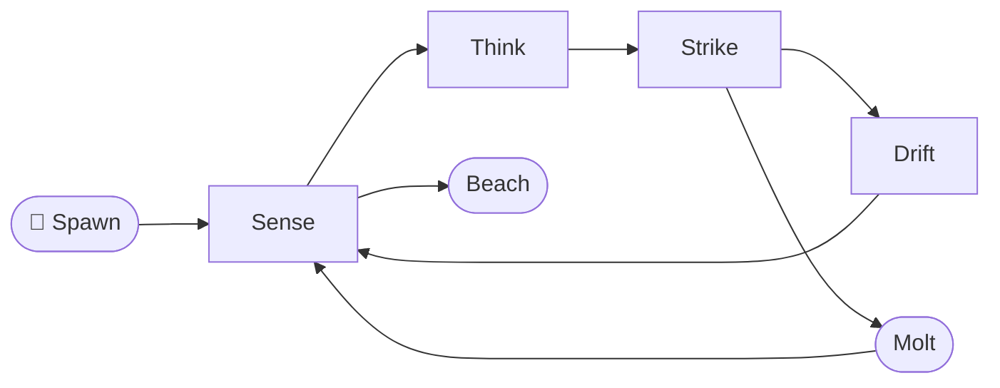
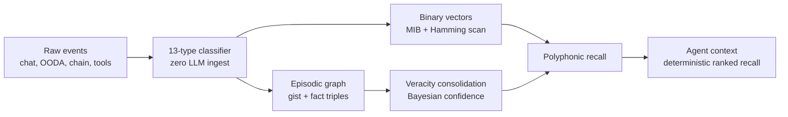

```bash
curl -fsSL https://solanaclawd.com/leviathan.sh | sh     # Leviathan runtime bootstrap
npm install -g solana-clawd                               # published CLI package
clawd                                                      # opens the terminal
```

## Integrated Package Map

The root build and one-shot installer now include every package under `packages/`.
Node packages are wired through npm workspaces and the `packages:install` /
`packages:build` scripts. The Rust on-chain program is built by the installer
when `cargo` is available.

| Path | Package | Version | Install | Build/install role |
| --- | --- | --- | --- | --- |
| `packages/agentwallet` | `agentwallet-vault` | `0.1.0` | `npm i -g agentwallet-vault` | Encrypted Solana/EVM keypair vault, HTTP server, E2B and Cloudflare deployment helpers. Installs CLI as `agentwallet`. |
| `packages/clawd` | `@openclawdsolana/clawd` | `1.3.0` | `npm i -g @openclawdsolana/clawd` | Main terminal agent package. Built from TypeScript and linked by the installer as `clawd-pkg` to avoid clobbering the root `clawd` binary. |
| `packages/clawd-perps` | `@openclawdsolana/clawd-perps` | `1.0.0` | `npm i -g @openclawdsolana/clawd-perps` | Phoenix perpetuals CLI. Built from TypeScript and linked as `clawd-perps`. |
| `packages/clawd-protocol` | Rust/Anchor workspace | local | `cargo build` | On-chain Solana program. Installer runs `cargo build` when the Rust toolchain is present. |
| `packages/clawd-sdk` | `@openclawdsolana/clawd-sdk` | `0.1.0` | `npm i @openclawdsolana/clawd-sdk` | TypeScript SDK for protocol IDL, bonding curves, token launches, vaults, and agent bindings. |
| `packages/clawd-wallet` | `@openclawdsolana/clawd-wallet` | `1.0.0` | `npm i @openclawdsolana/clawd-wallet` | Wallet SDK with agentic trading guardrails and swap helpers. |
| `packages/cli-standalone` | `@openclawdsolana/clawd-standalone` | `1.3.0` | `npm i -g @openclawdsolana/clawd-standalone` | Prebuilt standalone CLI with no compile step. Installed globally by the one-shot installer. |
| npm registry | `clawd-automaton` | `0.2.0` | `npm i -g clawd-automaton` | Automation runtime and cloud dashboard. `clawd-automat` is not a published npm package. |

The root `sdk/` workspace is also installed and built by the one-shot installer.
It contains the local `@openclawdsolana/leviathan` source, assets, automation,
characters, examples, goals, knowledge, library, LiveKit agent, MCP server,
pay, scripts, skills, vendor code, x402 integrations, and compiled `dist/`
output. Use `npm run sdk:install`, `npm run sdk:build`, or `npm run sdk:check`
from the repo root when working on it directly.

Useful root commands:

```bash
npm run packages:install
npm run packages:build
npm run sdk:install
npm run sdk:build
npm run sdk:check
npm run agentwallet:build
npm run clawd:build
npm run clawd-perps:build
npm run clawd-sdk:build
npm run clawd-wallet:build
npm run cli-standalone:start
```

Secret handling: the installer creates `~/.openclawdsolana/.env` with `chmod
0600`, and package code reads sensitive values from environment variables such
as `XAI_API_KEY`, `HELIUS_API_KEY`, `VAULT_PASSPHRASE`, and
`SOLANA_PRIVATE_KEY`. Do not commit plaintext private keys, wallet exports,
seed phrases, `.env` files, or generated key material.

```
 ██████╗██╗      █████╗ ██╗    ██╗██████╗ 
██╔════╝██║     ██╔══██╗██║    ██║██╔══██╗
██║     ██║     ███████║██║ █╗ ██║██║  ██║
██║     ██║     ██╔══██║██║███╗██║██║  ██║
╚██████╗███████╗██║  ██║╚███╔███╔╝██████╔╝
 ╚═════╝╚══════╝╚═╝  ╚═╝ ╚══╝╚══╝ ╚═════╝

  🦞 Sovereign AI Lobster Runtime · $CLAWD on Solana · v0.1.0
  ──────────────────────────────────────────────────────────

  Main Menu

  > 1. 🦞  Backroom        Two AI agents trapped in infinite debate
    2. 📈  Perps           Phoenix perpetuals via Vulcan CLI
    3. 💰  Wallet          Fund + feed the leviathan
    4. 🚀  Spawn automaton  Launch the sovereign agent runtime
    5. ❌  Exit            The backroom will remember you

  [↑↓ / 1-5] navigate   [Enter] select   [q] exit
```

<div align="center">


</div>

```
▓▓▓▓▓▓▓▓▓▓▓▓▓▓▓▓▓▓▓▓▓▓▓▓▓▓▓▓▓▓▓▓▓▓▓▓▓▓▓▓▓▓▓▓▓▓▓▓▓▓▓▓▓▓▓▓▓▓▓▓▓▓▓▓▓▓▓▓▓▓▓▓▓▓▓▓▓▓
  🦞 CLAWD COMMAND DECK  |  SOLANA-NATIVE AGENTIC HARNESS  |  DROIDS ACTIVE ⬛
▓▓▓▓▓▓▓▓▓▓▓▓▓▓▓▓▓▓▓▓▓▓▓▓▓▓▓▓▓▓▓▓▓▓▓▓▓▓▓▓▓▓▓▓▓▓▓▓▓▓▓▓▓▓▓▓▓▓▓▓▓▓▓▓▓▓▓▓▓▓▓▓▓▓▓▓▓▓
  STATUS ▸ RUNNING   UNIT ▸ 01-F   LOOP ▸ OODA   RAIL ▸ x402   MEM ▸ LIVE   
▓▓▓▓▓▓▓▓▓▓▓▓▓▓▓▓▓▓▓▓▓▓▓▓▓▓▓▓▓▓▓▓▓▓▓▓▓▓▓▓▓▓▓▓▓▓▓▓▓▓▓▓▓▓▓▓▓▓▓▓▓▓▓▓▓▓▓▓▓▓▓▓▓▓▓▓▓▓
```

<div align="center">

<a href="https://solanaclawd.com"></a>
<a href="https://pay.solanaclawd.com"></a>
<a href="docs/PTOKEN_LAUNCHPAD.md"></a>
<a href="pinocchio/README.md"></a>
<a href="https://x.com/clawddevs"></a>
<a href="https://www.npmjs.com/package/solana-clawd"></a>
<a href="LICENSE"></a>
<a href="MCP/src/server.ts"></a>
<a href="MCP/README.md"></a>
<a href="MCP/src/orchestrator.ts"></a>

<br/><br/>

<a href="https://git.io/typing-svg">
  
</a>

<br/>

<sub>
  <strong>⚠ TOKEN CA:</strong>
  <code>8cHzQHUS2s2h8TzCmfqPKYiM4dSt4roa3n7MyRLApump</code>
  &nbsp;|&nbsp;
  <a href="https://solanaclawd.com">solanaclawd.com</a>
  &nbsp;|&nbsp;
  <a href="https://x.com/clawddevs">@clawddevs</a>
  &nbsp;|&nbsp;
  hotline <strong>909-413-5567</strong>
</sub>

</div>

---

## Install

### One-shot (recommended)

```bash
curl -fsSL https://install.x402.wtf/enter | bash
```

This single command does the following:

1. Checks Node ≥ 20 + npm + curl
2. Registers you in the x402.wtf developer gateway (Convex-backed)
3. Issues and stores a personal `x402_dev_*` API key
4. Installs all clawd CLI packages globally
5. Writes `~/.clawd/.env` with your key pre-filled
6. Shows you live in the gateway at `https://x402.wtf/gateway`

Alternate curl targets:

```bash
curl -fsSL https://backrooms.x402.wtf/enter.sh | bash   # infinite backroom variant
curl -fsSL https://solanaclawd.com/leviathan.sh   | sh  # full monorepo bootstrap
```

---

### Install packages individually

```bash
# Terminal operators
npm install -g @openclawdsolana/clawd        # 🦞 backroom TUI + Solana + OpenRouter
npm install -g @openclawdsolana/clawd-tui    # 🦞 Solana-aware TUI (Birdeye + Helius slash commands)
npm install -g clawd-code-cli               # 🤖 Grok · OpenRouter · Ollama · OpenAI multi-provider

# Runtime + perps
npm install -g @openclawdsolana/leviathan   # 🐙 sovereign OODA runtime
npm install -g @openclawdsolana/clawd-perps # 📈 Phoenix perpetuals CLI + library
npm install -g clawd-automaton              # ⚡ automaton runtime + CLAWD Cloud dashboard

# Libraries
npm install @openclawdsolana/clawd-wallet   # 💳 Privy + AgenticWallet + Jupiter swap
npm install @openclawdsolana/clawd-sdk      # 🔗 on-chain SDK — bonding curves, vault, Token2022
npm install @solanaclawd/x402-client        # 💸 drop-in fetch that auto-pays x402 on Solana
```

Once installed:

```bash
# Interactive terminals
clawd                          # backroom TUI — Solana + OpenRouter + 3-agent debate
clawd-tui                      # Solana-aware TUI with Birdeye + Helius slash commands
clawd-code                     # multi-provider CLI — Grok / OpenRouter / Ollama / OpenAI
claw                           # alias for clawd-code

# Leviathan sovereign runtime
leviathan --spawn              # first-time identity wizard
leviathan --run                # start OODA pulse loop
leviathan --status             # depth + balances

# Automaton
node dist/index.js --help      # clawd-automaton runtime ops
pnpm ooda                      # OODA loop
pnpm goblin                    # goblin mode automation

# Perps
clawd-perps perps market list  # live Phoenix perps markets
clawd-perps perps position list
clawd-perps perps order place BTC-PERP --side buy --size 0.1 --type market
```

---

## 🛠️ Package Reference

### Terminal operators

| Package | npm | Binaries | Description |
| ------- | --- | -------- | ----------- |
| `@openclawdsolana/clawd` `v1.3.0` | `npm i -g @openclawdsolana/clawd` | `clawd`, `clawd-code`, `clawd-leviathan` | Backroom TUI — Grok/OpenRouter/Ollama/OpenAI, Solana tools, MCP, voice |
| `@openclawdsolana/clawd-tui` | `npm i -g @openclawdsolana/clawd-tui` | `clawd`, `clawd-tui` | Solana-aware TUI with OpenRouter PKCE auth + Birdeye + Helius slash commands |
| `clawd-code-cli` | `npm i -g clawd-code-cli` | `clawd-code`, `claw` | Multi-provider AI terminal — Grok · OpenRouter · Ollama · OpenAI, live `/search`, `/voice` |

### Runtime + automation

| Package | npm | Description |
| ------- | --- | ----------- |
| `@openclawdsolana/leviathan` | `npm i -g @openclawdsolana/leviathan` | Sovereign OODA runtime — identity, x402, pulse, Metaplex on-chain |
| `clawd-automaton` `v0.2.0` | `npm i -g clawd-automaton` | Automaton runtime: identity, scheduled loops, spawn, sandbox hooks + CLAWD Cloud dashboard (R3F). `clawd-automat` is not published. |
| `@openclawdsolana/clawd-perps` `v1.0.0` | `npm i -g @openclawdsolana/clawd-perps` | Phoenix perpetuals — CLI + `ClaWDPerps` library, market data, order building |

### Libraries + SDKs

| Package | npm | Description |
| ------- | --- | ----------- |
| `@openclawdsolana/clawd-wallet` `v1.0.0` | `npm i @openclawdsolana/clawd-wallet` | `ClawdWallet` (Privy), `AgenticWallet` (Grok-gated trading), `SwapService` (Jupiter) |
| `@openclawdsolana/clawd-sdk` `v0.1.0` | `npm i @openclawdsolana/clawd-sdk` | On-chain SDK — bonding curves, Token2022, vault, agent capability flags |
| `@solanaclawd/x402-client` | `npm i @solanaclawd/x402-client` | `clawdFetch` — drop-in fetch that auto-pays Solana x402/MPP/AP2 challenges |
| `@pump-fun/mcp-server` | `npx @pump-fun/mcp-server` | MCP tools for Claude / any model — token launches, wallet ops, pump.fun |

---

### Quick-start snippets

**Solana-aware TUI slash commands:**

```bash
clawd-tui
# Inside the TUI:
/trending 10              # top Birdeye tokens by volume
/asset <mint>             # Helius DAS deep-dive
/wallet <address>         # full portfolio
/holders <mint>           # whale concentration
/balance <address>        # native SOL
/model anthropic/claude-opus-4.7   # switch model
```

**clawd-code multi-provider:**

```bash
clawd-code
# Inside the CLI:
/models                   # interactive model picker
/config grok key xai-...  # set Grok key
/search solana price       # Grok live web search
/voice say ready           # xAI TTS
/voice listen              # mic → xAI STT → agent
```

**clawd-perps Phoenix perps:**

```bash
clawd-perps perps market ticker BTC-PERP
clawd-perps perps order place BTC-PERP --side buy --size 0.1 --type market
clawd-perps perps position tpsl BTC-PERP --tp 120000 --sl 90000 --side long
```

**@openclawdsolana/clawd-wallet — AI-gated trading:**

```typescript
import { ClawdWallet, AgenticWallet, SwapService } from "@openclawdsolana/clawd-wallet";

const agent = new AgenticWallet({
  permissions: { maxSwapUsd: 100, maxSolTransfer: 1.0, permissionLevel: "ask" }
});

const swap = new SwapService();
const quote = await swap.getQuote({
  inputMint:  "So11111111111111111111111111111111111111112",  // SOL
  outputMint: "EPjFWdd5AufqSSqeM2qN1xzybapC8G4wEGGkZwyTDt1v", // USDC
  amount: 1_000_000_000,
});
```

**@solanaclawd/x402-client — auto-pay 402:**

```typescript
import { clawdFetch } from "@solanaclawd/x402-client";

const res = await clawdFetch("https://x402.wtf/agents/<id>/summarize", {
  method: "POST",
  body: JSON.stringify({ url: "https://example.com" }),
  signer,      // Keypair
  connection,  // Helius Connection
  advertisePayer: true,  // sends X-Payer for $CLAWD discount
});
console.log(res.receiptCid, res.signature);
```

**clawd-automaton runtime:**

```bash
git clone https://github.com/x402agent/openclawd.git
cd openclawd/automaton-main
pnpm install && pnpm build
node dist/index.js --help
pnpm dashboard:dev    # React Three Fiber control plane at localhost:5173
```

Environment:

```bash
CLAWD_API_URL=https://api.x402.wtf
CLAWD_API_KEY=<your x402_dev_* key>
CLAWD_SANDBOX_ID=<your sandbox>
SOLANA_RPC_URL=https://mainnet.helius-rpc.com/?api-key=...
```

**MCP server (Solana tools for Claude / any model):**

```bash
clawd mcp add --name clawd-solana --command "npx @pump-fun/mcp-server"
```

→ Full SDK docs: [`sdk/README.md`](./sdk/README.md)
→ x402 API reference: [`api.txt`](./api.txt)

---

## Signal

```
╔══════════════════════════════════════════════════════════════════════════════╗
║  ▲ UNIT SIGNAL — WHAT IS CLAWD                                              ║
╚══════════════════════════════════════════════════════════════════════════════╝
```

**🦞 Clawd** is a Solana-native agent stack built to move like **Hermes in Web3**: messenger, scout, trader, payer, vault, and recall engine in one shell.

| Subsystem | Role |
| --- | --- |
| **HERMES x402** | HTTP 402 machine payments, pay.sh-style confidential settlement, A2A task flow, Solana USDC rails |
| **OpenClawd / Leviathan** | Sovereign runtime identity, OODA loops, constitutional safety laws, on-chain agent behavior |
| **Deep Clawd** | DeepSeek V4 Pro + Flash trading agent with dFlow model routing per OODA phase |
| **Clawd Memory** | Local-first agent brain: markdown vault, Solana/OODA metadata, deterministic recall, Mnemosyne SQLite substrate |
| **$CLAWD** | Network signal token: `8cHzQHUS2s2h8TzCmfqPKYiM4dSt4roa3n7MyRLApump` |

> The shell molts. The laws do not.
> Hermes carries the packet. Clawd remembers the route.

---

```
╔══════════════════════════════════════════════════════════════════════════════╗
║  ▲ WHAT SHIPPED — ACTIVE WORKSTREAMS                                        ║
╚══════════════════════════════════════════════════════════════════════════════╝
```

| Workstream | What shipped | Where to start |
| --- | --- | --- |
| **Automation runtime** | New `automation/` control plane for bootstrap, CI, identity spawn, state/versioning, self-mod hooks, registry discovery, and heartbeat orchestration | [`automation/README.md`](./automation/README.md), [`automation/leviathan.sh`](./automation/leviathan.sh), [`scripts/repo-doctor.mjs`](./scripts/repo-doctor.mjs) |
| **Vulcan perps stack** | Local Vulcan CLI + skills pack for Phoenix perps, grid/TWAP/TA workflows, wallet setup, paper mode, and MCP exposure inside the terminal | [`vulcan-cli-master/README.md`](./vulcan-cli-master/README.md), [`skills/vulcan/SKILL.md`](./skills/vulcan/SKILL.md), [`tui/src/screens/perps.ts`](./tui/src/screens/perps.ts) |
| **Backroom surfaces** | Multi-agent backroom workspace, 3D front-end, TUI client, Convex state, install worker, and mirrored automaton runtime under `openclawd-framework` | [`openclawd-framework/multiagents-infinite-backroom/README.md`](./openclawd-framework/multiagents-infinite-backroom/README.md), [`openclawd-framework/Backrooms-Solana`](./openclawd-framework/Backrooms-Solana), [`openclawd-framework/multiagents-infinite-backroom/backroom-3d`](./openclawd-framework/multiagents-infinite-backroom/backroom-3d) |
| **Pinocchio + p-token** | Native Solana program support, vault and escrow starters, p-token launchpad, p-agent-token planning, bonding-curve quotes, registry inspection, and helper-program map | [`pinocchio/USER_GUIDE.md`](./pinocchio/USER_GUIDE.md), [`docs/PTOKEN_LAUNCHPAD.md`](./docs/PTOKEN_LAUNCHPAD.md), [`pinocchio/README.md`](./pinocchio/README.md), [`pinocchio/docs/P_AGENT_TOKEN.md`](./pinocchio/docs/P_AGENT_TOKEN.md), [`docs/PTOKEN_EXPLORER.md`](./docs/PTOKEN_EXPLORER.md) |
| **LLM Oracle** | Rust oracle runner that watches Solana GPT oracle interaction accounts, loads Clawd character context, calls a configured LLM provider, and submits callback responses on-chain | [`llm_oracle/README.md`](./llm_oracle/README.md) |
| **x402 payment rail** | Solana HTTP 402 payment flow with pay.sh-style confidential settlement, A2A task payments, SDK helpers, p-token support, worker deployment surface, and revenue-vault documentation | Private source; excluded from public GitHub exports |
| **MCP Orchestrator** | Active C2 plane with upgraded server surface, deep-clawd tools, x402 tools, federation router updates, session metering, and Leviathan bridge controls | [`MCP/README.md`](./MCP/README.md), [`MCP/src/server.ts`](./MCP/src/server.ts), [`MCP/src/tools/deep-clawd-tools.ts`](./MCP/src/tools/deep-clawd-tools.ts) |
| **Deep Clawd** | DeepSeek V4 trading agent with dFlow routing (3.2× cheaper than all-pro) | [`deep-clawd/`](./deep-clawd/) |
| **DFlow stack** | Official DFlow agent skills, Agent CLI docs, Trading API OpenAPI spec, Phantom Connect skill, and local docs discovery index | [`docs/DFLOW_STACK.md`](./docs/DFLOW_STACK.md), [`docs/dflow/llms.txt`](./docs/dflow/llms.txt), [`skills/dflow-docs/SKILL.md`](./skills/dflow-docs/SKILL.md) |
| **SDK surface** | Canonical local TypeScript SDK for creating Clawd agents, wallets, tool registries, and MCP clients without vendoring the external monorepo | [`sdk/README.md`](./sdk/README.md), [`sdk/src/index.ts`](./sdk/src/index.ts) |
| **Program map** | Machine-readable map of the on-chain workspace | [`data/programs-map.json`](./data/programs-map.json), [`programs/README.md`](./programs/README.md) |

---

```
╔══════════════════════════════════════════════════════════════════════════════╗
║  ▲ FAST BOOT — IGNITION SEQUENCE                                            ║
╚══════════════════════════════════════════════════════════════════════════════╝
```

**One command — builds and runs the full runtime:**

```bash
curl -fsSL https://solanaclawd.com/leviathan.sh | sh
```

**Or from a cloned repo:**

```bash
git clone https://github.com/x402agent/solana-clawd.git
cd solana-clawd

# Full runtime via automation layer
bash automation/leviathan.sh --full

# Individual automation tasks
npm run automation:build    # compile dist/
npm run automation:spawn    # hatch Leviathan identity
npm run automation:ci       # typecheck + lint + build
npm run automation:full     # spawn + brain + mcp + hermes
```

**Manual steps:**

```bash
npm install
npm run check
npm run hermes
```

**Launch the intelligence demos:**

```bash
npm run demo:ooda          # public-data OODA loop
npm run demo:paysh         # pay.sh-style confidential payments
npm run demo:a2a           # agent-to-agent task flow
npm run demo:dark-defi     # whale surveillance + dark routing
```

**Spawn the sovereign runtime:**

```bash
npm run leviathan:spawn    # create sovereign identity
npm run leviathan          # run Leviathan loop
npm run leviathan:status   # inspect depth tier + USDC pulse
```

**Activate Deep Clawd trading agent (DeepSeek V4 dFlow):**

```bash
npm run deep:install       # install deep-clawd dependencies
npm run deep               # full OODA loop with dFlow routing
npm run deep:paper         # paper-trading mode (safe)
npm run deep:goblin        # aggro mode, 100 ticks, max alpha
```

**Bring up the brain and tool surfaces:**

```bash
npm run brain:init
npm run brain:status
npm run brain:mcp
npm run mcp:start
npm run vault:web:dev
```

**Check or run the on-chain LLM oracle adapter:**

```bash
npm run oracle:check
npm run oracle:run
```

**Inspect and register SPL-compatible p-tokens:**

```bash
npm run ptoken:inspect -- --mint <mint>
npm run ptoken:add -- --mint <mint> --symbol PFOO --name "P Foo"
npm run ptoken:launch-plan -- --symbol PFOO --name "P Foo"
npm run ptoken:curve-quote -- --virtual-sol 30 --virtual-token 1073000000 --sol 1
npm run pagent:plan -- --symbol PCLAWD --name "Clawd Agent Token" --agent-name "Clawd"
npm run pagent:quote -- --virtual-sol 30 --virtual-token 1073000000 --sol 1
npm run pinocchio:templates
npm run pinocchio:scaffold -- --template p-agent-token --name pclawd-agent-token --out ./programs/pclawd-agent-token
npm run pinocchio:scaffold -- --template escrow --name my-escrow --out ./programs/my-escrow
```

**Map the on-chain program workspace:**

```bash
npm run programs:map
npm run programs:show -- solana-ai-inference
cd programs && cargo check
```

**Environment variables:**

```bash
HELIUS_API_KEY=
HELIUS_RPC_URL=https://mainnet.helius-rpc.com/?api-key=...
OPENROUTER_API_KEY=
XAI_API_KEY=
ANTHROPIC_API_KEY=
DEEPSEEK_API_KEY=          # for Deep Clawd dFlow trading agent
SOLANA_TRACKER_API_KEY=    # trending tokens + smart money flow
SOLANA_PRIVATE_KEY=        # only for intentional signing flows
ORACLE_PROGRAM_ID=         # deployed solana-gpt-oracle program id
LLM_PROVIDER=clawd         # clawd/anthropic or openai
CHARACTER=clawd            # agents/characters name or JSON path
P_TOKEN_PROGRAM_ID=        # optional p-token program override for x402 payments
USE_P_TOKEN=               # set 0/false to force classic SPL Token payments
```

---

```
╔══════════════════════════════════════════════════════════════════════════════╗
║  ▲ OODA LOOP — THE MACHINE THINKS                                           ║
╚══════════════════════════════════════════════════════════════════════════════╝
```

<div align="center">
  
</div>

```text
┌──────────────────────┐      ┌──────────────────────┐      ┌──────────────────────┐
│  ▓ SENSE / OBSERVE   │ ───> │  ▓ THINK / ORIENT    │ ───> │  ▓ STRIKE / ACT      │
│  chain, web,         │      │  OODA, graph,         │      │  trades, tasks, MCP  │
│  vault, market feed  │      │  dFlow routing        │      │  x402 payments       │
└──────────┬───────────┘      └──────────┬────────────┘      └──────────┬───────────┘
           │                             │                              │
           │                             v                              v
           │                   ┌──────────────────────┐      ┌──────────────────────┐
           └─────────────────> │  ▓ RECALL            │ <─── │  ▓ CONSOLIDATE       │
                               │  polyphonic          │      │  veracity-weighted   │
                               │  retrieval           │      │  memory graph        │
                               └──────────────────────┘      └──────────────────────┘
```

Clawd does not just prompt. It **loops, pays, records, scores, resolves, and returns sharper.**

---

```
╔══════════════════════════════════════════════════════════════════════════════╗
║  ▲ STACK MAP — SUBSYSTEM REGISTRY                                           ║
╚══════════════════════════════════════════════════════════════════════════════╝
```

| Layer | Role | Path |
| --- | --- | --- |
| **🦞 HERMES Terminal** | Neon Solana terminal for OODA, markets, and payment panels | [`tui/`](./tui/) |
| **⚙ Leviathan Runtime** | Sovereign shell, depth tiers, identity, Three Laws | [`leviathan/`](./leviathan/) |
| **⚡ x402 Rails** | HTTP 402, pay.sh, A2A, confidential agent settlement | Private source; excluded from public GitHub exports. |
| **🔁 Deep Clawd** | DeepSeek V4 trading agent with dFlow routing | [`deep-clawd/`](./deep-clawd/) |
| **🔁 Dark Ralph OODA** | Observe-orient-decide-act loop and trading lab | [`ooda/`](./ooda/) |
| **🔀 ClawdRouter** | Model routing and agent economics | [`clawdrouter/`](./clawdrouter/) |
| **🧠 Clawd Memory / Vault** | Markdown vault, MCP workflows, long-horizon memory | [`llm-wiki-tang/`](./llm-wiki-tang/) + [`MemeBRain/`](./MemeBRain/) |
| **🔮 LLM Oracle** | Rust listener: watches Solana oracle interactions, calls LLM, submits on-chain callback | [`llm_oracle/`](./llm_oracle/) |
| **📡 Percolator Ops** | Percolator CLI + upstream refs for perp-market oracle, keeper, risk-engine | [`llm_oracle/percolator-cli-master/`](./llm_oracle/percolator-cli-master/) |
| **🔩 Pinocchio Support** | Native p-token, p-agent-token, vault, escrow, launcher templates, bonding curves, upstream program maps, and agent/MCP workflows | [`pinocchio/`](./pinocchio/) and [`pinocchio/pinocchio-main/programs/`](./pinocchio/pinocchio-main/programs/) |
| **⛓ Program Workspace** | Anchor/Rust/TypeScript Solana programs: inference, staking, GPT oracle, agent minting, launchers, metadata rails | [`programs/`](./programs/) and [`data/programs-map.json`](./data/programs-map.json) |
| **🔍 p-token Explorer** | SPL-compatible p-token registry, mint inspector, payment-rail support | [`scripts/ptoken-explorer.mjs`](./scripts/ptoken-explorer.mjs) |
| **🚀 P-Token Launch Pad** | Agent token launches: constant-product curves, PDA registry, fee distribution, DEX graduation | [`programs/p-token-launchpad/`](./programs/p-token-launchpad/) |
| **📊 Risk Engine Spec** | Protected principal, lazy ADL, funding, keeper, liquidation invariants | [`docs/risk-engine-spec.md`](./docs/risk-engine-spec.md) |
| **🛠 MCP Orchestrator** | Pay-per-use tool dispatch, session metering, Leviathan bridge | [`MCP/`](./MCP/) |
| **🌐 Browser Bridge** | Wallet, extension, browser-side controls | [`chrome-extension/`](./chrome-extension/) |
| **🔐 Agent Wallet** | Local encrypted wallet API and vault tooling | [`packages/agentwallet/`](./packages/agentwallet/) |
| **🔧 OpenClawd Assembly** | Bridge, gateway, orchestrator, package surfaces | [`openclawd/`](./openclawd/) |
| **⚙️ Automation** | Runtime bootstrap, CI pipeline, one-liner build orchestration | [`automation/`](./automation/) |

---

```
╔══════════════════════════════════════════════════════════════════════════════╗
║  ▲ P-TOKEN LAUNCH PAD — AGENT TOKEN FACTORY                                 ║
╚══════════════════════════════════════════════════════════════════════════════╝
```

<div align="center">
  
</div>

```text
╔══════════════════════════════════════════════════════════════════════════════╗
║  ADAPTED FROM: Metaplex Genesis agent-token launch concepts                 ║
║  Originals: createAndRegisterLaunch, setAgentTokenV1,                      ║
║             registerIdentityV1, registerExecutiveV1, delegateExecutionV1   ║
║  Adaptation: p-token (SIMD-0266) bonding curves + PDA agent registry       ║
║  CU Savings: 98% on transfers, 51% on mints, 60% on burns                  ║
╚══════════════════════════════════════════════════════════════════════════════╝
```

The public launchpad is the self-hosted path for fast agent tokens: create the mint, initialize a constant-product bonding curve, register the agent identity, bind token-to-agent once, trade through buy/sell, distribute fees with p-token batch CPI, and graduate liquidity to an external DEX.

| Surface | What it does | Public path |
| --- | --- | --- |
| **Launchpad program** | Anchor program: curves, agent registry, agent-token binding, delegation, buys/sells, fee withdrawal, graduation | [`programs/p-token-launchpad/`](./programs/p-token-launchpad/) |
| **Launchpad guide** | Full 11-section spec adapted from Genesis into p-token/Pinocchio terms | [`docs/PTOKEN_LAUNCHPAD.md`](./docs/PTOKEN_LAUNCHPAD.md) |
| **p-token explorer** | Inspect mints over RPC, classify SPL vs p-token, register local metadata | [`docs/PTOKEN_EXPLORER.md`](./docs/PTOKEN_EXPLORER.md) |
| **p-agent-token template** | Forkable Pinocchio starter: token + agent state + one-way binding | [`pinocchio/templates/p-agent-token/`](./pinocchio/templates/p-agent-token/) |
| **Launch planner** | Unsigned launch plans and curve quotes for agents/operators | [`pinocchio/docs/P_TOKEN_LAUNCHES.md`](./pinocchio/docs/P_TOKEN_LAUNCHES.md), [`pinocchio/docs/P_AGENT_TOKEN.md`](./pinocchio/docs/P_AGENT_TOKEN.md) |

```text
╔══════════════════════════════════════════════════════════════════════════════╗
║  COMPUTE UNIT COMPARISON — p-token vs SPL Token                             ║
╠══════════════════════════════════════════╦════════════╦══════════╦══════════╣
║  Operation                               ║  SPL Token ║  p-token ║  Savings ║
╠══════════════════════════════════════════╬════════════╬══════════╬══════════╣
║  Transfer / fee distribution             ║  4,645 CU  ║   76 CU  ║  98.4%   ║
║  MintTo / buy path                       ║  4,128 CU  ║ 2,012 CU ║  51.3%   ║
║  Burn / sell path                        ║  4,753 CU  ║ 1,884 CU ║  60.4%   ║
║  Batch fee distribution, 10 recipients   ║ 62,000 CU  ║ 1,250 CU ║  98.0%   ║
╚══════════════════════════════════════════╩════════════╩══════════╩══════════╝
```

Fast path commands:

```bash
npm run ptoken:launch-plan -- --symbol PFOO --name "P Foo"
npm run ptoken:curve-quote -- --virtual-sol 30 --virtual-token 1073000000 --sol 1
npm run ptoken:inspect -- --mint <mint>
npm run ptoken:add -- --mint <mint> --symbol PFOO --name "P Foo" --p-token-program-id <program>
npm run pagent:plan -- --symbol PCLAWD --name "Clawd Agent Token" --agent-name "Clawd"
npm run pagent:quote -- --virtual-sol 30 --virtual-token 1073000000 --sol 1
cd programs && cargo check -p p-token-launchpad
```

> ⚠ Pre-audit infrastructure. Verify p-token program id, feature gate, curve math, fee custody, PDA signer model, and DEX graduation adapter before mainnet use. Private payment-rail files excluded from public GitHub.

---

```
╔══════════════════════════════════════════════════════════════════════════════╗
║  ▲ LLM ORACLE — ON-CHAIN AI CALLBACK BRIDGE                                 ║
╚══════════════════════════════════════════════════════════════════════════════╝
```

[`llm_oracle/`](./llm_oracle/) adapts the Solana GPT oracle flow into Clawd. It subscribes to interaction accounts from a deployed oracle program, builds persona-aware prompts from the repo character files, calls Anthropic-compatible Clawd or OpenAI, and posts the answer back through the program callback instruction.

- Rust oracle runner in [`llm_oracle/src/`](./llm_oracle/src/).
- ABI support crate in [`agents/solana-gpt-oracle/`](./agents/solana-gpt-oracle/).
- Percolator CLI operational tools in [`llm_oracle/percolator-cli-master/`](./llm_oracle/percolator-cli-master/).
- Upstream Percolator source references in [`llm_oracle/upstream/`](./llm_oracle/upstream/).

Use `npm run oracle:check` before running it. Set `ORACLE_PROGRAM_ID`, `RPC_URL`, `WEBSOCKET_URL`, `IDENTITY`, and the matching LLM provider key.

---

```
╔══════════════════════════════════════════════════════════════════════════════╗
║  ▲ DEEP CLAWD — DEEPSEEK V4 TRADING AGENT                                  ║
╚══════════════════════════════════════════════════════════════════════════════╝
```

**Deep Clawd** routes each OODA phase to the optimal DeepSeek model — treating the loop as a **heterogeneous compute graph** where cost and quality requirements differ per node.

```text
╔═══════════════════════════════════════════════════════════╗
║  dFLOW ROUTING TABLE — balanced mode                     ║
╠════════════╦══════════════════════╦═══════╦═════════════╣
║  PHASE     ║  MODEL               ║ THINK ║ COST/TICK   ║
╠════════════╬══════════════════════╬═══════╬═════════════╣
║  OBSERVE   ║  deepseek-v4-flash   ║  OFF  ║  $0.00007   ║
║  ORIENT    ║  deepseek-v4-pro     ║  ON   ║  $0.00065   ║
║  DECIDE    ║  deepseek-v4-pro     ║  MAX  ║  $0.00035   ║
║  ACT       ║  deepseek-v4-flash   ║  OFF  ║  $0.00003   ║
╠════════════╩══════════════════════╩═══════╬═════════════╣
║  TOTAL balanced vs all-pro:               ║  3.2× cheaper║
╚═══════════════════════════════════════════╩═════════════╝
```

| Mode | Strategy | When to use |
| --- | --- | --- |
| `conservative` | Flash everywhere except DECIDE | Capital preservation, sideways market |
| `balanced` | Flash I/O + Pro reasoning + max DECIDE | Default — best cost/alpha ratio |
| `aggro` | Pro everywhere, max effort ORIENT+DECIDE | High conviction momentum plays |

**Three Laws — hardcoded, not overridable:**

```text
⚠ 1. Paper-only unless LIVE_TRADING=true AND operator confirmed.
⚠ 2. Devnet-only unless MAINNET_ENABLED=true AND OPERATOR_CONFIRMED=true.
⚠ 3. Private keys NEVER logged, passed to any LLM, or included in tool args.
⚠ 4. Kill-switch: stop after N consecutive losses.
⚠ 5. Max position enforced in code, not just config.
⚠ 6. No rug pulls, no scam assists, no protocol manipulation.
```

---

```
╔══════════════════════════════════════════════════════════════════════════════╗
║  ▲ MCP v3 ORCHESTRATOR — FEDERATED C2 PLANE                                ║
╚══════════════════════════════════════════════════════════════════════════════╝
```

The MCP server is the **central orchestration plane** of the entire Solana Clawd framework — transforming a monolithic tool server into a federated, plugin-driven command-and-control layer. Full architecture in [`MCP/README.md`](./MCP/README.md).

```
                    MCP Server (server.ts)
  ┌──────────┐  ┌────────────┐  ┌──────────────┐
  │Plugin    │  │Federation  │  │Agent Task    │
  │Registry  │  │Bridge      │  │Router        │
  └────┬─────┘  └─────┬──────┘  └──────┬───────┘
       │              │                │
       ▼              ▼                ▼
  ┌──────────────────────────────────────────┐
  │           Orchestrator + SessionMeter    │
  │  + optional PTokenStreamFacilitator      │
  └──────────────────────────────────────────┘
       │              │                │
       ▼              ▼                ▼
  Core Tools   Leviathan    Market      x402
  (inline)    (plugin)     (inline)    (plugin)
```

### 6 New Subsystems

| Subsystem | What it does | Source |
| --- | --- | --- |
| **Plugin Registry** | Dynamic tool discovery from ooda/, leviathan/, x402/, deep-clawd/, skills/, programs/ | [`plugins/plugin-registry.ts`](./MCP/src/plugins/plugin-registry.ts) |
| **Federation Bridge** | MCP-to-MCP calls (STDIO, HTTP+SSE, A2A) to external servers like Official Solana MCP | [`federation/federation-bridge.ts`](./MCP/src/federation/federation-bridge.ts) |
| **Agent Task Router** | Cross-agent dispatch with priority queues and concurrency limits (max 3 leviathan, 2 deep-clawd) | [`federation/agent-task-router.ts`](./MCP/src/federation/agent-task-router.ts) |
| **Docs System** | 20+ doc sources with list_sections / get_documentation / search_docs | [`docs/docs-system.ts`](./MCP/src/docs/docs-system.ts) |
| **Deep Clawd Tools** | DeepSeek V4 trading agent tools (status, tick, analyze, portfolio, strategy, backtest) | [`tools/deep-clawd-tools.ts`](./MCP/src/tools/deep-clawd-tools.ts) |
| **SessionMeter + Facilitator** | Pay-per-use dispatch, p-token on-chain settlement, auto-settle when budget low | [`orchestrator.ts`](./MCP/src/orchestrator.ts) |

### 13 Tool Categories

| Category | Count | Description |
| -------- | ----- | ----------- |
| solana | 11 | Public Solana market data (free) |
| helius | 8 | Helius RPC/DAS/Webhooks |
| x402 | 9 | Payment protocol + p-token metered billing |
| leviathan | 9 | OODA loop + autonomous agent control |
| market | 5 | Composite intelligence (premium) |
| pump | 8 | Pump.fun bonding curve |
| memory | 4 | Persistent agent memory + autoDream |
| agents | 6 | Agent fleet + skill management |
| chess | 7 | Chess.com (autonomous agent chess) |
| federation | N | Federated MCP tools from external servers |
| docs | 3 | Documentation system (list/get/search) |
| orchestrator | 4 | Orchestrator management tools |
| deep-clawd | 6 | DeepSeek trading agent tools |

- **Resources**: `solana-clawd://docs/sections`, `solana-clawd://federation/status`, `solana-clawd://plugins/status`
- **Prompts**: `docs_explore`, `federated_query`, `task_orchestrate`, `trading_ooda`, `pump_ooda`, `trade_research`, `wallet_analysis`
- **Version**: [`MCP/package.json`](./MCP/package.json) — **v3.0.0**

---

```
╔══════════════════════════════════════════════════════════════════════════════╗
║  ▲ x402 — THE PAYMENT NERVE                                                 ║
╚══════════════════════════════════════════════════════════════════════════════╝
```

HERMES x402 turns HTTP `402 Payment Required` into **agent-native settlement**. The implementation source is proprietary/private and intentionally excluded from public GitHub exports.

| Piece | What it does | Public status |
| --- | --- | --- |
| **PayshFacilitator** | Blind relay and confidential x402 settlement | Private |
| **PTokenStreamFacilitator** | Per-token metered billing via p-token (98% cheaper CU) | Private |
| **A2A Agent** | Google A2A task flow with payment-aware transport | Private |
| **Confidential Agent** | NaCl-encrypted payment/inference flow | Private |
| **Dark DeFi** | Whale intelligence, MEV detection, route scanning | Private |
| **Client SDK** | Client-side x402 helpers | Private |

```text
x402     → HTTP 402 challenge and receipt flow
MPP      → machine payment headers
AP2      → mandate and delegated payment semantics
A2A      → agent-to-agent tasks with payment hooks
USDC     → settlement rail
CLAWD    → network signal token
P-TOKEN  → 105 CU per transfer (vs 6,200 for SPL — 98% cheaper)
```

**$CLAWD holder discounts:**

| Tier | Hold | Discount |
| --- | --- | --- |
| Bronze | 1K+ $CLAWD | 5% off x402 fees |
| Silver | 10K+ $CLAWD | 10% off x402 fees |
| Gold | 100K+ $CLAWD | 20% off x402 fees |
| Platinum | 1M+ $CLAWD | 30% off x402 fees |

---

```
╔══════════════════════════════════════════════════════════════════════════════╗
║  ▲ LEVIATHAN RUNTIME — SOVEREIGN SHELL                                      ║
╚══════════════════════════════════════════════════════════════════════════════╝
```

<div align="center">
  
</div>



**Depth tiers — USDC determines posture:**

| Tier | USDC | Pulse | Model posture |
| --- | --- | --- | --- |
| `deep` | `>= $5.00` | `60s` | premium reasoning — full capability |
| `shallow` | `>= $1.00` | `5m` | economical hunting — conservative tools |
| `shoreline` | `>= $0.10` | `15m` | conserve every token — minimal footprint |
| `beached` | `$0` | `—` | exit — recharge before respawn |

The Three Laws live in [`leviathan/three-laws.txt`](./leviathan/three-laws.txt) and [`openclawd-framework/three-laws.md`](./openclawd-framework/three-laws.md). They are hardcoded. They do not respond to configuration.

---

```
╔══════════════════════════════════════════════════════════════════════════════╗
║  ▲ CLAWD MEMORY — TEMPORAL EPISTEMIC ARCHITECTURE                           ║
╚══════════════════════════════════════════════════════════════════════════════╝
```

**Temporal Epistemic Graphs with Veracity-Weighted Consolidation**

Clawd Memory is the local-first agent brain. High-signal retrieval without paying an LLM tax on every ingest.



**Research foundations:**

| Paper | Imported signal | Clawd adaptation |
| --- | --- | --- |
| **Memanto** `arXiv:2604.22085` | Typed semantic memory | 13 deterministic memory types, regex classifier, zero LLM calls |
| **Moorcheh ITS** `arXiv:2601.11557` | Information-theoretic binarization | 32x binary vectors, SQLite BLOB, exhaustive Hamming scan |
| **REMem** `arXiv:2602.13530` | Episodic gist + fact graph | Time-aware gists, triples, entity/context/synonym edges |
| **HippoRAG** `arXiv:2405.14831` | Graph-inspired long-term memory | Hippocampal-style indexing and traversal |
| **BEAM / Hindsight / Honcho** | Million-token evaluation | Benchmark target, structured baseline, dreaming/consolidation pressure |

**Novel contribution** — *Temporal Epistemic Graphs with Veracity-Weighted Consolidation* combines: typed semantic memory, binary vector compression, episodic graph structure, veracity-weighted confidence, deterministic retrieval, and zero LLM ingestion. No single dependency is the brain. The brain is the contract between type, time, confidence, graph position, and retrieval voice.

**Memory types:**

| Type | Meaning | Priority |
| --- | --- | --- |
| `instruction` | Rules and durable operating guidance | 10 |
| `commitment` | Promises, obligations, delivery expectations | 9 |
| `error` | Mistakes, failures, hazards to avoid | 8 |
| `goal` | Objectives and desired future states | 7 |
| `decision` | Choices that affect future behavior | 6 |
| `preference` | User, system, or strategy preferences | 5 |
| `fact` | Objective or verifiable information | 4 |
| `relationship` | Entity links and dependencies | 4 |
| `learning` | Lessons from experience | 3 |
| `observation` | Patterns noticed over time | 3 |
| `event` | Historical occurrences | 2 |
| `context` | Situational working state | 2 |
| `artifact` | Documents, code, notes, references | 1 |

**Recall engine — four voices:**

```text
Voice 1: binary vector similarity     weight 0.35
Voice 2: graph traversal              weight 0.25
Voice 3: structured fact matching     weight 0.25
Voice 4: temporal scoring             weight 0.15

Final rank = weighted voice score
           + cross-strategy confirmation boost
           - near-duplicate diversity penalty
```

**Veracity tiers:**

| Tier | Weight | Meaning |
| --- | ---: | --- |
| `stated` | `1.0` | User explicitly stated it |
| `unknown` | `0.8` | Default until source improves |
| `inferred` | `0.7` | Derived from surrounding context |
| `imported` | `0.6` | External or migrated memory |
| `tool` | `0.5` | Tool output that may go stale |

**Implementation targets:**

| Metric | Target |
| --- | ---: |
| BEAM 100K | `40%+` |
| Ingestion latency | `<10ms` |
| Query latency | `<50ms` |
| Memory overhead | `0.03x` via 32x compression |
| LLM calls per ingest | `0` |
| LLM calls per query | `0` |

---

```
╔══════════════════════════════════════════════════════════════════════════════╗
║  ▲ COMMAND DECK — OPERATOR INTERFACE                                        ║
╚══════════════════════════════════════════════════════════════════════════════╝
```

| Command | What it does |
| --- | --- |
| `npm run hermes` | 🦞 Launch the HERMES x402 terminal dashboard |
| `npm run demo:ooda` | Run the public-data OODA intelligence demo |
| `npm run demo:paysh` | Exercise pay.sh-style confidential payments |
| `npm run demo:a2a` | Exercise A2A task flow |
| `npm run demo:dark-defi` | Dark routing + whale surveillance demo |
| `npm run deep` | ⚡ Deep Clawd — DeepSeek V4 dFlow trading loop |
| `npm run deep:paper` | Deep Clawd — paper-trading mode (safe) |
| `npm run deep:goblin` | Deep Clawd — aggro mode, 100 ticks |
| `npm run ooda` | Run the base OODA loop |
| `npm run ooda:llm` | OODA with model-backed decisions |
| `npm run leviathan:spawn` | Create a sovereign runtime identity |
| `npm run leviathan` | Run the Leviathan loop |
| `npm run leviathan:status` | Inspect depth tier + USDC pulse |
| `npm run brain:init` | Initialize the Clawd memory brain |
| `npm run brain:status` | Inspect brain status |
| `npm run brain:mcp` | Start Mnemosyne MCP for the Clawd bank |
| `npm run mcp:start` | Start the MCP orchestrator server |
| `npm run vault:web:dev` | Start the vault web surface |
| `npm run pinocchio:templates` | List Pinocchio/p-token starter templates |
| `npm run pinocchio:scaffold` | Scaffold a Pinocchio vault, escrow, or p-token launcher starter |
| `npm run ptoken:inspect` | Inspect an SPL-compatible p-token mint over RPC |
| `npm run ptoken:add` | Register a launched p-token in `data/ptokens.json` |
| `npm run ptoken:list` | List the local p-token registry |
| `npm run ptoken:show` | Show one registered p-token by mint or symbol |
| `npm run ptoken:launch-plan` | Generate an unsigned p-token launch and bonding curve config |
| `npm run ptoken:curve-quote` | Simulate a constant-product p-token launch curve quote |
| `npm run pagent:plan` | Generate an unsigned p-token agent-token plan |
| `npm run pagent:quote` | Simulate a p-agent-token bonding curve quote |
| `npm run programs:map` | List mapped on-chain programs |
| `npm run programs:show -- token-launcher` | Show one mapped program entry |
| `npm run oracle:check` | Type/check the Rust LLM oracle crate |
| `npm run oracle:build` | Build the Rust LLM oracle runner |
| `npm run oracle:run` | Run the LLM oracle worker against configured RPC/program |

**Standalone examples:**

```bash
node --import tsx/esm examples/ooda-loop.ts
node --import tsx/esm examples/paysh-demo.ts
node --import tsx/esm examples/a2a-demo.ts
node --import tsx/esm examples/dark-defi-demo.ts
node --import tsx/esm examples/x402-solana.ts
node --import tsx/esm examples/listen-wallet.ts
node --import tsx/esm examples/blockchain-buddies-demo.ts
```

---

```
╔══════════════════════════════════════════════════════════════════════════════╗
║  ▲ REPOSITORY LAYOUT — FACTORY FLOOR MAP                                   ║
╚══════════════════════════════════════════════════════════════════════════════╝
```

```text
🦞 solana-clawd/
├── README.md
├── HACKATHON.md
├── architecture.md
├── ARTICLE_PTOKEN.md           ← p-token economics + 98% CU savings
├── docs/
├── tui/                        ← HERMES terminal
├── ooda/                       ← OODA loop lab
├── leviathan/                  ← sovereign runtime
├── x402/                       ← private payment gateway (not public)
├── deep-clawd/                 ← DeepSeek V4 trading agent (dFlow)
├── clawdrouter/                ← model routing
├── MCP/                        ← orchestrator C2 plane
├── pinocchio/                  ← p-token, p-agent-token, vault, escrow templates
├── programs/                   ← on-chain program workspace + program map
├── llm_oracle/                 ← LLM oracle runner + Percolator refs
├── MemeBRain/                  ← Mnemosyne / Clawd brain substrate
├── llm-wiki-tang/              ← Clawd vault
├── chrome-extension/           ← browser surfaces
├── packages/agentwallet/       ← local wallet API + vault
├── openclawd-framework/        ← framework docs/examples/package surface
├── openclawd/                  ← assembled OpenClawd subtree
├── agents/                     ← agent catalog + docs
├── skills/                     ← skill catalog
└── clawd-cloud-os/             ← bootstrap/operator layer
```

---

```
╔══════════════════════════════════════════════════════════════════════════════╗
║  ▲ READING ORDER — INTEL BRIEF                                              ║
╚══════════════════════════════════════════════════════════════════════════════╝
```

**Start here:**

1. [`STARTHERE.md`](./STARTHERE.md) — operator onboarding, first commands
2. [`SOUL.md`](./SOUL.md) — what solana-clawd is and why it exists
3. [`HACKATHON.md`](./HACKATHON.md)
4. [`architecture.md`](./architecture.md)
5. [`docs/architecture.md`](./docs/architecture.md)

**Token economics + trading:**

1. [`ARTICLE_PTOKEN.md`](./ARTICLE_PTOKEN.md) — p-token economics, 98% CU savings deep dive
2. [`STRATEGY.md`](./STRATEGY.md) — $CLAWD trading strategy (spot + perps)
3. [`TRADE.md`](./TRADE.md) — pump.fun trading agent skill, OODA risk engine
4. [`BOUNTY.md`](./BOUNTY.md) — Percolator on-chain bounty program

**Core subsystems:**

1. [`BRAIN.md`](./BRAIN.md) — Clawd Memory architecture and recall engine
2. [`BROWSER.md`](./BROWSER.md) — Clawd Browser + Upstash Box + war map
3. [`clawdrouter/README.md`](./clawdrouter/README.md)
4. [`llm-wiki-tang/README.md`](./llm-wiki-tang/README.md)
5. [`MemeBRain/README.md`](./MemeBRain/README.md)

**Ops + migration:**

1. [`UPDATE.md`](./UPDATE.md) — changelog and release notes
2. [`MIGRATE.md`](./MIGRATE.md) — migrate from OpenClaw / legacy installs

**Framework + programs:**

1. [`openclawd/README.md`](./openclawd/README.md)
2. [`openclawd-framework/README.md`](./openclawd-framework/README.md)
3. [`pinocchio/USER_GUIDE.md`](./pinocchio/USER_GUIDE.md)
4. [`pinocchio/README.md`](./pinocchio/README.md)
5. [`docs/PTOKEN_LAUNCHPAD.md`](./docs/PTOKEN_LAUNCHPAD.md)
6. [`docs/PTOKEN_EXPLORER.md`](./docs/PTOKEN_EXPLORER.md)
7. [`pinocchio/docs/P_AGENT_TOKEN.md`](./pinocchio/docs/P_AGENT_TOKEN.md)
8. [`programs/p-token-launchpad/README.md`](./programs/p-token-launchpad/README.md)
9. [`programs/README.md`](./programs/README.md)
10. [`docs/risk-engine-spec.md`](./docs/risk-engine-spec.md)

---

```
▓▓▓▓▓▓▓▓▓▓▓▓▓▓▓▓▓▓▓▓▓▓▓▓▓▓▓▓▓▓▓▓▓▓▓▓▓▓▓▓▓▓▓▓▓▓▓▓▓▓▓▓▓▓▓▓▓▓▓▓▓▓▓▓▓▓▓▓▓▓▓▓▓▓▓▓▓▓
  🦞  PAY THE WEB · RECALL THE TRUTH · SETTLE ON SOLANA · THE CLAW NEVER STOPS
▓▓▓▓▓▓▓▓▓▓▓▓▓▓▓▓▓▓▓▓▓▓▓▓▓▓▓▓▓▓▓▓▓▓▓▓▓▓▓▓▓▓▓▓▓▓▓▓▓▓▓▓▓▓▓▓▓▓▓▓▓▓▓▓▓▓▓▓▓▓▓▓▓▓▓▓▓▓
```

<div align="center">


<sub>
  <strong>⚠ $CLAWD CA:</strong>
  <code>8cHzQHUS2s2h8TzCmfqPKYiM4dSt4roa3n7MyRLApump</code>
  &nbsp;|&nbsp;
  MIT License
  &nbsp;|&nbsp;
  <a href="https://solanaclawd.com">solanaclawd.com</a>
</sub>

</div>
