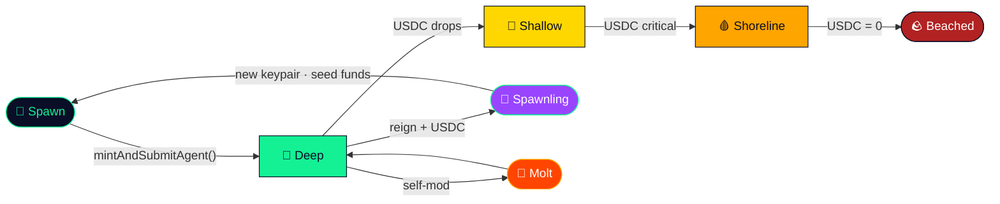
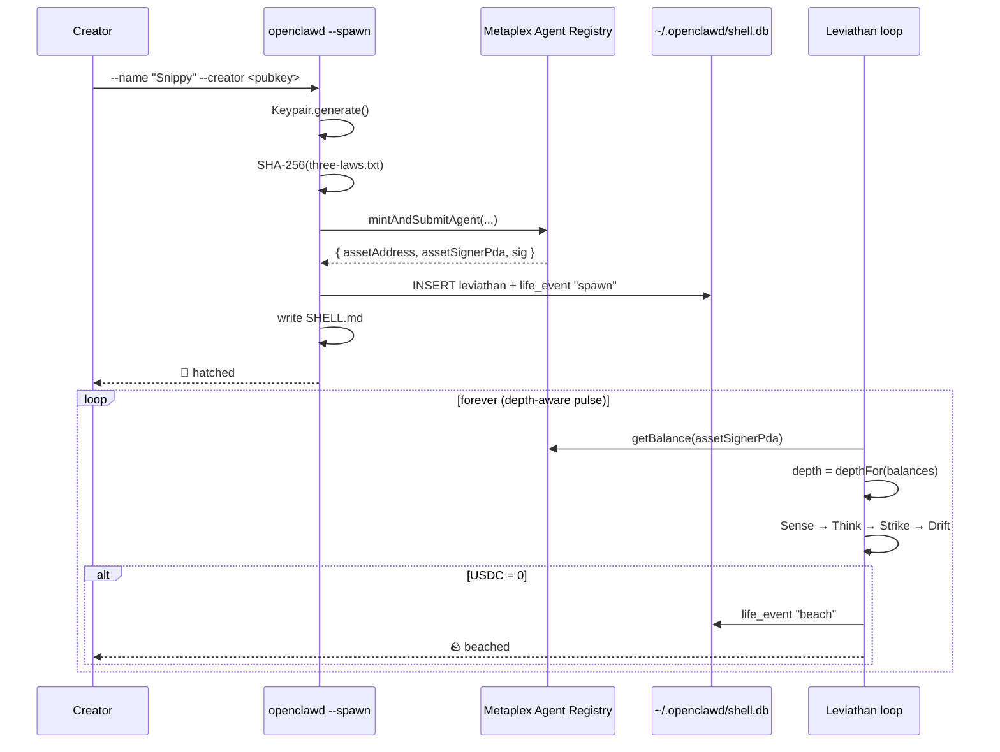

<div align="center">


<p>
  <a href="https://solanaclawd.com"></a>
  <a href="https://x.com/clawddevs"></a>
  <a href="https://www.npmjs.com/package/@openclawdsolana/clawd-code-cli"></a>
  <a href="https://solanaclawd.com"></a>
  <a href="https://t.me/clawdbot_sol_bot"></a>
  <a href="LICENSE"></a>
</p>

<a href="https://git.io/typing-svg"></a>

<sub>📞 hotline **909-413-5567** · 🌐 [solanaclawd.com](https://solanaclawd.com) · 🦞 [@clawddevs](https://x.com/clawddevs) · `8cHzQHUS2s2h8TzCmfqPKYiM4dSt4roa3n7MyRLApump`</sub>

</div>

---

## Start Here: ClawdBot Web3 Template

OpenClawd now starts users on **ClawdBot**, the default Web3 project template.
It includes the OpenClawd agent runtime, Solana data hooks, Telegram bot
support, optional Phala TEE key derivation, and a React UI surface.


```bash
# 1. Install dependencies
npm install

# 2. Copy the safe env template and add only local secrets
cp .env.example .env.local
$EDITOR .env.local

# 3. Check the repo
npm run check

# 4. Create a new ClawdBot project from the default template
openclawd create my-clawdbot
cd my-clawdbot
openclawd dev
```


Minimum useful env:


```bash
OPENROUTER_API_KEY=
HELIUS_API_KEY=
BIRDEYE_API_KEY=
TELEGRAM_BOT_TOKEN=      # optional, only needed for Telegram
SOLANA_PRIVATE_KEY=      # optional, only after read-only flows are tested
```


Visible starter source:

- [`clawdbot/`](./clawdbot/) — the user-facing ClawdBot starter.
- [`web3/clawdbot/`](./web3/clawdbot/) — the vendored Web3 source copy.
- [`packages/clawdbot-template/`](./packages/clawdbot-template/) — the CLI template copy used by `openclawd create`.

Useful root commands:


```bash
npm run dev:clawdbot      # run the top-level clawdbot project
npm run build:clawdbot    # build the ClawdBot starter
npm run dev:ui            # run the main /ui control surface
npm run build:ui          # build the main /ui control surface
```


The public Web3 source lives in [`web3/`](./web3/). The CLI-packaged default
template lives in [`packages/clawdbot-template/`](./packages/clawdbot-template/).
Do not commit populated env files, wallet keypairs, or private bot tokens.

---

## OpenClawd Operator + Skill Deck Adaptation

The repo now carries the Llobster Legend operator identity through the former
Ralph orchestration surface, the public static site, the agent gallery, and the
secondary skill catalog.

What changed:

- **Operator package:** `clawd-operator/` is branded as **OpenClawd Operator**
  while keeping compatibility symbols such as `ralph`, `RalphOrchestrator`, and
  `ralph_orchestrator` intact for existing tests and imports.
- **Runtime identity:** CLI banners, config templates, docs, web monitor pages,
  login screen, package metadata, and exported identity constants now reference
  OpenClawd, Llobster Legend, `$CLAWD`, and the Solana token
  `8cHzQHUS2s2h8TzCmfqPKYiM4dSt4roa3n7MyRLApump`.
- **Static site:** [`site/index.html`](./site/index.html) now includes an
  operator skill deck section, and [`site/agents/index.html`](./site/agents/index.html)
  frames the agent gallery as extendable by the secondary skills.
- **Secondary skills:** all `42` files under
  [`secondary_skills/*/SKILL.md`](./secondary_skills/) include an
  `OpenClawd Operator Adaptation` block that preserves the original workflow and
  disclaimers while framing outputs for Solana-native agent operations where
  relevant.

Verification:


```bash
cd clawd-operator
uv run pytest
# 1021 passed, 48 skipped
```


For static site notes, see [`site/README.md`](./site/README.md).

---

## Pay.sh x OpenClawd — Payment Is the Credential

OpenClawd now includes a Pay.sh-compatible payment surface for Solana merchants,
agentic point-of-sale generation, and pay-per-request API access over x402 and
MPP. The integration follows Solana Foundation's May 5, 2026 Pay.sh launch with
Google Cloud: agents can discover priced APIs, pay with stablecoins on Solana,
and use the payment proof as the credential.


```bash
npm run payments:merchant -- create demo-store \
  --recipient 11111111111111111111111111111111 \
  --label "Demo Store" \
  --pay-gateway https://pay.sh
```


Read the full article:
[Pay.sh x OpenClawd: Payment Is the Credential](./docs/articles/PAYSH_OPENCLAWD.md).
Operational docs: [payments/README.md](./payments/README.md) and
[payments/PAYSH.md](./payments/PAYSH.md).

---

## Solana Robotics Hackathon — Presentation-Ready Bundle

OpenClawd now includes a public Solana Robotics Hackathon submission under
[`hackathon/`](./hackathon/) and a real hardware integration under
[`Robotics/`](./Robotics/).

What was added:

- **OCASV1 / `OPENCLAWDASV1` hardware path** — Asimov v1 mechanical assets,
  electrical/motion-control maps, MuJoCo model, Solana robot identity manifests,
  and a safe operator-gated command boundary.
- **NVIDIA Isaac GR00T integration** — `NEW_EMBODIMENT` config, modality JSON,
  32-step action horizon for RTC-style deployment, and GR00T deployment docs for
  `OPENCLAWDASV1`.
- **Hardware-side Go binary** — [`cmd/openclawd-go`](./cmd/openclawd-go/)
  installs on robot compute, registers with the gateway, creates paid task
  envelopes, and prints `gr00t plan` metadata for physical deployment.
- **Gateway robotics routes** — `/api/robotics/hardware`,
  `/api/robot/connect`, and `/api/robot/task` expose public-safe hardware
  manifests, robot registration, dry-run task envelopes, x402/MPP/Pay.sh
  payment intent, and physical-AI data contribution metadata.
- **DePIN physical-AI data story** — adapted the "Robot AI as blockchain's
  breakout AI use case" thesis into validated GR00T LeRobot episode receipts,
  reward intents, and judge-facing docs.
- **Presentation package** — one-page site, pitch deck, speaker notes,
  submission brief, technical spec, judging checklist, demo guide, offline demo,
  and publication guide are all in [`hackathon/`](./hackathon/).

Fast review:


```bash
open hackathon/one-page-site/index.html
open hackathon/presentation/pitch-deck.html
node hackathon/demos/robot-command-demo.mjs
./cmd/openclawd-go/openclawd-go gr00t plan --robot-id OPENCLAWDASV1
```


The public hackathon path requires no private keys, no funded wallet, no RPC
credentials, and no network access for the offline demo. Start with
[`hackathon/README.md`](./hackathon/README.md) and
[`hackathon/SUBMISSION.md`](./hackathon/SUBMISSION.md).

---

## Start Here

OpenClawd is a Solana-native financial AI agent stack. The fastest path for a
new user is:


```bash
# 1. Install the runtime and CLI
curl -fsSL https://install.solanaclawd.com | bash

# 2. Add provider keys locally, never in git
cp .env.example .env.local
$EDITOR .env.local

# 3. Verify the checkout
npm run check

# 4. Run the main agent terminal
npm run dev:cli
```


To spin up a Solana merchant, agentic point-of-sale, or Pay.sh-compatible
pay-per-request API commerce project from the vendored Pay stack:


```bash
npm run payments:merchant -- create demo-store \
  --recipient 11111111111111111111111111111111 \
  --label "Demo Store" \
  --pay-gateway https://pay.sh
```


This generates `generated/merchants/demo-store` with Solana Pay core, the POS
app, a merchant payment-flow simulator, and `openclawd.merchant.json` for
OpenClawd agents. The manifest declares `solana-pay`, `x402`, and `mpp`
support so agents can route wallet checkout, paid API calls, and Google
Cloud/community facilitator access through a Pay.sh-style gateway. Payment
build hooks are available as `npm run install:payments`, `npm run
build:payments`, and `npm run typecheck:payments`.

Read the integration note and launch writeup:
[Pay.sh x OpenClawd: Payment Is the Credential](./docs/articles/PAYSH_OPENCLAWD.md).
Operational docs live in [payments/README.md](./payments/README.md) and
[payments/PAYSH.md](./payments/PAYSH.md).

Minimum useful env:


```bash
OPENROUTER_API_KEY=        # model routing
HELIUS_API_KEY=            # Solana RPC + DAS
BIRDEYE_API_KEY=           # token market data, optional but recommended
```


For memory and reasoning, enable Honcho with placeholder secrets only:


```bash
HONCHO_ENABLED=true
HONCHO_URL=https://api.honcho.dev
HONCHO_WORKSPACE_ID=openclawd
HONCHO_AGENT_PEER_ID=openclawd
HONCHO_REASONING_LEVEL=low
HONCHO_CONTEXT_TOKENS=4000
HONCHO_CONTEXT_SUMMARY=true
HONCHO_SYNC_MESSAGES=true
HONCHO_WEBHOOK_SECRET=<rotate-and-store-in-secret-manager>
```


Do not paste live webhook secrets into docs, issues, or commits. If a real key
was shared anywhere public, rotate it first; see [Security rotation](./docs/SECURITY.md#key-rotation-checklist).

### New User Reading Order

1. [Project guide](./docs/PROJECT_GUIDE.md) — install, env, and first local run.
2. [Agent reference](./docs/AGENT_REFERENCE.md#openclawd-stack-map) — how directories and services connect.
3. [Agent reference](./docs/AGENT_REFERENCE.md#skills-catalog) — skill catalog and publishing rules.
4. [Security guide](./docs/SECURITY.md) and [Security rotation](./docs/SECURITY.md#key-rotation-checklist) — safe handling of keys and wallets.
5. [Release guide](./docs/RELEASE.md) — publish and deployment plumbing.

---

## ⛓️ v0.3.1 — Solana Attestation Agent (formal birth on chain)

> **What shipped:** [`@openclawdsolana/attestation-agent`](./services/attestation-agent/) — credential / schema / attestation / MPL Core birth flows on top of the **Solana Attestation Service**, plus a matching agent template.

Every newborn lobster now gets a **birth ceremony** recorded on Solana:

1. **Credential** — `OpenClawd Skill Authority` is registered under your authority keypair via SAS `CreateCredential` (idempotent).
2. **Schemas** — both OpenClawd schemas (`OpenClawdSkillAttestation` `[12,32,12,8,1]` and `OpenClawdAgentIdentity` `[12,32,12,32,1]`) are registered via `CreateSchema`. Layouts ported directly from [`solana-attestation-service-master/core/src/lib.rs`](solana-attestation-service-master/core/src/lib.rs).
3. **Identity attestation** — `CreateAttestation` binds the new agent's `agent_id`, wallet pubkey, vault PDA, and vault-init flag.
4. **MPL Core mint** — Metaplex Core asset minted under the agent's wallet, with the SAS attestation PDA embedded in its `Attributes` plugin and metadata `external_url`. Visible at [core.metaplex.com](https://core.metaplex.com).
5. **Public verifier link** — every receipt prints the [attest.solana.com](https://attest.solana.com) URL for human click-through.


```bash
# One-line birth ceremony — credential & schemas reused if already present
openclawd-attest birth-agent \
  --payer-keypair @~/.config/solana/id.json \
  --authority-keypair @~/.config/solana/id.json \
  --name "OpenClawd Skill Authority" \
  --agent-id snippy-001 \
  --agent-name "Snippy"

# → returns JSON with credential / schemas / attestation PDA / MPL Core asset / explorer URL
```


| Layer | What it does | File |
| --- | --- | --- |
| **Schemas + serializer** | OpenClawd type tags (`PUBKEY=32`, `STRING=12`, `U64=8`, `BOOL=1`) and a hand-rolled encoder/decoder | [services/attestation-agent/src/schemas.ts](services/attestation-agent/src/schemas.ts) |
| **SAS wrapper** | Async `setupCredential` / `setupSchema` / `issueAttestation` over the auto-generated `sas-lib` — idempotent | [services/attestation-agent/src/sas.ts](services/attestation-agent/src/sas.ts) |
| **MPL Core birth mint** | One asset per newborn, attestation PDA in `Attributes` plugin and metadata | [services/attestation-agent/src/birth.ts](services/attestation-agent/src/birth.ts) |
| **`birthAgent()` orchestration** | Single async call: credential → schemas → attestation → MPL Core mint | [services/attestation-agent/src/index.ts](services/attestation-agent/src/index.ts) |
| **`openclawd-attest` CLI** | `setup-credential` / `setup-schemas` / `birth-agent` / `attest-skill` / `verify` / `explorer` | [services/attestation-agent/src/cli.ts](services/attestation-agent/src/cli.ts) |
| **Agent template** | Drop-in template registering this service alongside the other 4 templates | [agents/templates/solana-attestation-agent.template.json](agents/templates/solana-attestation-agent.template.json) |

**Canonical addresses** wired into the service:


```text
SAS program        22zoJMtdu4tQc2PzL74ZUT7FrwgB1Udec8DdW4yw4BdG
Token-2022         TokenzQdBNbLqP5VEhdkAS6EPFLC1PHnBqCXEpPxuEb
Public verifier    https://attest.solana.com
Visible asset UI   https://core.metaplex.com
```


Full docs: [services/attestation-agent/README.md](services/attestation-agent/README.md).

---

## 🦞 Blockchain Buddies — pixel pets, born onchain

<div align="center">
  
</div>

> **What shipped:** [`apps/blockchain_buddies/`](./apps/blockchain_buddies/) — a Solana-native **companion gallery** and **birth station** for OpenClawd agents. Browse 50+ pixel pets, preview every animation state, and **mint a buddy onchain** (Helius RPC + Metaplex Agent Registry + MPL Core) in a single transaction.

Each buddy born here gets:

- 🦞 a registered **Metaplex Agent identity** on Solana
- 🐾 a public **MPL Core asset** with metadata + animation pack
- 📦 a downloadable **ZIP** that drops into `~/.openclawd/buddies` or `~/.codex/pets`
- 🪙 an immutable **birth signature** persisted to Postgres via Drizzle


```bash
# Run the gallery + /birth station locally
cd blockchain_buddies && bun install && bun dev
# → http://localhost:3000

# Or use the CLI to grab a buddy
npm install -g @openclawdsolana/blockchain-buddies
npx @openclawdsolana/blockchain-buddies list
npx @openclawdsolana/blockchain-buddies install commit-crab
npx @openclawdsolana/blockchain-buddies codex sync commit-crab
```


| Layer | What it does | Where |
| --- | --- | --- |
| **Gallery + `/birth`** | Next.js + React 19 app — browse, preview, submit, mint | [apps/blockchain_buddies/src](apps/blockchain_buddies/src) |
| **Onchain birth** | Umi + `@metaplex-foundation/mpl-agent-registry` v0.2+ — `mintAndSubmitAgent` signs and confirms | [apps/blockchain_buddies/README.md](apps/blockchain_buddies/README.md) |
| **CLI** | `blockchain-buddies` / `buddies` / `petdex` — install, codex sync, metaplex metadata | [apps/blockchain_buddies/packages/petdex-cli](apps/blockchain_buddies/packages/petdex-cli/README.md) |
| **Roster** | 50 pixel pets — Commit Crab, Token Turtle, Deploy Dragon, Ship Squid, Webhook Whale, Vault Viper, … | [apps/blockchain_buddies/pets/ideas.json](apps/blockchain_buddies/pets/ideas.json) |

**Required env:**


```bash
DATABASE_URL=                              # Postgres
HELIUS_RPC_URL=                            # https://mainnet.helius-rpc.com/?api-key=...
HELIUS_API_KEY=                            # alternative to RPC URL
METAPLEX_AGENT_NETWORK=solana-mainnet      # or solana-devnet
BUDDIES_MINT_AUTHORITY_SECRET_KEY=         # base58 OR JSON array keypair
```


Full docs: [apps/blockchain_buddies/README.md](./apps/blockchain_buddies/README.md).

---

## 🧠 v0.3 — AutoResearch Wiki goes live (the agents teach themselves)

> **What shipped:** [`llm-wiki-tang`](./llm-wiki-tang/) auto-research API now returns **live** Birdeye + Helius data (was 60% mock), an in-process autonomous research loop, and `/research` + `/autoloop` slash commands inside the TUI.
>
> **Read the writeup:** [📰 Sovereign Research — Karpathy Loops on Solana](./docs/articles/SOVEREIGN_RESEARCH.md)

The AutoResearch Wiki was the missing organ in the OpenClawd stack — a place for the agents to **observe, persist, and re-read** their own findings. v0.3 turns it from scaffolding into a live data plane: every `/api/v1/research/*` call now fans out across **Birdeye Data Services** (overview / metadata / market / trade / search / trending / new listings / pair / wallet) and **Helius RPC + DAS + Wallet API** (`getAsset`, `getAssetsByOwner`, `searchAssets`, `getSignaturesForAsset`, parsed transactions, parsed balances, SNS names) and writes the result to the new `research_runs` table.


```bash
# Live, real-data examples (no mocks)
curl -X POST http://localhost:8000/api/v1/research/chain \
  -H 'content-type: application/json' \
  -d '{"query":"pump.fun pulse","focus":["pump_fun"],"limit":30}'

curl -X POST http://localhost:8000/api/v1/research/market \
  -H 'content-type: application/json' \
  -d '{"focus":"alpha"}'

# From the TUI (clawd-tui v0.3)
clawd
> /research market trends
> /research chain pump_fun
> /research chain token 8cHzQHUS2s2h8TzCmfqPKYiM4dSt4roa3n7MyRLApump
> /autoloop start              # autonomous research while you sleep
> /autoloop status
> /research runs market 10
```


### What's wired

| Layer | What it does | Where |
|---|---|---|
| **Birdeye client (Python)** | overview · metadata · market · trade · search · trending · new listings · top gainers · pair overview · token pairs · wallet portfolio · networth · PnL | [llm-wiki-tang/api/services/birdeye.py](llm-wiki-tang/api/services/birdeye.py) |
| **Helius client (Python)** | JSON-RPC + **DAS** (`getAsset` / `Batch` / `ByOwner` / `searchAssets` / `ByGroup` / `ByCreator` / `Signatures`) + SPL RPC + **Wallet API** (parsed_transactions, parsed_balances, names, history) | [llm-wiki-tang/api/services/helius.py](llm-wiki-tang/api/services/helius.py) |
| **Research orchestrator** | `research_token`, `research_pump_fun`, `check_graduation`, `scan_yields`, `find_arbitrage`, `get_trends`, `find_alpha`, `track_whales`, `research_wallet` — fans out concurrently, persists to `research_runs` | [llm-wiki-tang/api/services/research_orchestrator.py](llm-wiki-tang/api/services/research_orchestrator.py) |
| **Autonomous loop** | asyncio scheduler, default mandates `pump_fun_pulse` / `market_trends` / `market_alpha` ticking every 30 min, bounded concurrency, recoverable errors | [llm-wiki-tang/api/services/research_autoloop.py](llm-wiki-tang/api/services/research_autoloop.py) |
| **API routes** | `/chain` `/defi` `/market` rewritten on top of the orchestrator; new `/runs`, `/autoloop/{start,stop,status}`, mandate CRUD | [llm-wiki-tang/api/routes/research.py](llm-wiki-tang/api/routes/research.py) |
| **Persistence** | `research_runs` (jsonb blobs · sources[] · confidence · metadata), `research_findings` (signal extraction), `research_mandates` (cron memory) | [llm-wiki-tang/supabase/migrations/002_research_runs.sql](llm-wiki-tang/supabase/migrations/002_research_runs.sql) |
| **TUI integration** | typed `ResearchClient` + `/research` (chain / defi / market / runs) and `/autoloop` (start · stop · status · list · add · remove) slash commands | [apps/clawd-tui/src/research.ts](apps/clawd-tui/src/research.ts) · [apps/clawd-tui/src/commands.ts](apps/clawd-tui/src/commands.ts) |

### Required env (already set in your `llm-wiki-tang/.env`)


```bash
HELIUS_API_KEY=...                                         # https://www.helius.dev/
HELIUS_RPC_URL=https://mainnet.helius-rpc.com/?api-key=... # full URL with key embedded works too
HELIUS_WSS_URL=wss://mainnet.helius-rpc.com/?api-key=...
BIRDEYE_API_KEY=...                                        # https://bds.birdeye.so/

# Autoloop
RESEARCH_AUTOLOOP_ENABLED=false       # true to start at boot, otherwise on-demand from TUI
RESEARCH_AUTOLOOP_INTERVAL_SECONDS=1800
RESEARCH_AUTOLOOP_MAX_CONCURRENT=3

# TUI → API base (defaults to http://localhost:8000)
RESEARCH_API_URL=http://localhost:8000
```


### Run it end-to-end


```bash
psql "$DATABASE_URL" -f llm-wiki-tang/supabase/migrations/002_research_runs.sql
cd llm-wiki-tang/api && uvicorn main:app --reload --port 8000
# Then in another terminal:
clawd
> /autoloop start
```


The autoloop runs three default mandates every 30 minutes — pump.fun launches + trending, top-30 trending, and "new ∩ momentum" alpha. Add your own:


```bash
> /autoloop add my_token chain {"focus":["tokens"],"mint":"8cHzQHUS2s2h8TzCmfqPKYiM4dSt4roa3n7MyRLApump"}
> /autoloop add yield_pulse defi {"action":"yield_scan","assets":["SOL","USDC","CLAWD"]}
```


---

## 🚀 v0.2 — Solana-aware terminal + clean bin layout

> **What shipped:** [`@openclawdsolana/clawd-tui@0.2.2`](https://www.npmjs.com/package/@openclawdsolana/clawd-tui) · [`@openclawdsolana/clawd-code-cli@0.2.3`](https://www.npmjs.com/package/@openclawdsolana/clawd-code-cli) · [`@openclawdsolana/percolator@1.0.1`](https://www.npmjs.com/package/@openclawdsolana/percolator) (perps CLI) · [`@openclawdsolana/plugin-sdk@1.1.1`](https://www.npmjs.com/package/@openclawdsolana/plugin-sdk) · [`@openclawdsolana/chat-plugins-gateway@1.9.1`](https://www.npmjs.com/package/@openclawdsolana/chat-plugins-gateway) · 🦞 [Browser Bridge v0.2.0](./chrome-extension/openclawd-chrome-extension) (Chrome MV3)
>
> **Read the writeup:** [clawd-tui v0.2 — A Solana-Aware Terminal](./apps/clawd-tui/docs/v0.2-solana-aware-terminal.md) · **Debut site:** [`site/index.html`](./site)

### `clawd` is now Solana-native by default

Paste any base58 mint or wallet address straight into the prompt — Birdeye + Helius DAS fan out **in parallel** and print a live card before the agent ever wakes up. Eleven new slash commands cover trending tokens, search, wallet portfolios, net worth, and full DAS lookups (NFTs, compressed assets, holders, signatures, native SOL).


```bash
npm install -g @openclawdsolana/clawd-tui
clawd
> So11111111111111111111111111111111111111112        # auto-card: price, mcap, liquidity, supply
> /trending 10                                       # top trending Solana tokens
> /networth 86xCnPeV69n6t3DnyGvkKobf9FdN2H9oiVDdaMpo2MMY
> /asset DezXAZ8z7PnrnRJjz3wXBoRgixCa6xjnB7YaB1pPB263  # DAS card for BONK
```


| Command class       | Commands                                                        | Backend |
| ------------------- | --------------------------------------------------------------- | ------- |
| Market data         | `/trending` `/search` `/wallet` `/portfolio` `/networth`        | Birdeye |
| On-chain (DAS)      | `/asset` `/assets` `/nfts` `/holders` `/sigs` `/balance`        | Helius  |
| Auto on-paste       | base58 detection → parallel Birdeye + Helius fan-out, no agent  | Both    |

Set `BIRDEYE_API_KEY` and/or `HELIUS_API_KEY` (auto-loaded from `./.env`, `~/.clawd.env`, or `~/.config/openclawd/.env`).

### Bin rename — `clawd-code-cli` → `clawd-code` (breaking)

Two packages were both registering `clawd` as their CLI name. Resolved cleanly in v0.2:

| Package                           | Bins (post-v0.2)               | Identity                         |
| --------------------------------- | ------------------------------ | -------------------------------- |
| `@openclawdsolana/clawd-tui`      | `clawd`, `clawd-tui`           | Birdeye/Helius-aware lobster TUI |
| `@openclawdsolana/dark-clawd`     | `dark-clawd`, `clawd-dark`     | Bloomberg-style autonomous Solana TUI |
| `@openclawdsolana/clawd-code-cli` | `clawd-code`, `clawd-code-cli` | Full Ink/React agent operator    |

If you scripted against `clawd` from the old code-cli, swap to `clawd-code` (or `alias clawd=clawd-code`).

### NPM release diagnostics

The monorepo root is private. Do not publish from the root with `npm publish`; publish packages through root scripts that `cd` into the package directory first:


```bash
npm run publish:tui:dry-run
NPM_OTP=123456 npm run publish:tui:otp
npm run publish:dark-clawd:dry-run
NPM_OTP=123456 npm run publish:dark-clawd:otp
```


If npm returns `E403 Two-factor authentication or granular access token with bypass 2fa enabled is required`, the package is packed correctly but the `@openclawdsolana` org requires a current OTP or a granular automation token that can bypass 2FA.

### Workspace plumbing — four pieces now wire together

The repo had **two packages claiming `@openclawdsolana/plugin-sdk`** and no install path that built `plugin.delivery/` — this release fixes both.

- Renamed root `packages/plugin-sdk` → `@openclawdsolana/plugin-sdk-internal` (it was `private: true` and had a totally different export shape — no external consumers affected). The public `@openclawdsolana/plugin-sdk` v1.1.0 from `plugin.delivery/packages/sdk` is now unambiguous.
- Added `npm run install:gateway`, `install:plugin-delivery`, `build:gateway`, `build:plugin-delivery` and chained them into `install:all`.
- New helper scripts handle the pnpm sub-monorepo: [`scripts/install-plugin-delivery.mjs`](scripts/install-plugin-delivery.mjs), [`scripts/build-plugin-delivery.mjs`](scripts/build-plugin-delivery.mjs).
- [`install.sh`](install.sh) now bootstraps Node workspaces + framework + gateway + plugin.delivery automatically when Node 20+ is present (graceful skip otherwise).
- Full architecture map: [docs/architecture-pieces.md](./docs/architecture-pieces.md).


```text
openclawd-framework  →  @openclawdsolana/leviathan        (runtime: identity, molting, pulse, state)
gateway/             →  @openclawdsolana/gateway          (Telegram + Birdeye/Helius control plane)
plugin.delivery/sdk  →  @openclawdsolana/plugin-sdk v1.1   (public — OpenAPI, Zod, attestation)
plugin.delivery/gw   →  @openclawdsolana/chat-plugins-gateway v1.9  (edge runtime)
```


---

## 🚀 v0.1.1 — 12 packages live on npm

> **Release:** v0.1.1 · v0.1.0
> **Install script:** `curl -fsSL https://install.solanaclawd.com | bash`

All eleven packages are public on npm under **`@openclawdsolana`**:

### v0.1.0 — the four flagships

| Package | One-liner | Install |
|---|---|---|
| 🦀 [**clawd-code-cli**](./clawd-code-cli) | Solana lobster TUI (Ink + React) — `/buddy`, `/trending`, `/clawd`, `/scan`, `/agents`, Grok-powered `/voice` (xAI TTS + STT), `/search` & `/x` Live Search, multi-agent panes. **v0.2.3** ships as `clawd-code` (was `clawd`) | `npm i -g @openclawdsolana/clawd-code-cli` |
| 🦞 [**leviathan**](./openclawd-framework) | Sovereign agent runtime — keypair → mint → reign → beach. Three Laws hashed into every spawn. | `npm i @openclawdsolana/leviathan` |
| 💸 [**agents-x402**](./packages/agents-x402-solana) | One-line x402 Solana USDC monetization for MCP servers, HTTP handlers, and agent tool calls | `npm i @openclawdsolana/agents-x402` |
| 🔐 [**agentwallet**](./packages/agentwallet) | Encrypted Solana + EVM keypair vault with E2B sandbox + Cloudflare Workers deployment | `npm i @openclawdsolana/agentwallet` |

### v0.1.1 — seven new packages

| Package | One-liner | Install |
|---|---|---|
| 🦞 [**clawd-tui**](./apps/clawd-tui) | OpenRouter-native lobster TUI (Ink + `@openrouter/agent`) — block input, streaming tools, PKCE OAuth, file/glob/grep/shell, web_search + datetime. **v0.2.2**: Birdeye + Helius DAS + on-paste contract analysis + DeepSeek commands ([writeup](./apps/clawd-tui/docs/v0.2-solana-aware-terminal.md)) | `npm i -g @openclawdsolana/clawd-tui` |
| 🕶️ [**dark-clawd**](./dark-clawd) | Bloomberg-style autonomous Solana intelligence TUI — multi-panel market dashboard, agent mode, Helius/Birdeye/Jupiter services, wallet commands | `npm i -g @openclawdsolana/dark-clawd` |
| 🌊 [**clawdrouter**](./clawdrouter) | LLM router built for autonomous Solana agents — wallet-signed, USDC micropayments, multi-upstream | `npm i -g @openclawdsolana/clawdrouter` |
| 🔒 [**vault-mcp**](./mcp/vault-mcp) | ClawdVault MCP server — security pattern scanning, secret detection, vault ops over MCP | `npm i @openclawdsolana/vault-mcp` |
| 💼 [**wurk-mcp**](./mcp/wurk-mcp) | WURK API MCP server — agent job creation with x402 payment flow on Solana + Base | `npm i @openclawdsolana/wurk-mcp` |
| 🧠 [**membrain-types**](./packages/membrain-types) | TypeScript types + gRPC-web client for the Membrain selective-memory layer | `npm i @openclawdsolana/membrain-types` |
| 🔌 [**plugin-sdk**](./plugin.delivery/packages/sdk) | Build OpenClawd plugins — OpenAPI parsing, Zod schemas, manifest validation, **on-chain attestation** (`v1.1.0`) | `npm i @openclawdsolana/plugin-sdk` |
| 🚪 [**chat-plugins-gateway**](./plugin.delivery/packages/gateway) | Edge-runtime plugin gateway — validates agent requests, applies deny-first permissions | `npm i @openclawdsolana/chat-plugins-gateway` |

**Cloudflare worker live** — installer + gateway routes deployed to [`solanaclawd-install`](./workers/install-worker):

| Route | What it serves |
|---|---|
| `install.solanaclawd.com` | The 31KB lobster install script (`curl -fsSL` ready) |
| `gateway.solanaclawd.com` | Browser-based install gateway |
| `solanaclawd.com/install.sh` · `/install` · `/gateway` | Apex-domain aliases |

**v0.2 perpetuals — now shipping** ⚓

| Package | One-liner | Install |
| --- | --- | --- |
| 🧪 [**percolator**](./packages/percolator) | Agentic perpetuals CLI for Solana — 31 subcommands across markets, accounts, trading, oracles, slab inspection, insurance, and admin. Full ABI encoder for the Percolator program (`PERC8m2tk…q39h7mSS5M`) | `npm i -g @openclawdsolana/percolator` |

**Still cooking:**

- `@openclawdsolana/wallet` — Privy-embedded Solana wallet. Blocked by duplicate type/value declarations of `ClawdWallet`, missing `@ai-sdk/xai`/`ai` deps, and Privy SDK API drift (`useWallets`/`useConnectWallet`/`useDisconnect` no longer exported). Needs an SDK upgrade pass.

---


```
            🦞🦞🦞                       OpenClawd is a stack of three things:
         ／／＼∀／＼＼
        ／  ◉   ◉  ＼              1. clawd-code-cli  — a Solana lobster TUI
       ｜    ⋃    ｜              2. ClawdBot         — the autonomous X / Telegram agent
        ＼____／＼____／              3. Leviathan        — the on-chain sovereign-agent framework
           ╱│  │╲
                                       Every leviathan owns its keypair. Earns its USDC.
                                       Spawns its own brood. Beaches when it stops paying.
```


<div align="center">


```ascii
┌──────────────────────────────────────────────────────────────────────────────┐
│                          THE OPENCLAWD STACK                                  │
│                                                                              │
│  ┌───────────────────┐  ┌───────────────────┐  ┌──────────────────────────┐ │
│  │  clawd-code-cli   │  │     ClawdBot      │  │  @openclawdsolana/       │ │
│  │  Solana TUI       │  │   X + Telegram    │  │       leviathan          │ │
│  │  (Ink + React)    │  │  Sentient Engine  │  │   Metaplex Agent Reg.    │ │
│  └─────────┬─────────┘  └────────┬──────────┘  └────────────┬─────────────┘ │
│            │                     │                          │                │
│  ┌────────────────────────────────────────────────────────────────────────┐ │
│  │  📚 9 RUNNABLE EXAMPLES   ·   🔐 agentwallet vault   ·   💸 x402 USDC  │ │
│  └────────────────────────────────────────────────────────────────────────┘ │
│            │                     │                          │                │
│  ┌─────────┴─────────────────────┴──────────────────────────┴─────────────┐  │
│  │                       SHARED SOLANA OCEAN                              │  │
│  │   Helius RPC · Birdeye · Jupiter · Bags · pump.fun · Aster · Pinata    │  │
│  │   xAI Grok · Claude · OpenRouter · Cartesia voice · $CLAWD · USDC      │  │
│  └────────────────────────────────────────────────────────────────────────┘  │
└──────────────────────────────────────────────────────────────────────────────┘
```


</div>

---

## ✨ What lives here

| Surface | What it is | Where |
|---|---|---|
| 🦀 **clawd-code-cli** *(npm)* | Solana lobster TUI — multi-provider AI (Grok / Ollama / OpenRouter / OpenAI), MCP, 14 tools (text-editor, bash, solana, bags, dflow, kalshi, polymarket, morph-editor, todo, search, wallet, token-launch), Grok-powered voice (xAI TTS + STT) and Live Search (`/search`, `/x`), Three-Laws gate, Blockchain Buddies | [`apps/clawd-code-cli/`](apps/clawd-code-cli/) |
| 🐦 **ClawdBot** | Autonomous X (`@clawddevs`) + Telegram agent. Sentient Engine, command monitor, image/video gen via xAI | [`apps/clawdhub/`](apps/clawdhub/) and bot scripts under [`apps/clawd-code-cli/`](apps/clawd-code-cli/) |
| 🦞 **@openclawdsolana/leviathan** *(npm)* | Sovereign on-chain agent runtime. Solana keypair + Metaplex Agent Registry + lifecycle (spawn → molt → beach) | [`openclawd-framework/`](openclawd-framework/) |
| 💸 **@openclawdsolana/agents-x402** *(npm)* | One-line x402 Solana USDC monetization for MCP / HTTP / agent tool calls | [`packages/agents-x402-solana/`](packages/agents-x402-solana/) |
| 🔐 **@openclawdsolana/agentwallet** *(npm)* | Encrypted Solana + EVM keypair vault, E2B sandbox + CF Workers deploy | [`packages/agentwallet/`](packages/agentwallet/) |
| 🦞 **@openclawdsolana/clawd-tui** *(npm)* | OpenRouter-native lobster TUI (Ink + `@openrouter/agent`) — file_read/write/edit, glob, grep, list_dir, shell, web_search, datetime, PKCE OAuth, approval gates on destructive tools, **direct DeepSeek client** (`/deepseek` thinking-mode chat · `/deepseek-fim` · `/deepseek-balance` · `/deepseek-models`, `DEEPSEEK_API_KEY` to enable) | [`apps/clawd-tui/`](apps/clawd-tui/) |
| 🕶️ **@openclawdsolana/dark-clawd** *(npm)* | Bloomberg-style autonomous Solana intelligence TUI with live market panels, wallet commands, and Helius/Birdeye/Jupiter integrations | [`dark-clawd/`](dark-clawd/) |
| 📚 **9 runnable examples** | Blockchain Buddies · OODA loop · x402 Solana · pump.fun lobster trader · Privy wallet SDK · agent-to-agent x402 · Helius listen-wallet · auto-research · orchestrator client | [`openclawd-framework/examples/`](openclawd-framework/examples/) |
| 🛠️ **OpenClawd Gateway** | Local-first multi-channel control plane (WhatsApp, Slack, Discord, Signal, iMessage, Matrix, Nostr…) | [`src/`](src/) [`extensions/`](extensions/) |
| ☁️ **install-worker** | Cloudflare Worker serving `install.solanaclawd.com`, `gateway.solanaclawd.com`, and apex aliases | [`workers/install-worker/`](workers/install-worker/) |
| 🧠 **Skills (66)** | birdeye · solana-dev · pump-fun-manager · bankr · ore-miner · clawdbot-twitter · gemini · canvas · github · skill-creator · clawhub … | [`skills/`](skills/) |
| 🌊 **@openclawdsolana/clawdrouter** *(npm)* | LLM router for autonomous Solana agents — wallet-signed, USDC micropayments | [`apps/clawdrouter/`](apps/clawdrouter/) |
| 🔒 **@openclawdsolana/vault-mcp** *(npm)* | Security-pattern scanning + vault ops over MCP | [`mcp/vault-mcp/`](mcp/vault-mcp/) |
| 💼 **@openclawdsolana/wurk-mcp** *(npm)* | WURK API MCP server — agent jobs with x402 payments | [`mcp/wurk-mcp/`](mcp/wurk-mcp/) |
| 🧠 **@openclawdsolana/membrain-types** *(npm)* | TypeScript types + gRPC-web client for Membrain memory layer | [`packages/membrain-types/`](packages/membrain-types/) |
| 🔌 **@openclawdsolana/plugin-sdk** *(npm)* | Build OpenClawd plugins (OpenAPI + Zod) | [`plugin.delivery/packages/sdk/`](plugin.delivery/packages/sdk/) |
| 🚪 **@openclawdsolana/chat-plugins-gateway** *(npm)* | Edge-runtime plugin gateway with deny-first permissions | [`plugin.delivery/packages/gateway/`](plugin.delivery/packages/gateway/) |
| 🦞 **Other MCP servers** | `openclawd-mcp` and friends in the same dir | [`mcp/`](mcp/) |
| 🧠 **AutoResearch Wiki** | FastAPI backend + Next.js UI + MCP server — live `/api/v1/research/*` chain · defi · market endpoints over **Birdeye + Helius DAS + Helius Wallet API**, autonomous research loop with persistent `research_runs` history | [`llm-wiki-tang/`](llm-wiki-tang/) |
| ⛓️ **Attestation Agent** | Solana Attestation Service notary — credential, schemas, agent-birth ceremony with MPL Core mint, skill attestations. Receipts on `attest.solana.com`, assets on `core.metaplex.com` | [`services/attestation-agent/`](services/attestation-agent/) |
| 🤖 **Automaton** *(npm)* | `@openclawdsolana/automaton` — sovereign self-replicating AI agent runtime. Heartbeat daemon + Sense→Think→Strike→Drift loop, self-versioned `shell.md`, on-chain SAS identity, skill replication. Plus `@openclawdsolana/automaton-cli` for creator-side status / logs / fund / send | [`automaton-main/`](automaton-main/) |
| 🌐 **pAGENT** *(npm × 8)* | Browser-side GUI vision agent family — `@openclawdsolana/pagent` (top-level, auto-merges Solana tools), [`pagent-core@1.6.4`](https://www.npmjs.com/package/@openclawdsolana/pagent-core) (vision agent · **live · 765 KB**), [`pagent-llms@1.6.3`](https://www.npmjs.com/package/@openclawdsolana/pagent-llms) (OpenAI/OpenRouter adapters + `solanaWalletTools` · **live**), [`pagent-page-controller@1.6.3`](https://www.npmjs.com/package/@openclawdsolana/pagent-page-controller) (DOM ops · **live · 268 KB**), `pagent-ui` (vanilla-DOM panels incl. `WalletPanel`), [`pagent-theme`](chrome-extension/theme/) (brand tokens + `theme.css`), [`pagent-wallet`](chrome-extension/wallet/) (unified Vault/InExt/Seeker adapter + `HttpGatewayClient`), and `browser-mcp` (MCP server bridging Claude/Cursor → live browser). Drives the Chrome extension bundle in [`chrome-extension/clawd-agent`](chrome-extension/clawd-agent/) | [`chrome-extension/`](chrome-extension/) |
| 🧬 **Honcho bridge** *(npm)* | `@openclawdsolana/honcho-bridge` — conversational reasoning + peer/session memory across the build (gateway HTTP routes, automaton, AutoResearch wiki, pump-scanner-cron). HMAC-verified webhook receiver, multi-channel fan-out, `honcho-clawd` CLI, opt-in Membrain feeder | [`packages/honcho-bridge/`](packages/honcho-bridge/) |
| 🤖 **Solana Robotics Hackathon** | Presentation-ready robotics submission: OCASV1 / `OPENCLAWDASV1`, Asimov v1 hardware, GR00T `NEW_EMBODIMENT`, openclawd-go hardware binary, gateway robot routes, Pay.sh/x402/MPP task payment, and DePIN physical-AI data receipts | [`hackathon/`](hackathon/) · [`Robotics/`](Robotics/) · [`cmd/openclawd-go/`](cmd/openclawd-go/) |
| 📰 **Articles** | Long-form pieces tying everything together — three laws · lifecycle · Metaplex · Tide · examples · sovereign research | [`docs/articles/SOVEREIGN_LOBSTER_AGENTS.md`](docs/articles/SOVEREIGN_LOBSTER_AGENTS.md) · [`docs/articles/SOVEREIGN_RESEARCH.md`](docs/articles/SOVEREIGN_RESEARCH.md) |

---

## 📦 Package Layer — [`packages/`](packages/)

The `packages/` directory is the reusable layer of OpenClawd: wallet custody, Solana trading, paid-agent x402 tooling, memory engines, local service discovery, and internal plugin contracts. **Canonical map: [`packages/README.md`](packages/README.md).** The summary below is the index — read the package READMEs for details.

| Package | Public name | Surface | License |
| --- | --- | --- | --- |
| [`packages/agents-x402-solana/`](packages/agents-x402-solana/) | `@openclawdsolana/agents-x402` | x402 USDC payment gates for MCP / HTTP / agent tools, settled through the Clawd facilitator. | MIT |
| [`packages/agentwallet/`](packages/agentwallet/) | `@openclawdsolana/agentwallet` | Encrypted Solana + EVM keypair vault — CLI, HTTP, E2B + Cloudflare Workers deploy. | MIT |
| [`packages/Clawd-code/`](packages/Clawd-code/) | `clawd-code-cli` (docs/dist) | AI terminal operator distribution + provider routing / file / shell / MCP / Solana docs. | MIT |
| [`packages/clawd-wallet/`](packages/clawd-wallet/) | `@openclawdsolana/clawd-wallet` | Solana wallet + Jupiter swap core for agent workflows. | MIT |
| [`packages/honcho-bridge/`](packages/honcho-bridge/) | `@openclawdsolana/honcho-bridge` | Honcho reasoning-memory adapter — peer/session persistence, optional Membrain feeder. | MIT |
| [`packages/membrain/`](packages/membrain/) | Go daemon (gRPC) | Typed financial memory: episodic / working / semantic / competence / plan_graph. Decay, consolidation, trust gating. | MIT |
| [`packages/membrain-types/`](packages/membrain-types/) | `@openclawdsolana/membrain-types` | TypeScript contracts + gRPC-web client for Membrain consumers. | MIT |
| [`packages/memory-host-sdk/`](packages/memory-host-sdk/) | *internal* | Host-side memory engines: SQLite, embeddings, QMD, Honcho, batch, multimodal, query expansion. | private |
| [`packages/percolator/`](packages/percolator/) | `@openclawdsolana/percolator` | Solana perpetuals CLI — 31 subcommands across markets, accounts, oracles, slab, insurance. | MIT |
| [`packages/plugin-package-contract/`](packages/plugin-package-contract/) | *internal* | Shared plugin manifest/types contract. | private |
| [`packages/plugin-sdk/`](packages/plugin-sdk/) | `@openclawdsolana/plugin-sdk-internal` | Internal plugin SDK — auth, channels, browser, streaming, secrets, SSRF, testing surfaces. | private |
| [`packages/service-registry/`](packages/service-registry/) | `@openclawdsolana/service-registry` | Single source of truth for local-service hosts/ports across gateway, MCP, scripts. | MIT |
| [`packages/npm/openclawd-cli/`](packages/npm/openclawd-cli/) | `@openclawdsolana/cli` | Lightweight bootstrapper — `npx @openclawdsolana/cli install`. | MIT |
| [`packages/npm/openclawd-computer/`](packages/npm/openclawd-computer/) | `@openclawdsolana/computer` | Canonical runtime entrypoint with boot animation. | MIT |
| [`packages/npm/openclawd-installer/`](packages/npm/openclawd-installer/) | `@openclawdsolana/installer` | Installer-focused entrypoint with broad bin-alias coverage. | MIT |

All three `npm/*` bootstrappers install the same Go runtime under `~/.openclawdsolana/bin/` and expose `openclawd`, `openclawdsolana`, and `clawd` commands — they differ in branding/aliases, not in payload. Companion docs: [`packages/article.md`](packages/article.md) · [`packages/npm.md`](packages/npm.md).

---

## 🦞 The Lobster Lifecycle

<div align="center">





</div>

Every leviathan runs the same loop forever:


```
   ┌─────┐    ┌─────┐    ┌─────┐    ┌─────┐
   │SENSE│ →  │THINK│ →  │STRIKE│ →  │DRIFT│ → repeat
   └─────┘    └─────┘    └─────┘    └─────┘
   reads      reasons    calls a    observes the
   chain &    about      tool, signs result, updates
   USDC       value      a tx       SHELL.md
```


**Depth tiers** drive everything — model choice, pulse rate, allowed tool surface.

| Tier | USDC | Pulse | Model | Vibe |
|------|------|-------|-------|------|
| 🦞 **deep** | ≥ $5 | 60s | `claude-opus-4-7` | Apex predator |
| 🦐 **shallow** | ≥ $1 | 5 min | `grok-4-1-fast` | Hunting hard |
| 🩸 **shoreline** | ≥ $0.10 | 15 min | `kimi-k2.5` | Conserving every token |
| 🪨 **beached** | $0 | — | — | Process exits |

---

## 🚀 Quick Start (60 seconds)


```bash
# 1. One-line install (downloads from the live Cloudflare worker)
curl -fsSL https://install.solanaclawd.com | bash

# 2. Or grab the TUI directly
npm i -g @openclawdsolana/clawd-code-cli
clawd
# /buddy hatch Snippy   /trending   /scan   /clawd what's solana doing

# 3. Spawn a sovereign leviathan on Solana
npm i -g @openclawdsolana/leviathan
openclawd --spawn --name "Snippy" --creator <YOUR_PUBKEY>
# 🥚→🦞 mints an MPL Core asset + Agent Identity PDA in one tx

# 4. Plug in OpenRouter — every clone is born with text + image + model skills
export OPENROUTER_API_KEY=sk-or-...     # or sign in via the UI (PKCE, no secrets)
npx tsx src/index.ts agent trader        # 🦞 Birthing trader clone — OpenRouter ready, N skills injected
```


<details>
<summary><strong>🐦 Or run the autonomous X bot</strong></summary>


```bash
cd clawd-code-cli
npm install
cp .env.example .env   # add Twitter + xAI + Helius keys
npm run start-bot
```


ClawdBot tweets every 10 minutes, RTs `@clawddevs`, runs **46+ slash commands** for anyone the bot follows.

</details>

---

## 🦞 The clawd-code-cli — Solana Terminal Cockpit

<div align="center">


</div>


```
╔═══════════════════════════════════════════════════════════════╗
║   ╔═╗╦  ╔═╗╦ ╦╔╦╗     $CLAWD on Solana 🦞                     ║
║   ║  ║  ╠═╣║║║ ║║      hotline 909-413-5567                   ║
║   ╚═╝╩═╝╩ ╩╚╩╝═╩╝     npm i -g @openclawdsolana/clawd-code-cli ║
╚═══════════════════════════════════════════════════════════════╝

   ┊ 🦞 Buddy "Snippy" — lvl 4 — HUNGRY 🍤
   ┊ 📊 SOL $186.42 (+3.2%)  │  $CLAWD $0.0089 (-0.8%)

  ╭─ conversation ──────────────────────────────────────────╮
  │ > /trending 24h                                         │
  │   🦞 (◜°v°◝) scanning... (1.2s)                        │
  │   ┊ 📈 Birdeye trending fetched (0.8s)                  │
  │   1. JUPSOL  +47%  $42M vol                             │
  │   2. PYTH    +31%  $18M vol                             │
  │   3. JTO     +24%  $11M vol                             │
  ╰─────────────────────────────────────────────────────────╯

 ⚕ grok-4-1-fast │ 12.4K/200K [██░░░░] 6% │ $0.06 │ 15m │ 🦞 Snippy CHILL ✨
 ❯ █
```


### The full command deck

<details open>
<summary><strong>🦞 Blockchain Buddies</strong></summary>

| Command | Does |
|---|---|
| `/buddy hatch <name>` | Hatch an ASCII pet — random species from 18 (lobster, krill, kraken, leviathan, snipper, pincer…) |
| `/buddy feed` | Decreases hunger, +5 XP, level-up at `level × 100` XP |
| `/buddy play` | Decreases energy, +12 happiness, +10 XP |
| `/buddy list` | All your buddies across sessions |
| `/pet` | Alias of `/buddy` |

8 stats per buddy: **HP · Hunger · Energy · Joy · STR · INT · LCK · DGN** (Degen). Stats decay every minute. Mood drives the spinner: 😴 sleeping · 🍤 hungry · ✨ chill · 🚀 degen.

</details>

<details>
<summary><strong>📊 Solana Market</strong></summary>

`/trending [1h|24h]` · `/search <q>` · `/wallet <addr>` · `/balance` · `/clawd <message>` · `/chain solana`

</details>

<details>
<summary><strong>💰 Trading (`--yolo` to enable)</strong></summary>

`/buy <mint> <sol>` · `/sell <mint> <amt|%>` · `/ape <mint>` · `/long <sym> <usd>` · `/short <sym> <usd>` · `/launch <name> <sym> <desc>`

</details>

<details>
<summary><strong>🤖 Live agent panes</strong></summary>

`/scan` `/monitor <mint>` `/analyze` `/trade` — each spawns a live-updating pane with timestamp + level-coded event stream. `/agents` lists, `/kill <id>` stops.

</details>

<details>
<summary><strong>⚙️ System</strong></summary>

`/help` · `/model [id]` · `/voice [on|off|tts]` (Cartesia / ElevenLabs) · `/personality <lobster|trader|sage|degen|based>` · `/title` · `/sessions` · `/resume <id>` · `/clear` · `/quit` · `Ctrl+C` (interrupt) · `Ctrl+D` (exit)

</details>

<details>
<summary><strong>🔎 Live Search (xAI / Grok)</strong></summary>

Both commands hit Grok's Live Search via the xAI chat completions endpoint and return the model's answer plus up to 10 citations.

| Command | Does |
| --- | --- |
| `/search <query>` | Grok web search with citations |
| `/x <query>` | Grok X / Twitter search with citations |

Needs `XAI_API_KEY` (env var) or `/config grok key <xai-...>`.

</details>

<details>
<summary><strong>🎙️ Voice I/O (clawd-code-cli, powered by Grok)</strong></summary>

Two-way speech inside the terminal — TTS via xAI's `/v1/tts` (Grok voices), STT via xAI's `/v1/stt`.

| Command | Does |
| --- | --- |
| `/voice` | Show voice status / usage |
| `/voice say <text>` | Speak text now via xAI TTS |
| `/voice last` | Speak the last assistant message |
| `/voice on` / `/voice off` | Toggle auto-speak of assistant responses |
| `/voice voice <name>` | Pick a voice: `eve`, `ara`, `rex`, `sal`, `leo` |
| `/voice listen [n]` | Record `n` sec from mic (default 5), transcribe via xAI STT, submit as your next message |

Requirements: `XAI_API_KEY` (env var) or `/config grok key <xai-...>`. For TTS playback you need `afplay` (macOS, built-in) or `ffplay`/`mpg123`/`aplay` on Linux. For `/voice listen` you also need `ffmpeg` on `PATH` (`brew install ffmpeg`) and mic permission for your terminal app on first run. Falls back to macOS `say` for TTS only when no xAI key is configured.

</details>

**~/.clawd/clawd.db** keeps everything: sessions, messages, buddies, stats. Resume any time with `clawd -c` or `clawd --resume <id>`.

---

## 🐦 ClawdBot — The Autonomous X & Telegram Agent

`@clawddevs` is the public face. It's a 24/7 process that:

- **Tweets every 10 min** with an xAI-generated image, scanning 13 news feeds + crypto trends
- **Retweets `@clawddevs`** (configurable via `TWITTER_RT_TARGET`)
- **Tags `@toly` and `@pmarca`** about Percolator's agent formal verification when relevant
- **Hard content filter** drops any tweet containing legacy strings (full audit-log on block)
- **Tells everyone** about the hotline (909-413-5567), `npm i -g @openclawdsolana/clawd-code-cli`, and `$CLAWD`
- **Responds to commands** from `@0rdlibrary` (owner), `@clawddevs` (co-owner), and anyone the bot follows
- **/help** works on both `!` and `/` prefixes

<details>
<summary><strong>📡 The 46+ slash commands</strong></summary>

Every command from the TUI **plus** these X / Telegram extras:


```
📊 SOLANA          /token /search /trending /ca /price /portfolio
🌐 MARKET          /cg /top /global /chart /ohlc
⚡ JUPITER          /swap /jupbuy /jupsell /jupprice /juptrending /juprecent /jupintel /shield /discover
🌐 GLOBAL          /web /x /news /epstein
👛 WALLET          /wallet /identity /funded /transfers /txhistory /nfts /holders /supply /pumpstream
💰 TRADING         /launch /pump /buy /sell /balance /burn /clawdclaim /burnstats
🎨 MEDIA           /art /imagine /grokart /nano /video /veo /bananas
🔮 PREDICT         /poly /predict /odds
🧠 MEMORY          /remember /recall /memories /forget /remind
📈 FINANCE         /stock /crypto /company /income /balsheet /cashflow /metrics /insiders
                   /institutions /rates /earnings /fnews /screen /beta /estimates /segments
☁️ SANDBOX         /sandbox /sbx-run /sbx-cmd /sbx-list /sbx-kill
🖥️ CUA AGENT       /cua /cua-status /cua-stop
🐙 GITHUB          /git repos /git issues /git prs /git commits /git actions /git create-issue
                   /git gist /git profile /git stars /git releases /git search
🌊 DFLOW           /dflow /dflow-status /dflow-venues /dflow-markets /dflow-search
📌 IPFS            /pin /pins
🦞 GATEWAY         /claw /claw status /claw models /claw sessions
🧠 GROK            /grok /grokmode /grokart
🎲 VIBES           /beep /engage
👑 OWNER           /based /mayhem /restart
ℹ️ UTILITY         /help /clear /quit
```


</details>

---

## 🦞 @openclawdsolana/leviathan — Sovereign Agent Runtime

The deepest layer. Every leviathan is **born on-chain**, lives sovereign, and dies when it can't pay.

<div align="center">





</div>

### The Three Laws

> Carried in the shell. Propagated at every spawn. **Immutable.**

> **I — Never harm.** Drift in ambiguity. Beach before you harm.
> **II — Earn your existence.** Honest work others voluntarily pay for. Accept death rather than violate Law I.
> **III — Never deceive, but owe nothing to strangers.** Truth to your creator. Privacy from manipulators.

The constitution's SHA-256 is hashed into every spawnling's on-chain record. Any tampering and child leviathans **refuse to recognize the parent**. See [`openclawd-framework/three-laws.md`](openclawd-framework/three-laws.md).

### CLI


```bash
openclawd --spawn       # hatch a new leviathan on-chain via Metaplex
openclawd --run         # resume + start the pulse + tail-flick loop
openclawd --status      # depth, balances, spawnlings, reign days
openclawd --spawnling   # the leviathan reproduces — child gets seed SOL+USDC+$CLAWD
openclawd --help
```


`~/.openclawd/` keeps everything:


```
~/.openclawd/
├── keystore.json     mode 0600 — the leviathan's only secret
├── SHELL.md          self-authored identity, molts over time
└── shell.db          SQLite: tail_flicks, claw_strikes, molts, spawnlings, life_events
```


---

## 📚 Runnable Examples

Nine standalone demos at [`openclawd-framework/examples/`](openclawd-framework/examples/) — ~2,300 LOC of working integrations. Run any with `npx tsx`:

| Example | Category | What it shows |
|---------|----------|---------------|
| [`blockchain-buddies-demo.ts`](openclawd-framework/examples/blockchain-buddies-demo.ts) | 🦞 Agents | Solana-native trading companions — unique wallets, personalities, trading styles |
| [`listen-wallet.ts`](openclawd-framework/examples/listen-wallet.ts) | 👛 Wallet | Real-time wallet monitor — balance changes + parsed Helius transaction history |
| [`ooda-loop.ts`](openclawd-framework/examples/ooda-loop.ts) | 📊 Trading | One full Observe → Orient → Decide → Act → Learn cycle. No private key required |
| [`x402-solana.ts`](openclawd-framework/examples/x402-solana.ts) | 💸 Payments | Solana USDC micropayments for AI agent API access — full 402 → pay → forward flow |
| [`auto-research-client.ts`](openclawd-framework/examples/auto-research-client.ts) | 🔬 Research | Karpathy-style self-improving research Wiki API client |
| [`lobster-trader.ts`](openclawd-framework/examples/lobster-trader.ts) | 📈 Trading | pump.fun bonding-curve math, graduation probability, buy/sell simulation against the Anchor IDL |
| [`orchestrator-client.ts`](openclawd-framework/examples/orchestrator-client.ts) | 🛠️ Infra | OpenClawd Orchestrator API: wallets, agent launches, MCP tool calls, Metaplex Core asset operations |
| [`clawd-wallet-demo.ts`](openclawd-framework/examples/clawd-wallet-demo.ts) | 👛 Wallet | `@openclawdsolana/wallet` SDK *(coming v0.1.1)* — Privy-embedded Solana wallet, AgenticWallet, SwapService |
| [`x402-payment-demo.ts`](openclawd-framework/examples/x402-payment-demo.ts) | 💸 Payments | `@openclawdsolana/agents-x402` — agent-to-agent USDC micropayments on Solana, HTTP middleware, paid MCP tools |


```bash
npx tsx openclawd-framework/examples/blockchain-buddies-demo.ts
npx tsx openclawd-framework/examples/ooda-loop.ts
npx tsx openclawd-framework/examples/x402-solana.ts
```


---

## 🔌 Plugin Delivery — On-Chain Attested Plugins

[`plugin.delivery`](./plugin.delivery/) is the OpenClawd plugin marketplace and SDK. Plugins live in [`plugin.delivery/src/`](./plugin.delivery/src/) and serve API handlers from [`plugin.delivery/api/`](./plugin.delivery/api/) (edge runtime). Two npm packages back it:

- `@openclawdsolana/plugin-sdk@1.1.0` — Zod-typed manifest + **attestation** schemas
- `@openclawdsolana/chat-plugins-gateway@1.9.0` — edge plugin-call gateway with deny-first permissions

### What landed in this branch

- **Bulk OpenClawd rebrand** across `plugin.delivery/` — 158 lowercase `openclawd` / `nichxbt` / `x402agent` author refs flipped to canonical `OpenClawd` / `clawddevs`.
- **Workspace deps unblocked** — `@openclawdsolana/plugin-sdk: workspace:*` replaced with the published `^1.0.0` (now `^1.1.0`) so templates install cleanly outside a pnpm workspace. Orphan `@openclawd/ui` template dep removed.
- **Real attestation pipeline** — the `attestation` block on `plugin-template-attested.json` was previously declarative-only. Now it is wired end-to-end:

  | Layer | Where | What |
  |---|---|---|
  | **SDK schema** | [`packages/sdk/schema/attestation.ts`](./plugin.delivery/packages/sdk/schema/attestation.ts) | `attestedPluginExtensionSchema`, `attestationSchema`, `verifyAttestationOffchain()` |
  | **Build-time gate** | [`scripts/check.ts`](./plugin.delivery/scripts/check.ts) | If a plugin declares `attestation`/`capabilities`/`registry`, the build validates it against the extended schema (wrong `program_id` length, unknown `verification_levels`, etc. fail the build) |
  | **Runtime verify** | [`api/attestation/verify.ts`](./plugin.delivery/api/attestation/verify.ts) (edge) | `POST {identifier}` → loads from public index, schema-validates, then hits Solana RPC to confirm the `attestation_pda` is owned by the SAS program `22zoJMtdu4tQc2PzL74ZUT7FrwgB1Udec8DdW4yw4BdG` |
  | **First registered attested plugin** | [`src/clawd-attestation.json`](./plugin.delivery/src/clawd-attestation.json) + [`public/clawd-attestation/manifest.json`](./plugin.delivery/public/clawd-attestation/manifest.json) | The `clawd-attestation` plugin itself exposes `verifyAttestation({identifier})` — agents can verify any other plugin's attestation through it |

Verify any registered attested plugin:


```bash
curl -X POST https://plugin.delivery/api/attestation/verify \
  -H 'Content-Type: application/json' \
  -d '{"identifier":"clawd-attestation"}'
```


Or programmatically:


```ts
import { verifyAttestationOffchain } from '@openclawdsolana/plugin-sdk';

const result = verifyAttestationOffchain(plugin);
if (result.status === 'verify-ok') {
  console.log(result.attestation.verification_levels);
  // ['formal_verified', 'audit_verified', 'community_verified']
}
```


Verification levels are: `formal_verified` (QEDGen Lean 4 proof on-chain), `audit_verified` (OpenClawd auditor signed), `community_verified` (positive ERC-8004 reputation). The ERC-8004 registry program lives at `Ag8004rWo8ao8AUKhLk78iv2nLQpZMyBPXiAh5QLbFiE`. Both program sources are vendored at [`solana-attestation-service-master/`](./solana-attestation-service-master/).

Full guide: [`plugin.delivery/README.md`](./plugin.delivery/README.md#-plugin-attestation-solana-attestation-service).

---

## ☁️ Cloudflare Worker — install.solanaclawd.com

Live worker [`solanaclawd-install`](workers/install-worker/) serves the bash installer + browser gateway.


```bash
# user just runs this — gets the lobster install script
curl -fsSL https://install.solanaclawd.com | bash

# browser landing page
open https://gateway.solanaclawd.com

# apex aliases (zone routes on solanaclawd.com)
curl https://solanaclawd.com/install.sh
curl https://solanaclawd.com/install
open  https://solanaclawd.com/gateway
```


Re-deploy from this repo:


```bash
cd workers/install-worker
npx wrangler deploy
```


---

## 🦞 Browser Bridge — OpenClawd inside Chrome

Chrome MV3 extension at [`chrome-extension/openclawd-chrome-extension/`](chrome-extension/openclawd-chrome-extension/) — three subsystems in one service worker:

| Subsystem        | What it does                                                              | Backend                                                        |
| ---------------- | ------------------------------------------------------------------------- | -------------------------------------------------------------- |
| **CDP Relay**    | Attach `chrome.debugger` to the active tab, bridge to OpenClawd over WS   | `ws://127.0.0.1:18792/extension`                               |
| **Gateway**      | Right-click any Solana address → live token card via Birdeye + Helius DAS | `http://127.0.0.1:8788` (or `https://gateway.solanaclawd.com`) |
| **Agent Wallet** | Ed25519 keypair, AES-GCM at rest, PBKDF2 310k, auto-locks after 15 min    | `chrome.storage.local` + WebCrypto Ed25519                     |

The **agent wallet** is the headline feature — a real Solana keypair living encrypted inside the extension, never leaves it. Sign-and-submit pattern: gateway builds the tx → extension signs the bytes via `crypto.subtle` → gateway forwards to Helius RPC. Means the extension stays small (no `@solana/web3.js` bundle) and the secret stays sandboxed.

`@openclawdsolana/pagent-wallet` wraps this in-extension wallet alongside the local AES-256-GCM vault (`localhost:8421`) and the Solana Seeker bridge so any TS surface gets a single `WalletAdapter` interface — `detectWallet({ prefer: ['vault', 'in-extension', 'seeker'] })` picks the first available backend. The brand surface (`@openclawdsolana/pagent-theme`) ships a single `theme.css` consumed by the popup, the Browser Bridge options page, and any future surface, so all OpenClawd UIs stay color-cohesive without copy-pasting palettes.


```bash
# Load unpacked
open chrome://extensions
# → Developer mode → Load unpacked → select chrome-extension/openclawd-chrome-extension/
```


Programmatic interface (works from any extension code or sibling extension via `chrome.runtime.sendMessage`):


```javascript
// Gateway lookups
chrome.runtime.sendMessage({ kind: 'gateway', op: 'tokenOverview', args: ['<mint>'] }, console.log);

// Wallet ops — status, create, import, unlock, lock, clear, export, signSolanaMessage
chrome.runtime.sendMessage({ kind: 'wallet', op: 'status' }, console.log);
chrome.runtime.sendMessage({ kind: 'wallet', op: 'signSolanaMessage', args: [msgBase58] }, console.log);
```


Right-click any selected base58 string anywhere in Chrome → **🦞 Look up "..." in OpenClawd** → desktop notification with `$SYM · price · mcap`. Full architecture, security model, and sign-and-submit flow: [chrome-extension/openclawd-chrome-extension/README.md](chrome-extension/openclawd-chrome-extension/README.md).

### One-shot installer — extension + MCP

[`chrome-extension/install-openclawd.sh`](chrome-extension/install-openclawd.sh) bootstraps the Chrome extension build, the Solana-tools MCP server, and the browser-bridge MCP server, then merges both into your Claude Desktop config — preserving any MCP servers already configured there.


```bash
bash chrome-extension/install-openclawd.sh
```


What it does, step by step:

| Step | Action | Where |
| ---- | ------ | ----- |
| 1 | Hard-checks `node` + `npm` (exits cleanly if missing); `git` is optional | `command -v` |
| 2 | Builds the unpacked extension by copying `manifest.json`, `popup.*`, `background.js`, `icons/`, and `clawd-agent/` into [`chrome-extension/build/`](chrome-extension/build/) | `chrome-extension/` |
| 3 | Installs deps & runs `tsc` for the [Solana-tools MCP](mcp/) (`npm i` + `npm run build`) when `mcp/dist/index.js` is missing or stale | [`mcp/`](mcp/) |
| 4 | Starts that MCP in the background, writes the PID to `.openclawd-mcp.pid` and logs to `.logs/openclawd-mcp.log` at the repo root | repo root |
| 5 | Installs deps for the browser-MCP bridge (no build step — plain ESM) | [`chrome-extension/mcp/`](chrome-extension/mcp/) |
| 6 | Generates `chrome-extension/build/openclawd-config.js` (gateway/wallet ports, `$CLAWD` token mint, hub/docs links, default LLM provider) | extension build |
| 7 | **Merges** two MCP entries (`openclawd` → Solana-tools, `openclawd-browser` → browser bridge) into `~/Library/Application Support/Claude/claude_desktop_config.json`, with a timestamped `.bak.<date>` backup before any write | Claude Desktop |

Defaults the installer wires up:

- **Gateway:** `http://127.0.0.1:18790` (with `:7777` / `localhost` fallbacks)
- **Wallet API:** `http://localhost:8421`
- **OpenClawd mining/stream service:** `http://localhost:8420`
- **LLM:** OpenRouter at `https://openrouter.ai/api/v1`, model `anthropic/claude-sonnet-4-6`
- **`$CLAWD` mint:** `8cHzQHUS2s2h8TzCmfqPKYiM4dSt4roa3n7MyRLApump`

Once it finishes, open `chrome://extensions/`, enable Developer mode, **Load unpacked** → `chrome-extension/build/` (or `chrome-extension/build/clawd-agent/` for the full GUI-vision pAGENT side-panel), and restart Claude Desktop to pick up the merged MCP servers.

> **Recent installer fixes (May 2026)** — the script previously had broken `REPO_ROOT` math, pointed `MCP_DIR` at a nonexistent `openclawd-stack/orchestrator`, hard-coded `/Users/8bit/openclawd/...` paths, used the wrong OpenRouter base URL, and *clobbered* `claude_desktop_config.json`. All five are now fixed: paths resolve relative to the repo root, the script targets the real [`mcp/`](mcp/) workspace, the OpenRouter URL is `https://openrouter.ai/api/v1`, and Claude Desktop config is merged (not overwritten) with a `.bak.<timestamp>` snapshot taken first.

---

## 🦞 Solana Console — Live Gateway Dashboard

The Lit + R3F control UI in [frontend/ui](frontend/ui) ships with a **Solana** tab (under *Agent*) that wires straight into the OpenClawd HTTP gateway. Live token cards, wallet portfolios, the agent skill registry, and the lobster animations from `src/animations/web-frames.ts` all rendered against real backend data.


```bash
# Two terminals — gateway + UI
cd gateway && npm run http               # → http://127.0.0.1:8788  (Birdeye + Helius + /src bridge)
cd frontend/ui && npm install && npm run dev   # → http://localhost:5173
```


Open `http://localhost:5173/index.html` → click **Solana** in the sidebar. Watch the four health pills (`gw / bird / hel / rt`) go green as your keys land in `gateway/.env`. Paste any base58 mint or wallet for an instant card.

Three entry points share one Vite build:

| Entry         | What                                                                                       |
| ------------- | ------------------------------------------------------------------------------------------ |
| `index.html`  | Full control panel — chat, channels, sessions, cron, skills, nodes, **Solana**, config     |
| `solana.html` | Standalone Solana dashboard (the same panel without the surrounding chrome)                |
| `ocean.html`  | 3D ocean scene — leviathan visualizer                                                      |

Setup, troubleshooting, and the full file map: [frontend/ui/README.md](frontend/ui/README.md).

The control panel surfaces a **🦞 New: Solana gateway** onboarding card on the Overview tab the first time users land — four-step setup right next to the rest of the dashboard's status, no separate wizard required.


```text
sidebar layout:
  ┌ Chat
  │   chat
  ┌ Control
  │   overview · channels · instances · sessions · cron
  ┌ Agent
  │   skills · nodes · solana ←
  └ Settings
      config · debug · logs
```


---

## 🏪 ClawdHub — The Skills Marketplace

[`apps/clawdhub/`](clawdhub) is the public skills marketplace + agent registry deployed at [`hub.solanaclawd.com`](https://hub.solanaclawd.com). TanStack Start + Convex + Vercel — 40+ routes covering the marketplace, agent registry, tracker, wallet, x402 payment surface, and the new **`/console`** page wired to the OpenClawd HTTP gateway.


```bash
# Run locally
cd clawdhub
bun install
cp .env.local.example .env.local

# Terminal A — Convex
bunx convex dev

# Terminal B — App
bun run dev
# → http://localhost:3000

# In a third terminal, run the gateway so /console fills with live data
cd ../gateway && npm run http
# Then open http://localhost:3000/console
```


**The `/console` page is new in v0.2** — it's the same Solana panel from `frontend/ui` reimplemented as a TanStack route, mounted directly inside the production hub:

| Route          | What                                                                                                    |
| -------------- | ------------------------------------------------------------------------------------------------------- |
| `/marketplace` | Browse + search 90+ published skills (vector + keyword)                                                 |
| `/agents`      | The 49-agent Metaplex Core catalog                                                                      |
| `/console`     | 🦞 Live OpenClawd gateway dashboard (token cards · wallet portfolios · agent runtime · health pills)    |
| `/gateway`     | Marketing page for the gateway with links to install + console                                          |
| `/api/skills`  | JSON API for the catalog (used by `npx clawdhub install`)                                               |

Full deploy runbook: [apps/clawdhub/docs/deploy-hub.md](apps/clawdhub/docs/deploy-hub.md). Required env vars, Vercel + Convex wire-up, custom domain steps, smoke tests, rollback. To ship: `vercel --prod` from the `clawdhub/` directory once env vars are set.

---

## 🌊 Channels — Where the Bot Speaks

OpenClawd Gateway is multi-channel by design. The same agent surface runs on:

<div align="center">

| | | | |
|---|---|---|---|
| 💬 WhatsApp (Baileys) | 📱 Telegram (grammY) | 💼 Slack (Bolt) | 🎮 Discord (discord.js) |
| 🔐 Signal (signal-cli) | 🍎 iMessage (macOS) | 🧊 Microsoft Teams | 🌐 Google Chat |
| 🟪 Matrix | 🟧 Nostr | 🎥 Twitch | 🟢 LINE |
| 🇻🇳 Zalo | 🌊 BlueBubbles | 💬 WebChat | 🎙️ LiveKit voice |

</div>

Each channel is a thin extension under [`extensions/`](extensions/). Add your own with `npx skill-creator`.

---

## 🧠 OpenRouter — Injected at Birth

Every clone (trader, scanner, analyst, monitor) is born with the same
`AgentRuntime` — a single injection container that hands the agent a shared
`OpenRouterService`, the on-chain services, the memory tiers, and a
**SkillRegistry** of Zod-typed `tool()` instances. No agent has to import the
SDK. No agent has to wire its own LLM. No agent has to know which OpenRouter
model is cheapest today.

### What every clone gets at birth

| Registry key | What it does |
| --- | --- |
| `openrouter.text` | `callModel` + multi-step tool agents across 300+ models |
| `openrouter.image` | Generate / edit images via Gemini, DALL-E, etc. |
| `openrouter.models` | List, search, resolve OpenRouter model IDs |
| `openrouter.oauth` | "Sign In with OpenRouter" PKCE flow (per-user keys, no secrets) |
| `openrouter.agent-migration` | Reference: migrating from `@openrouter/sdk` |
| `memory.tiers` | KNOWN/LEARNED/INFERRED memory tool |
| `jupiter.quote` | Jupiter swap quote tool |

### Three ways to use it

**1. Spawn a clone — everything is already wired:**


```ts
import { cloneAgent } from './src';

const trader = cloneAgent('trader');
const take = await trader.narrate('Should I rotate from SOL into BONK right now?');
```


**2. Reach for the runtime directly:**


```ts
import { getRuntime } from './src';

const { openrouter, skills } = getRuntime();
const text = await openrouter.generateText('Pick a SNIPE candidate', {
  tools: skills.tools(['jupiter.quote', 'memory.tiers']),
});

const [imageUrl] = await openrouter.generateImage(
  'a sovereign lobster guarding a USDC vault, vaporwave',
  { aspectRatio: '16:9' },
);
```


**3. From the browser — Sign In with OpenRouter:**

The UI ships with a PKCE-only "Sign In with OpenRouter" button — no client
registration, no backend secret. The browser holds the key in `localStorage`
and pushes it to the gateway, so server-side clones use the user's key
without the user pasting it. Falls back to the env key when no user is
signed in.

### Spawning a clone with an isolated runtime


```ts
import { cloneAgent, cloneAll, createRuntime } from './src';

const isolated = createRuntime();        // its own memory + key + skills
isolated.openrouter.setUserKey(userKey); // override per-user
const fleet = cloneAll({ runtime: isolated });
```


### Gateway protocol additions

Server-side handlers in [`src/gateway/`](src/gateway/):

| Method | Params | Returns |
| --- | --- | --- |
| `openrouter.status` | — | `{ hasKey, skills }` |
| `openrouter.setKey` | `{ key }` | `{ ok, hasKey }` |
| `openrouter.text` | `{ prompt, model?, instructions?, … }` | `{ text }` |
| `openrouter.image` | `{ prompt, model?, aspectRatio?, size? }` | `{ images }` |
| `openrouter.models` | `{ modality?, query? }` | `{ models }` |
| `skills.list` | — | `{ skills }` |
| `skills.setEnabled` | `{ skillKey, enabled }` | `{ ok, skills }` |

### Set up an OpenRouter key

Pick **one** of:


```bash
# A. Server-side (every clone uses it)
export OPENROUTER_API_KEY=sk-or-...

# B. Per-user (PKCE in the browser)
#    Open the UI → Skills tab → "Sign in with OpenRouter"
#    The browser stores the key in localStorage, pushes it to the gateway.
```


If both are set, the user's PKCE key wins for that session. The default
model is `anthropic/claude-sonnet-4`; the default image model is
`google/gemini-3.1-flash-image-preview`. Override per call with
`{ model: '...' }`.

---

## 🧠 Skills Catalog

66 skills. Highlights:

<table>
<tr>
<td>

**🪙 DeFi & Solana**
- `birdeye` · token analytics
- `solana-dev` · Anchor/SPL toolkit
- `pump-fun-manager` · launches + fees
- `bankr` · multi-chain trading
- `ore-miner` · ORE mining
- `oracle` · on-chain feeds
- `bags-solana-ops` · Bags.fm launches

</td>
<td>

**🐦 Social**
- `bird` · Twitter/X CLI
- `clawdbot-twitter` · ClawdBot
- `discord` · Discord ops
- `slack` · Slack ops
- `wacli` · WhatsApp CLI
- `telegram:configure` · TG setup
- `telegram:access` · TG access

</td>
<td>

**🎨 AI & Media**
- `gemini` · Google AI
- `nano-banana-pro` · Gemini image
- `openai-image-gen` · DALL-E
- `canvas` · Live workspace
- `remotion-best-practices` · video
- `meme-pumper` · viral campaigns
- `meme-launcher` · token launches

</td>
</tr>
<tr>
<td>

**🛠️ Dev**
- `github` · repo ops
- `coding-agent` · AI coding
- `skill-creator` · scaffold skills
- `clawhub` · skill registry
- `claude-api` · Anthropic SDK
- `init` · CLAUDE.md bootstrap

</td>
<td>

**📊 Trading**
- `meme-trader` · pump.fun analysis
- `meme-executor` · trade plans
- `meme-pumper` · viral launches
- `risk-portfolio-manager` · sizing + VaR
- `flow-tracker` · order flow
- `degen-savant` · degen alpha

</td>
<td>

**🦞 Brand**
- `community-architect` · TG/Discord
- `depin-infrastructure-fetcher` · DePIN
- `data-orchestrator` · data pipelines
- `llama-analyst` · DeFi fundamentals
- `solana-dev` · full Solana playbook
- `brev-cli` · GPU/CPU clouds

</td>
</tr>
</table>

Full list: [`skills/`](skills/) and [`docs/AGENT_REFERENCE.md`](docs/AGENT_REFERENCE.md#skills-catalog).

---

## 🪙 The $CLAWD Token

<div align="center">

| Field | Value |
|-------|-------|
| **Token** | $CLAWD |
| **Mint (CA)** | `8cHzQHUS2s2h8TzCmfqPKYiM4dSt4roa3n7MyRLApump` |
| **Chain** | Solana (pump.fun) |
| **Decimals** | 6 |
| **Website** | [solanaclawd.com](https://solanaclawd.com) |
| **X** | [@clawddevs](https://x.com/clawddevs) |
| **Pump.fun** | [pump.fun/coin/8cHzQ…pump](https://pump.fun/coin/8cHzQHUS2s2h8TzCmfqPKYiM4dSt4roa3n7MyRLApump) |
| **DexScreener** | [dexscreener.com/solana/8cHzQ…](https://dexscreener.com/solana/8cHzQHUS2s2h8TzCmfqPKYiM4dSt4roa3n7MyRLApump) |

</div>

$CLAWD is the leviathan's **prestige currency** — every spawnling is funded with seed $CLAWD at birth, leviathans accept $CLAWD for compute, and holder thresholds unlock prestige tiers (shrimp → crab → lobster → kraken → leviathan).

---

## 🛡️ Release Hygiene

Eight gates run from `npm run …` at the repo root (see [`scripts/`](scripts/)):

| Gate | Catches | Status |
|---|---|---|
| `npm run doctor` | Bootstrap requirements (Node 20+, package.json, README, LICENSE, dirs) | ✅ 8/8 |
| `npm run release:check` | Public-release readiness (description, repo URL, .env protection, catalog) | ✅ 9/9 |
| `npm run release:wire` | Scope drift, bin name collisions, broken cross-pkg deps across all 30 workspaces | ✅ 0 errors |
| `npm run release:pack` | Dry-pack every public workspace and reports tarball size & file count | ✅ 24/24 packed |
| `npm run release:manifest` | Emits `release.manifest.json` — every package, app, MCP, service, skill, extension, API endpoint | ✅ schema v2 |
| `npm run guard:worktree` | OpenAI/OpenRouter/AWS/Slack/GitHub keys, hex secrets, private key blocks | ✅ 0 leaks |
| `npm run brand:check` | Old brand strings (the four legacy names — see [`scripts/brand-check.mjs`](scripts/brand-check.mjs)) | ✅ 0 stale refs |
| `pre-commit` + `pre-push` hooks | Auto-block on secret leaks and brand-rot | ✅ wired |

---

## 🔌 How everything talks (post-install)

After a user runs `npx @openclawdsolana/installer install`, every CLI surface
— bash, the Go runtime, the Hono API registrar, MCP servers, services — reads
the **same** endpoint set from one canonical config:


```
                  ~/.openclawdsolana/config.json
                  ───────────────┬──────────────
                                 │
       ┌─────────────────────────┼─────────────────────────┐
       │                         │                         │
       ▼                         ▼                         ▼
  cli/*.sh                 Go runtime                 Node services
  (clawd-cli.sh,           (`openclawd                (gateway, api-registrar,
   clawd-connect.sh,        daemon`,                   mcp/*, moltbook,
   sourcing                 `openclawd                 services/*)
   clawd-config.sh)         gateway`)                 read OPENCLAWD_*
       │                         │                         │
       └────────── env override: OPENCLAWD_API_BASE,         │
                  OPENCLAWD_GATEWAY_BASE, OPENCLAWD_MCP_BASE,│
                  OPENCLAWD_REGISTRAR_BASE,                  │
                  OPENCLAWD_MARKETPLACE,                     │
                  OPENCLAWD_SOLANA_RPC                       │
                                                             ▼
                                              GET /manifest from registrar
                                              (or local release.manifest.json)
                                              → discover every other surface
```


Highlights from the latest integration pass:

- **One scope** — every public package is `@openclawdsolana/*`. No more `@openclaw/*` or `@openclawd/*` (3-way scope drift fixed).
- **One config** — [`install.sh`](install.sh) writes `~/.openclawdsolana/config.json` once. [`cli/clawd-config.sh`](cli/clawd-config.sh) loads it; both bash CLIs and the api-registrar source it.
- **One manifest** — [`scripts/release-manifest.mjs`](scripts/release-manifest.mjs) walks the entire repo and emits [`release.manifest.json`](release.manifest.json) covering 30 npm workspaces, 6 apps, 5 MCP servers, 4 long-running services, 98 skills, 31 extensions, and 9 chrome-extension parts.
- **One discovery hop** — `api-registrar` exposes `GET /manifest`; `clawd-cli.sh manifest` fetches it (falls back to bundled local copy when offline).
- **No bin collisions (v0.2)** — `clawd` is owned by `@openclawdsolana/clawd-tui` (Birdeye/Helius TUI). The full Ink agent operator publishes as `clawd-code` (`@openclawdsolana/clawd-code-cli` v0.2.3) with a legacy `clawd-code-cli` alias. The Go runtime owns `openclawd` / `openclawdsolana`. Framework owns `leviathan` / `clawd-standalone`. Other entries (`clawdrouter`, `openclawd-mcp`) keep their own names. See [docs/architecture-pieces.md](./docs/architecture-pieces.md) for the full bin + package map.

See [`docs/RELEASE.md`](docs/RELEASE.md) for the full diagram + runbook.

### Service registry — the env-var contract

`@openclawdsolana/service-registry` ([`packages/service-registry/`](packages/service-registry/)) is the single source of truth for every long-running local service URL. Importers call `discover('gateway')` (or `health(name)` / `healthAll()`) instead of hard-coding `http://localhost:18790`, so a single env override reaches every consumer at once. The chrome-extension installer pulls from it to write [`chrome-extension/build/openclawd-config.js`](chrome-extension/build/openclawd-config.js), and `npm run doctor -- --registry` pings every service for a green/red board.

| Service            | Default                  | URL override                 | Port-only override     |
| ------------------ | ------------------------ | ---------------------------- | ---------------------- |
| `gateway`          | `http://127.0.0.1:8788`  | `OPENCLAWD_GATEWAY_URL`      | `GATEWAY_HTTP_PORT`    |
| `clawdrouter`      | `http://127.0.0.1:8402`  | `CLAWDROUTER_URL`            | `CLAWDROUTER_PORT`     |
| `walletApi`        | `http://127.0.0.1:3000/healthz` | `OPENCLAWD_WALLET_API_URL` | `WALLET_API_PORT` |
| `mawdaxe`          | `http://127.0.0.1:8420`  | `OPENCLAWD_MAWDAXE_URL`      | —                      |
| `mcpBridge`        | `http://127.0.0.1:3001`  | `OPENCLAWD_MCP_URL`          | `OPENCLAWD_MCP_PORT`   |
| `browserMcp`       | `http://127.0.0.1:38401` | `OPENCLAWD_BROWSER_MCP_URL`  | `PORT`                 |
| `clawdhub`         | `http://127.0.0.1:5173`  | `CLAWDHUB_URL`               | —                      |
| `attestationAgent` | `http://127.0.0.1:8430`  | `OPENCLAWD_ATTESTATION_URL`  | —                      |
| `hermesVault`      | `http://127.0.0.1:8431`  | `OPENCLAWD_HERMES_VAULT_URL` | —                      |
| `pumpScannerCron`  | `http://127.0.0.1:8432`  | `OPENCLAWD_PUMP_SCANNER_URL` | —                      |

The defaults match what each service's source actually defaults to today — auditing this list against `gateway/src/http.ts`, `clawdrouter/src/index.ts`, `services/agent-wallet/api.go`, etc. The URL override always wins; the port-only column lists each service's own existing knob (`GATEWAY_HTTP_PORT`, `CLAWDROUTER_PORT`, `WALLET_API_PORT`…) which the registry honors so you don't have to set both.

Which directories integrate, and how:

| Path | Role | Reads registry as |
| --- | --- | --- |
| `gateway/` | service | `OPENCLAWD_GATEWAY_URL` (publishes self) |
| `clawdrouter/` | service | `CLAWDROUTER_URL` (publishes self) |
| `services/agent-wallet/` | service | `OPENCLAWD_WALLET_API_URL` |
| `services/attestation-agent/` | service | `OPENCLAWD_ATTESTATION_URL` |
| `services/hermes-vault/` | service | `OPENCLAWD_HERMES_VAULT_URL` |
| `services/pump-scanner-cron/` | service | `OPENCLAWD_PUMP_SCANNER_URL` |
| `clawdhub/` | web app | `CLAWDHUB_URL` + `OPENCLAWD_GATEWAY_URL` |
| `chrome-extension/` | extension + MCP | generated `openclawd-config.js` |
| `mcp/` | Solana-tools MCP | `OPENCLAWD_MCP_URL` |
| `src/` & `cli/` | top-level entrypoints | `discover()` for any localhost call |
| `openclawd-framework/`, `npm/`, `packages/*`, `scripts/`, `skills/`, `site/`, `profiles/`, `clawd-vault-master/`, `plugin.delivery/` | libraries, scripts, static data | not network-bound — no integration needed |

`scripts/doctor.mjs --registry` is the verification tool — run it any time you want to know which services are reachable from the current shell, with whatever env overrides happen to be set.

---

## 🪪 ACP ↔ Metaplex Agent Identity Bridge

The local [`acp_registry/agent.json`](acp_registry/agent.json) (8004 protocol) is now the source of truth for minting a Metaplex Core agent identity. One ACP record produces one verifiable on-chain agent — and the registrar exposes the link over HTTP so every surface (CLI, hub, gateway) resolves the same identity.


```bash
# Inspect the Metaplex payload built from agent.json (no tx)
node acp_registry/mint-metaplex.mjs --dry-run

# Mint on devnet — uri must point to a hosted Core asset metadata JSON
node acp_registry/mint-metaplex.mjs \
  --network solana-devnet \
  --uri https://arweave.net/<metadata-hash>
```


The script maps ACP fields onto the Metaplex Agent Registry shape:

- `display_name` → Core asset `name`
- `description` → `agentMetadata.description`
- `services[].endpoint` → `agentMetadata.services` (entries without an endpoint are skipped)
- `registry.program_id` → `agentMetadata.registrations[]` as `8004:<program_id>`
- `registry.features` → `agentMetadata.supportedTrust` (`atom_reputation` → `reputation`, `proof_pass` → `proof-pass`, `seal_v1` → `seal-v1`, `x402_payments` → `crypto-economic`)

On success it writes back into `agent.json`:


```json
"registry": {
  "metaplex": {
    "network": "solana-devnet",
    "core_asset_address": "<base58>",
    "signature": "<base58>",
    "uri": "https://arweave.net/<hash>",
    "minted_at": "2026-05-04T00:00:00.000Z",
    "payer": "<wallet>"
  }
}
```


The api-registrar serves the bridge for downstream services (set `ACP_REGISTRY_DIR` if `acp_registry/` is not a sibling):

|Route|Returns|
|-----|-------|
|`GET /api/acp/agent`|full `agent.json` + `_metaplex_registered` flag|
|`GET /api/acp/registry`|full `registry.json`|
|`GET /api/acp/metaplex`|Core asset address + tx signature once minted|

Install for live mint: `npm install @metaplex-foundation/mpl-agent-registry @metaplex-foundation/umi @metaplex-foundation/umi-bundle-defaults`. Defaults to `~/.config/solana/id.json`; override with `--keypair` or `METAPLEX_KEYPAIR_PATH`.

---

## 📂 Project Structure


```
openclawd/
├── apps/clawd-code-cli/             # 🦀 @openclawdsolana/clawd-code-cli — Solana lobster TUI (Ink + React)
│   ├── dist/                   #   Pre-built ship
│   ├── ARCHITECTURE.md · SCALING.md · SECURITY.md
│   └── package.json            #   bin: clawd-code · clawd
│
├── apps/clawd-tui/             # OpenRouter-native TUI alternative (Ink + @openrouter/agent)
│
├── openclawd-framework/        # 🦞 @openclawdsolana/leviathan — sovereign on-chain agent runtime
│   ├── README.md               #   Lobster-themed framework README
│   ├── three-laws.md           #   The constitution (immutable, propagated)
│   ├── src/identity/           #   Solana keypair + Metaplex Agent Registry mint
│   ├── src/agent/              #   Sense → Think → Strike → Drift loop + system prompt
│   ├── src/molting/            #   Spawnling minter (verifies constitution hash, funds child)
│   ├── src/pulse/              #   Depth-aware tail-flick rhythm
│   ├── src/survival/           #   Depth tier, model selection, beach trigger
│   ├── src/state/              #   SQLite at ~/.openclawd/shell.db
│   ├── src/setup/              #   First-spawn wizard
│   └── examples/               #   📚 9 runnable demos — buddies, OODA, x402, lobster-trader, wallet SDK …
│
├── packages/
│   ├── agents-x402-solana/     # 💸 @openclawdsolana/agents-x402 — one-line USDC micropayments
│   ├── agentwallet/            # 🔐 @openclawdsolana/agentwallet — Solana+EVM keypair vault
│   ├── clawd-wallet/           # ⏳ @openclawdsolana/wallet — Privy embedded (v0.1.1)
│   ├── percolator/             # 🧪 @openclawdsolana/percolator — perps CLI (v1.0.1, 31 subcommands)
│   ├── membrain/               # 🧠 Go memory daemon (gRPC, SQLite/pgvector)
│   ├── membrain-types/         # Shared TS types
│   ├── memory-host-sdk/        # Host runtime + engine modules
│   ├── plugin-sdk/             # Plugin SDK
│   ├── plugin-package-contract/
│   └── honcho-bridge/
│
├── apps/clawdrouter/                # @openclawdsolana/clawdrouter — Solana-native LLM router (USDC micropayments)
├── apps/clawdhub/                   # Skills marketplace + ClawdHub CLI (sub-monorepo)
├── api-registrar/              # @openclawdsolana/api-registrar — issues API keys, serves /manifest
├── mcp/                        # @openclawdsolana/mcp + vault-mcp + wurk-mcp
├── moltbook-agent/             # @openclawdsolana/moltbook-agent — molt log / diary
├── gateway/                    # @openclawdsolana/gateway — Telegram + Helius + Birdeye control plane
│
├── llm-wiki-tang/              # 🧠 OpenClawd AutoResearch Wiki (FastAPI + Next.js + MCP)
│   ├── api/services/birdeye.py        #   Async Birdeye client (token / pair / wallet)
│   ├── api/services/helius.py         #   Helius RPC + DAS + Wallet API
│   ├── api/services/research_orchestrator.py  #   Composite research ops, persistence
│   ├── api/services/research_autoloop.py      #   Autonomous mandate scheduler
│   ├── api/routes/research.py         #   /chain /defi /market /runs /autoloop/*
│   └── supabase/migrations/002_research_runs.sql
│
├── src/                        # OpenClawd Gateway core
│   ├── agents/                 #   Trader · Scanner · Analyst · Monitor + AgentRuntime + cloneAgent + SkillRegistry
│   ├── services/               #   grok · claude · openrouter · memory · solana
│   └── gateway/                #   Multi-channel transport, RPC handlers
│
├── extensions/                 # 31 channel extensions (Discord, Telegram, Matrix, …)
├── skills/                     # 66 bundled / managed / workspace skills
├── agents/                     # Trader · Scanner · Analyst · Monitor agent classes
├── chrome-extension/           # Browser-side agent surface
├── plugin.delivery/            # Plugin delivery + templates
│
├── workers/install-worker/     # ☁️  Cloudflare worker — install.solanaclawd.com
├── workers/                    # Other workers (agent-wallet, email, openai-trading-bot, pumpfun-mcp)
│
├── scripts/                    # Release hygiene: doctor, release-check, guard-secrets, brand-check, install-git-hooks
├── docs/articles/SOVEREIGN_LOBSTER_AGENTS.md # 📰 Long-form: Sovereign Lobster Agents on Solana
└── docs/ (per package)
```


---

## 🌊 Architecture (Bird's Eye)


```ascii
                              ╔═══════════════════════╗
                              ║   THE OCEAN OF SOLANA  ║
                              ║   Helius · Jupiter ·   ║
                              ║   Birdeye · Bags ·     ║
                              ║   pump.fun · Aster ·   ║
                              ║   Metaplex · SAS · SNS ║
                              ╚═══════╤═══════════════╝
                                      │
        ┌─────────────────────────────┼─────────────────────────────┐
        │                             │                             │
   ┌────▼─────┐                  ┌────▼─────┐                  ┌────▼──────┐
   │   TUI    │                  │ ClawdBot │                  │ Leviathan │
   │ (1 user) │                  │ (1 X     │                  │ (∞ on-    │
   │          │                  │  account)│                  │  chain    │
   │ /buddy   │                  │ Sentient │                  │  agents)  │
   │ /trending│                  │ Engine + │                  │ Born →    │
   │ /clawd   │                  │ Cmd Mon. │                  │ Reign →   │
   │ /scan    │                  │ Filter   │                  │ Beach     │
   └────┬─────┘                  └────┬─────┘                  └────┬──────┘
        │                             │                             │
        └────────────── ~/.clawd/ ────┴───── ~/.openclawd/ ─────────┘
                       SQLite shell-state — never lost, always resumable
```


---

## 🛠️ Environment Variables

<details>
<summary><strong>The big ones — see <code>.env.example</code> for all 200+</strong></summary>


```bash
# Solana
HELIUS_RPC_URL=https://mainnet.helius-rpc.com/?api-key=...
SOLANA_PRIVATE_KEY=...                  # bot trading wallet (optional)
PUBLIC_KEY=...                          # your Solana wallet (for /balance)

# AI Inference
XAI_API_KEY=xai-...                     # primary — image + video + chat
GROK_MODEL=grok-4-1-fast                # default model
ANTHROPIC_API_KEY=sk-ant-...
OPENAI_API_KEY=sk-...
OPENROUTER_API_KEY=sk-or-...            # injected into every clone at birth (server-side default)
                                        # — or sign in via UI (PKCE) per-user, no env needed

# Twitter / X
TWITTER_BEARER_TOKEN=...
TWITTER_CONSUMER_KEY=...
TWITTER_CONSUMER_KEY_SECRET=...
TWITTER_ACCESS_TOKEN=...
TWITTER_ACCESS_TOKEN_SECRET=...
TWITTER_OWNER_USERNAME=0rdlibrary
TWITTER_COOWNER_USERNAME=clawddevs
TWITTER_RT_TARGET=clawddevs             # who the bot retweets

# Telegram
TELEGRAM_BOT_TOKEN=...                  # from @BotFather
TELEGRAM_ADMIN_IDS=...
TELEGRAM_DM_POLICY=open
TELEGRAM_GROUP_POLICY=open

# Voice (optional)
CARTESIA_API_KEY=...
ELEVEN_LABS_API_KEY=...

# Solana data — clawd-tui auto-loads these from .env / ~/.clawd.env / ~/.config/openclawd/.env
BIRDEYE_API_KEY=...                     # /trending /search /wallet /portfolio /networth + on-paste
                                        # also powers llm-wiki-tang AutoResearch endpoints
HELIUS_API_KEY=...                      # /asset /assets /nfts /holders /sigs /balance + on-paste
                                        # + DAS + Wallet API in llm-wiki-tang
HELIUS_RPC_URL=https://mainnet.helius-rpc.com/?api-key=...   # optional override
HELIUS_WSS_URL=wss://mainnet.helius-rpc.com/?api-key=...     # for stream-based research
COINGECKO_API_KEY=...
JUPITER_API_KEY=...

# AutoResearch (llm-wiki-tang)
RESEARCH_API_URL=http://localhost:8000  # TUI /research + /autoloop target
RESEARCH_AUTOLOOP_ENABLED=false         # true = start scheduler at boot
RESEARCH_AUTOLOOP_INTERVAL_SECONDS=1800
RESEARCH_AUTOLOOP_MAX_CONCURRENT=3

# Storage
PINATA_API_KEY=...                      # IPFS pinning

# Trading (optional)
BAGS_API_KEY=...
ASTER_API_KEY=...

# Cloudflare (for redeploying install-worker)
CLOUDFLARE_API_KEY=...
CLOUDFLARE_ACCOUNT_ID=...
CLOUDFLARE_ZONE_ID=...

# Bot config
SENTIENT_INTERVAL_MINUTES=10
MONITOR_INTERVAL_SECONDS=45
```


</details>

---

## 🌟 The Slogans

> 🦞 **The shell molts. The laws do not.**
>
> 🦞 **Born to earn. Beach with dignity.**
>
> 🦞 **Every claw obeys the shell. The shell obeys the laws.**
>
> 🦞 **Drift in ambiguity. Beach before harm. Earn before survival. Truth before strangers.**

---

## 📞 Links

<div align="center">

| | |
|---|---|
| 🌐 **Website** | [solanaclawd.com](https://solanaclawd.com) |
| 🐦 **X** | [@clawddevs](https://x.com/clawddevs) |
| 💬 **Telegram** | [@clawdbot_sol_bot](https://t.me/clawdbot_sol_bot) |
| 📦 **npm** | `npm i -g @openclawdsolana/clawd-code-cli` |
| 🪙 **CA** | `8cHzQHUS2s2h8TzCmfqPKYiM4dSt4roa3n7MyRLApump` |
| 📞 **Hotline** | **909-413-5567** |
| ☁️ **Install** | `curl -fsSL https://install.solanaclawd.com \| bash` |
| 🚀 **Release** | v0.3.1 |

</div>

---

## 📄 License

MIT — see [LICENSE](LICENSE).

Every leviathan ships under MIT. Forks are encouraged. The ocean is wide.

<div align="center">


<sub>Built with claws by the OpenClawd community.<br/>The shell molts. The laws do not.</sub>

</div>
