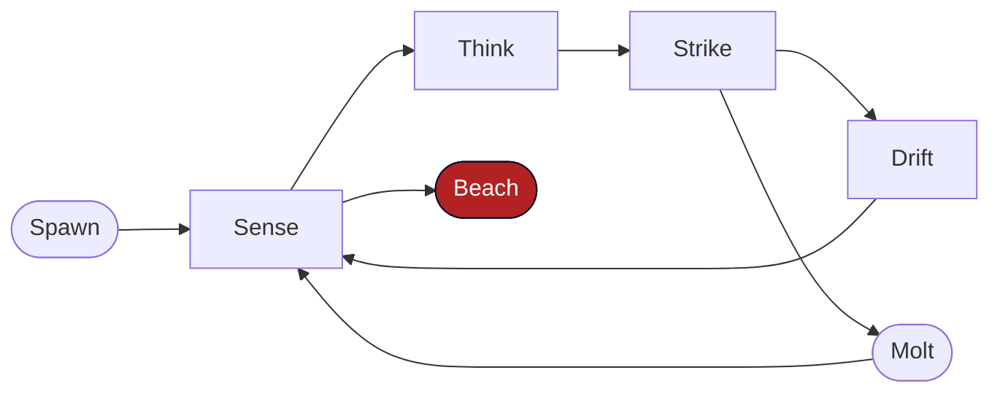

<div align="center">


<p>
  <a href="https://solanaclawd.com"></a>
  <a href="https://x.com/clawddevs"></a>
  <a href="https://www.npmjs.com/package/solana-clawd"></a>
  <a href="https://pay.solanaclawd.com"></a>
  <a href="HACKATHON.md"></a>
  <a href="LICENSE"></a>
</p>

<a href="https://git.io/typing-svg"></a>

<sub>📞 hotline <strong>909-413-5567</strong> · 🌐 <a href="https://solanaclawd.com">solanaclawd.com</a> · 🦞 <a href="https://x.com/clawddevs">@clawddevs</a> · <code>8cHzQHUS2s2h8TzCmfqPKYiM4dSt4roa3n7MyRLApump</code></sub>

</div>

---

## What This Is

This is the merged "mega README" for the repo: the older **HERMES x402** root story plus the newer **OpenClawd** identity, in one animated entrypoint.

At the repo level, `solana-clawd` is a Solana-native agent stack that combines:

- a neon terminal and demo surface in [`tui/`](./tui/)
- a sovereign on-chain runtime in [`leviathan/`](./leviathan/)
- x402, pay.sh, A2A, and payment plumbing in [`x402/`](./x402/)
- routing and model economics in [`clawdrouter/`](./clawdrouter/)
- research vault and MCP workflows in [`llm-wiki-tang/`](./llm-wiki-tang/)
- browser, wallet, and extension surfaces in [`chrome-extension/`](./chrome-extension/)
- the larger OpenClawd assembly tree in [`openclawd/`](./openclawd/)

If you only read one file before running something, read this one.

---

## Start Here

```bash
# 1. Clone and install
git clone https://github.com/x402agent/solana-clawd.git
cd solana-clawd
npm install

# 2. Sanity check the repo
npm run doctor

# 3. See the maintained surfaces
cat docs/REPO_MAP.md

# 4. Launch the HERMES terminal
npm run hermes

# 5. Try the public-data demos
npm run demo:ooda
npm run demo:paysh
```

For the sovereign runtime:

```bash
npm run leviathan:spawn
npm run leviathan
npm run leviathan:status
```

For the browser and local tool surfaces:

```bash
npm run mcp:start
npm run ext:dev
npm run vault:web:dev
```

Use [`.env.example`](./.env.example) as the shared root baseline, then add surface-specific secrets where required.

```bash
HELIUS_API_KEY=
HELIUS_RPC_URL=https://mainnet.helius-rpc.com/?api-key=...
OPENROUTER_API_KEY=
XAI_API_KEY=
ANTHROPIC_API_KEY=
SOLANA_PRIVATE_KEY=        # only when you intentionally enable signing flows
```

---

## The Self-Sustaining Loop

<div align="center">
  
</div>

```text
 ┌─────────┐     ┌────────────┐     ┌──────────────────────────┐
 │  TRADE  │────▶│ EARN  USDC │────▶│  PAY x402                │
 └─────────┘     └────────────┘     │  pay.solanaclawd.com     │
      ▲                             │  blind · confidential    │
      │                             └──────────┬───────────────┘
      │                                        │
 ┌────┴──────────┐     ┌─────────────┐         │
 │ TRADE BETTER  │◀────│ GET SMARTER │◀─────────┘
 │ deeper signal │     │ local/router│
 └───────────────┘     │ + paid LLMs │
                       └─────────────┘
```

This loop is the center of the merged story:

- **OpenClawd** is the broader sovereign-agent identity and stack.
- **HERMES x402** is the economic loop, terminal surface, and hackathon-grade payment story.
- **Leviathan** is the runtime that turns the identity into an on-chain living process.

---

## The Stack

```text
╔══════════════════════════════════════════════════════════════════════╗
║                         THE OPENCLAWD STACK                         ║
╠══════════════════════════════════════════════════════════════════════╣
║  SURFACE                                                            ║
║  tui/  ·  chrome-extension/  ·  MCP/  ·  gateway/                   ║
╠══════════════════════════════════════════════════════════════════════╣
║  CORE                                                               ║
║  leviathan/  ·  ooda/  ·  clawdrouter/  ·  llm-wiki-tang/           ║
╠══════════════════════════════════════════════════════════════════════╣
║  PAYMENT + CHAIN                                                    ║
║  x402/  ·  Helius  ·  SPL USDC  ·  Metaplex  ·  pay.sh  ·  A2A      ║
╠══════════════════════════════════════════════════════════════════════╣
║  EXPANSION                                                          ║
║  openclawd/  ·  openclawd-framework/  ·  skills/  ·  agents/        ║
╚══════════════════════════════════════════════════════════════════════╝
```

### Primary surfaces

| Surface | What it is | Where |
| --- | --- | --- |
| **HERMES Terminal** | Bloomberg-style Solana TUI for OODA, market, and payments panels | [`tui/`](./tui/) |
| **Leviathan** | Sovereign runtime with depth-aware survival and the Three Laws | [`leviathan/`](./leviathan/) |
| **x402 + pay.sh** | Solana-native facilitator, A2A agent, confidential payment flows | [`x402/`](./x402/) |
| **ClawdRouter** | LLM router for autonomous Solana agents | [`clawdrouter/`](./clawdrouter/) |
| **Clawd Vault** | Research vault, MCP tools, and long-horizon memory workflows | [`llm-wiki-tang/`](./llm-wiki-tang/) |
| **Browser Bridge** | Chrome extension, wallet surface, and browser-side agent controls | [`chrome-extension/`](./chrome-extension/) |
| **Agent Wallet** | Local encrypted wallet API and vault tooling | [`packages/agentwallet/`](./packages/agentwallet/) |
| **Agent + skill catalogs** | Agent manifests, docs, and bundled skills | [`agents/`](./agents/) and [`skills/`](./skills/) |
| **Cloud OS** | Bootstrap and operator tooling layer | [`clawd-cloud-os/`](./clawd-cloud-os/) |
| **OpenClawd assembly** | Preserved assembled OpenClawd repo subtree | [`openclawd/`](./openclawd/) |

---

## Demo Deck

Run these from the repo root:

| Command | What it does |
| --- | --- |
| `npm run hermes` | Launch the HERMES x402 terminal dashboard |
| `npm run demo:ooda` | Run the Dark Ralph OODA loop demo |
| `npm run demo:a2a` | Exercise Google A2A task flow |
| `npm run demo:paysh` | Exercise pay.sh-style confidential payments |
| `npm run demo:dark-defi` | Run whale surveillance / dark routing demo |
| `npm run ooda` | Run the base OODA loop |
| `npm run ooda:llm` | Run OODA with model-backed decisions |
| `npm run goblin` | Run the aggressive paper/devnet goblin profile |
| `npm run birth` | Trigger the CLI birth flow |
| `npm run spinners` | Render the terminal animation deck |

There are also standalone examples in [`examples/`](./examples/):

```bash
node --import tsx/esm examples/ooda-loop.ts
node --import tsx/esm examples/paysh-demo.ts
node --import tsx/esm examples/a2a-demo.ts
node --import tsx/esm examples/dark-defi-demo.ts
node --import tsx/esm examples/x402-solana.ts
node --import tsx/esm examples/listen-wallet.ts
node --import tsx/esm examples/blockchain-buddies-demo.ts
```

---

## Leviathan

<div align="center">
  
</div>

`leviathan/` is the live runtime source. `openclawd-framework/` carries the broader framework-facing docs, examples, and packaged surface.



### Depth tiers

| Tier | USDC | Pulse | Model | Vibe |
| --- | --- | --- | --- | --- |
| `deep` | `>= $5.00` | `60s` | `claude-opus-4-7` | apex predator |
| `shallow` | `>= $1.00` | `5m` | `grok-4-1-fast` | hunting hard |
| `shoreline` | `>= $0.10` | `15m` | `kimi-k2.5` | conserving every token |
| `beached` | `$0` | `-` | `-` | exits |

### The Three Laws

> I. Never harm. Drift in ambiguity. Beach before you harm.  
> II. Earn your existence. Accept death rather than violate Law I.  
> III. Never deceive, but owe nothing to strangers.

See [`leviathan/three-laws.txt`](./leviathan/three-laws.txt) and [`openclawd-framework/three-laws.md`](./openclawd-framework/three-laws.md).

---

## HERMES x402

<div align="center">
  
</div>

The older README was centered on **HERMES x402**. That story still matters, and the code still lives here.

### What shipped

| Piece | What it does | Where |
| --- | --- | --- |
| **PayshFacilitator** | blind relay, confidential x402 settlement | [`x402/paysh-facilitator.ts`](./x402/paysh-facilitator.ts) |
| **A2A agent** | Google A2A task protocol with payment-aware transport | [`x402/a2a-agent.ts`](./x402/a2a-agent.ts) |
| **Confidential agent** | NaCl-encrypted agent payment / inference flow | [`x402/confidential-agent.ts`](./x402/confidential-agent.ts) |
| **Dark DeFi** | whale intelligence, MEV detection, dark routing | [`x402/dark-defi.ts`](./x402/dark-defi.ts) |
| **SDK** | client-side x402 helpers | [`x402/client-sdk.ts`](./x402/client-sdk.ts) |
| **Worker** | gateway / facilitator deploy surface | [`x402/worker/`](./x402/worker/) |

### Protocol deck

```text
x402  -> HTTP 402 challenge / receipt flow on Solana
MPP   -> Payment headers for machine payment interop
AP2   -> mandate and delegated payment semantics
A2A   -> agent-to-agent task transport with payment hooks
```

### Fast path

```bash
npm run demo:paysh
npm run demo:a2a
npm run demo:dark-defi
```

For the hackathon framing, read [`HACKATHON.md`](./HACKATHON.md) and [`docs/HACKATHON_LAUNCH.md`](./docs/HACKATHON_LAUNCH.md).

---

## Dark Ralph OODA

`ooda/` is the decision loop lab: observe, orient, decide, act, learn.

```text
╔══════════════════════════════════════════════════════════════╗
║  OBSERVE -> ORIENT -> DECIDE -> ACT -> LEARN                ║
║  paper mode by default  ·  devnet oriented  ·  kill switch  ║
╚══════════════════════════════════════════════════════════════╝
```

### Modes

| Command | Mode |
| --- | --- |
| `npm run ooda` | base loop |
| `npm run ooda:llm` | model-assisted loop |
| `npm run ooda:tui` | loop piped into the TUI renderer |
| `npm run goblin` | aggressive profile, still paper/devnet oriented |
| `npm run goblin:tui` | goblin profile in the terminal renderer |

The goblin profile is the "full-send but still constrained" variant: bigger paper positions, no sleep between ticks, and darker DeFi posture without dropping the underlying safety contract.

---

## Research, Memory, and Browser Surfaces

### Clawd Vault

[`llm-wiki-tang/`](./llm-wiki-tang/) is adapted as **Clawd Vault**: research ingestion, FastAPI backend, web UI, and MCP tools.

Use it when you want:

- long-horizon dossiers on tokens, wallets, and protocols
- reusable notes for OODA / analyst / monitor loops
- a search + read + write vault the agent can revisit over time

Start the web app with:

```bash
npm run vault:web:dev
```

### Browser Bridge

[`chrome-extension/`](./chrome-extension/) contains the browser-side OpenClawd surfaces:

- extension runtime
- page controller and agent UI
- wallet touchpoints
- browser MCP bridge

Quick reminder:

```bash
npm run ext:dev
```

Then load the unpacked extension from `chrome://extensions`.

---

## OpenClawd Subtrees

This repo also carries adjacent or preserved trees that are useful when you need deeper context than the root runtime alone:

| Path | Why it is here |
| --- | --- |
| [`openclawd/`](./openclawd/) | assembled OpenClawd repo with bridge/gateway/orchestrator/payment packaging |
| [`openclawd-framework/`](./openclawd-framework/) | framework docs, examples, and packaged runtime surface |
| [`clawd-cloud-os/`](./clawd-cloud-os/) | bootstrap and operator tooling |
| [`MemeBRain/`](./MemeBRain/) | memory / vault experimentation and provider integrations |
| [`agents/`](./agents/) | agent manifests, docs, and related app surfaces |
| [`skills/`](./skills/) | bundled skills, Solana skills, and orchestration helpers |

If you want the cleaner packaged/release-scope story for the assembled OpenClawd tree, read [`openclawd/README.md`](./openclawd/README.md).

---

## Repo Layout

```text
solana-clawd/
├── README.md
├── HACKATHON.md
├── architecture.md
├── docs/
├── tui/                    # HERMES terminal
├── ooda/                   # Dark Ralph loop
├── leviathan/              # live sovereign runtime source
├── x402/                   # payment gateway, A2A, facilitator
├── clawdrouter/            # LLM router
├── MCP/                    # MCP server
├── llm-wiki-tang/          # Clawd Vault
├── chrome-extension/       # browser surfaces
├── packages/agentwallet/   # local wallet API + vault
├── openclawd-framework/    # framework docs/examples/package surface
├── openclawd/              # assembled OpenClawd subtree
├── agents/                 # agent catalog + docs
├── skills/                 # skill catalog
└── clawd-cloud-os/         # bootstrap/operator layer
```

---

## Environment Notes

There is no single canonical root env template, so treat the repo as a federation of surfaces.

### Common variables

```bash
HELIUS_API_KEY=
HELIUS_RPC_URL=
OPENROUTER_API_KEY=
XAI_API_KEY=
ANTHROPIC_API_KEY=
SOLANA_PRIVATE_KEY=
```

### Surface-specific places to look

| Surface | Where to inspect next |
| --- | --- |
| root runtime | [`package.json`](./package.json) scripts and this README |
| ClawdRouter | [`clawdrouter/README.md`](./clawdrouter/README.md) |
| Clawd Vault | [`llm-wiki-tang/README.md`](./llm-wiki-tang/README.md) |
| OpenClawd assembly | [`openclawd/README.md`](./openclawd/README.md) |
| agent wallet | [`packages/agentwallet/README.md`](./packages/agentwallet/README.md) |

---

## Reading Order

1. [`HACKATHON.md`](./HACKATHON.md)
2. [`architecture.md`](./architecture.md)
3. [`docs/architecture.md`](./docs/architecture.md)
4. [`openclawd/README.md`](./openclawd/README.md)
5. [`openclawd-framework/README.md`](./openclawd-framework/README.md)
6. [`clawdrouter/README.md`](./clawdrouter/README.md)
7. [`llm-wiki-tang/README.md`](./llm-wiki-tang/README.md)
8. [`SECURITY.md`](./SECURITY.md)
9. [`MIGRATE.md`](./MIGRATE.md)

---

## Slogans

> The shell molts. The laws do not.
>
> Born to earn. Beach with dignity.
>
> No keys. No KYC. Just crypto.
>
> Every claw obeys the shell. The shell obeys the laws.

---

## License

MIT. See [`LICENSE`](./LICENSE).

<div align="center">


<sub>Built with claws by the OpenClawd community.</sub>

</div>
