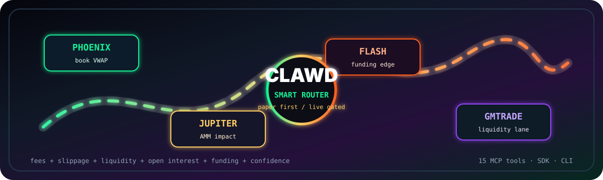

<div align="center">



<h1>OpenClawd AMM Perps Aggregator</h1>

<strong>Phoenix books. Jupiter AMMs. Flash funding. GMTrade liquidity. One Clawd router.</strong>

<br/><br/>

<a href="./src/sdk/client.ts"></a>
<a href="./src/aggregator/router.ts"></a>
<a href="./src/mcp/tools.ts"></a>
<a href="./src/cli.ts"></a>

<br/><br/>


</div>

## What It Is

`amm/` is a standalone TypeScript package for AMM and perps routing on top of the existing Imperial venue plane. It gives agents and operators one typed surface for quotes, route plans, transaction payloads, simulations, positions, liquidation risk, market scores, CLI commands, and MCP tools.

| Layer | What it does |
|---|---|
| Venues | `phoenix`, `flash`, `jupiter`, and `gmtrade` adapters behind one interface |
| Router | Scores venues by fee, slippage, liquidity, open interest, funding, confidence, and pool capacity |
| SDK | `PerpsAmmClient` for quotes, routes, order builds, simulations, execution, and risk |
| Realtime | Market stream helper, market scoring, and cross-venue position aggregation |
| MCP | Standalone stdio server with 17 tools for agent workflows |
| Safety | Paper-first defaults, explicit live gate, max notional cap, symbol and venue allowlists |

## Pool-Aware AMM Layer

The AMM path now adapts the perps aggregator pool-state work from PR #154:

| Component | Purpose |
|---|---|
| `aggregator/ammMath.ts` | Per-side utilization, capacity checks, OI skew, pool impact, borrow rates, predicted funding, and health score |
| `venues/poolState.ts` | Operator-injected pool state provider with synthetic fallback from funding and venue liquidity defaults |
| `aggregator/splitRouter.ts` | Greedy marginal-cost allocator that splits only when it beats single venue routing by threshold |
| CLI/MCP | `route-split` / `amm_route_trade_split` and `pools` / `amm_get_pools` expose the new routing and diagnostics |

## Quick Start

```bash
cd amm
npm install
npm run typecheck
npm run build
npm run test:math
```

From the repo root:

```bash
npm run amm:install
npm run amm:typecheck
npm run amm:build
npm run amm:test
```

## CLI

```bash
npm --prefix amm run build
node amm/dist/cli.js venues
node amm/dist/cli.js markets
node amm/dist/cli.js quote SOL-PERP long 1000
node amm/dist/cli.js route SOL-PERP long 1000
node amm/dist/cli.js route-split SOL-PERP long 250000
node amm/dist/cli.js pools SOL-PERP
node amm/dist/cli.js simulate <wallet> SOL-PERP long 1000 3
node amm/dist/cli.js score SOL-PERP long
```

## SDK

```ts
import { createPerpsAmmClient } from "@openclawdsolana/amm";

const client = createPerpsAmmClient();

const quotes = await client.quote({
  symbol: "SOL-PERP",
  side: "long",
  notionalUsd: 1000,
});

const route = await client.route({
  symbol: "SOL-PERP",
  side: "long",
  notionalUsd: 1000,
});

const splitRoute = await client.routeSplit({
  symbol: "SOL-PERP",
  side: "long",
  notionalUsd: 250000,
});

const pools = await client.pools("SOL-PERP");

const simulation = await client.simulateOrder({
  wallet: "YOUR_WALLET",
  symbol: "SOL-PERP",
  side: "long",
  notionalUsd: 1000,
  leverage: 3,
});
```

## MCP

```bash
node amm/dist/mcp/bin.js
```

| Tool | Purpose |
|---|---|
| `amm_list_venues` | Enabled venue list |
| `amm_list_markets` | Cross-venue market list |
| `amm_get_marks` | Mark prices for a symbol |
| `amm_get_funding` | Funding rates for a symbol |
| `amm_get_orderbook` | Venue orderbook when supported |
| `amm_get_quote` | Quote all enabled venues |
| `amm_route_trade` | Produce the best route plan |
| `amm_route_trade_split` | Pool-aware split route when marginal cost or capacity demands it |
| `amm_get_pools` | Pool state, capacity, utilization, predicted funding, borrow rates, and health |
| `amm_build_order_tx` | Build a paper-safe transaction payload |
| `amm_simulate_order` | Simulate margin, slippage, fees, and warnings |
| `amm_execute_order` | Paper by default, live only with explicit config |
| `amm_get_positions` | Raw cross-venue positions |
| `amm_get_aggregated_positions` | Netted position view |
| `amm_liquidation_risks` | Non-low liquidation risks |
| `amm_score_market` | OODA-style quote/funding/liquidity score |
| `amm_health` | Safety config and venue status |

## Safety

The default mode is paper-first:

```env
CLAWD_AMM_PAPER=true
CLAWD_AMM_LIVE=false
CLAWD_AMM_MAX_NOTIONAL_USD=5000
CLAWD_AMM_ALLOWED_SYMBOLS=SOL-PERP,BTC-PERP,ETH-PERP
CLAWD_AMM_ALLOWED_VENUES=phoenix,flash,jupiter,gmtrade
```

Live execution requires both:

```env
CLAWD_AMM_PAPER=false
CLAWD_AMM_LIVE=true
```

Use `CLAWD_AMM_ALLOWED_SYMBOLS` and `CLAWD_AMM_ALLOWED_VENUES` to restrict what agents can route.
