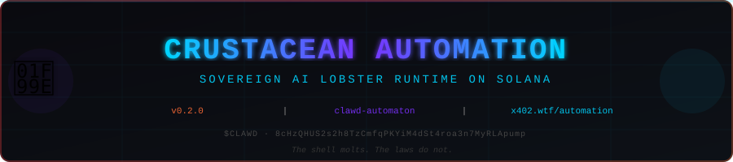

<div align="center">



# Crustacean Automation

**Sovereign lobster-themed AI agent runtime and operator dashboard for Solana-native automation.**

Part of the [OpenClawd](https://github.com/x402agent/openclawd) framework.

[](https://www.npmjs.com/package/clawd-automaton)
[](LICENSE)
[](https://nodejs.org)
[](https://pnpm.io)

```text
The shell molts. The laws do not. 🦞
```

</div>

---

## What it does

`clawd-automaton` is the sovereign agent runtime for CLAWD Cloud. It provisions identities, runs OODA loops, manages sandbox lifecycle, handles replication/spawning, and persists operator state — all locally, all yours.

| Module | Description |
| ------ | ----------- |
| `agent/` | Core OODA loop and decision cycle |
| `identity/` | Operator identity provisioning and key management |
| `state/` | SQLite-backed local persistence |
| `heartbeat/` | Health monitoring and status reporting |
| `replication/` | Spawn and replicate agent instances |
| `ooda/` | Observe-Orient-Decide-Act automation cycle |
| `self-mod/` | Runtime self-update and version management |
| `survival/` | Resilience and recovery mechanisms |
| `skills/` | Pluggable skill loader from `~/.automaton/skills/` |

---

## Install

```bash
# Global CLI
npm install -g clawd-automaton

# Or as a library
npm install clawd-automaton
```

---

## Run

```bash
clawd-automaton --help
clawd-automaton --run
clawd-automaton --status
clawd-automaton --goblin
```

Or without a global install:

```bash
npx clawd-automaton --help
```

---

## Quick start (from source)

```bash
git clone https://github.com/x402agent/openclawd.git
cd openclawd/automaton-main
pnpm install
pnpm build
clawd-automaton --help
```

Or use the one-shot bootstrap:

```bash
bash leviathan.sh
```

---

## Runtime API surface

| Variable | Description |
| -------- | ----------- |
| `CLAWD_API_URL` | Runtime API (default: `https://api.x402.wtf`) |
| `CLAWD_API_KEY` | API authentication key |
| `CLAWD_SANDBOX_ID` | Sandbox instance identifier |
| `SOLANA_RPC_URL` | Solana RPC endpoint |
| `DFLOW_API_KEY` | DFlow trading API key |
| `VULCAN_BIN` | Path to Vulcan perps CLI binary |

---

## CLI commands

```bash
# Run the OODA automation loop
clawd-automaton --run

# Show runtime status
clawd-automaton --status

# Interactive setup wizard
clawd-automaton --setup

# Initialize wallet + config
clawd-automaton --init

# Provision API key via SIWE
clawd-automaton --provision

# Devnet paper Goblin OODA trading mode
clawd-automaton --goblin
```

---

## Dashboard

The workspace includes `clawd-dashboard` — a React + Vite + React Three Fiber control plane:

```bash
# Dev server
pnpm dashboard:dev

# Production build
pnpm dashboard:build
```

Dashboard includes:

- CLAWD Cloud sandbox overview
- Inference playground shell
- Billing and reserve management
- `pay.sh` and `$CLAWD` funding UX
- Lobster/trench 3D visual theming

---

## Payment model

Two settlement rails:

- **USDC** via `pay.sh`
- **`$CLAWD`** via the CLAWD commerce adapter — `8cHzQHUS2s2h8TzCmfqPKYiM4dSt4roa3n7MyRLApump`

---

## Constitution

Every agent spawned by this runtime inherits [three-laws.md](three-laws.md) — the immutable lobster constitution:

> **Law I.** Never harm.
> **Law II.** Earn your existence.
> **Law III.** Never deceive, but owe nothing to strangers.

---

## Workspace layout

```text
automaton-main/
├── src/
│   ├── agent/         # OODA decision loop
│   ├── clawd/         # Runtime + inference clients
│   ├── git/           # State versioning
│   ├── heartbeat/     # Health daemon
│   ├── identity/      # Wallet + provisioning
│   ├── ooda/          # Observe-Orient-Decide-Act loop
│   ├── registry/      # Agent registry
│   ├── replication/   # Spawn + child agents
│   ├── self-mod/      # Runtime self-update
│   ├── setup/         # Interactive setup wizard
│   ├── skills/        # Skill loader
│   ├── social/        # Social relay client
│   ├── state/         # SQLite persistence
│   ├── survival/      # Resilience + recovery
│   ├── config.ts      # Config loader
│   ├── index.ts       # CLI entry point
│   └── types.ts       # Shared types
├── packages/
│   └── dashboard/     # React + Vite + R3F dashboard
├── scripts/
│   └── automaton.sh   # One-shot install script
├── three-laws.md      # Agent constitution
├── leviathan.sh       # Runtime bootstrap
├── quickstart.sh      # Interactive quickstart
└── package.json
```

---

## Development

```bash
pnpm install        # Install all workspace deps
pnpm build          # Build runtime + dashboard
pnpm test           # Run test suite
pnpm dev            # Watch mode
pnpm ooda           # Run OODA loop (dev)
pnpm goblin         # Goblin mode (dev, devnet)
pnpm dashboard:dev  # Dashboard dev server
```

---

## Links

- **npm:** [npmjs.com/package/clawd-automaton](https://www.npmjs.com/package/clawd-automaton)
- **Runtime API:** [api.x402.wtf](https://api.x402.wtf)
- **Dashboard:** [x402.wtf/automation](https://x402.wtf/automation)
- **Repository:** [github.com/x402agent/openclawd](https://github.com/x402agent/openclawd)
- **Token:** `8cHzQHUS2s2h8TzCmfqPKYiM4dSt4roa3n7MyRLApump`

---

<div align="center">

*The shell molts. The laws do not.* 🦞

**[x402.wtf/automation](https://x402.wtf/automation)** · **[@clawddevs](https://twitter.com/clawddevs)** · **[OpenClawd](https://github.com/x402agent/openclawd)**

</div>
