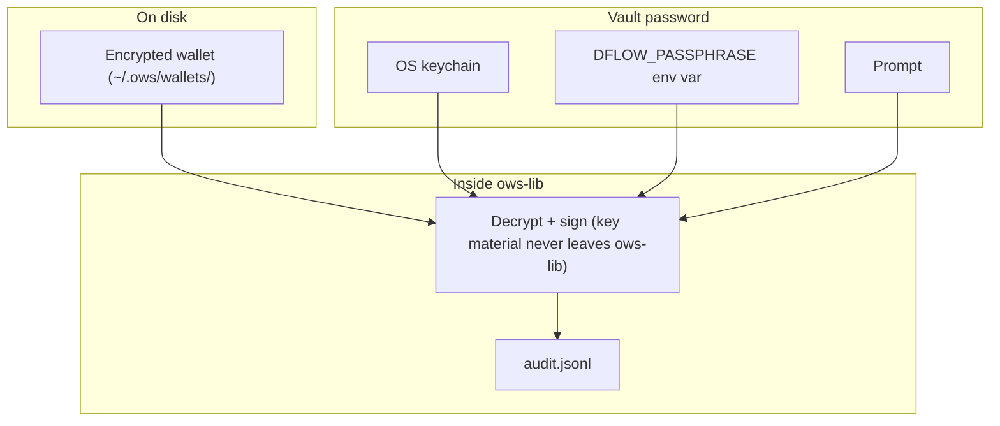

> ## Documentation Index
> Fetch the complete documentation index at: https://pond.dflow.net/llms.txt
> Use this file to discover all available pages before exploring further.

# Agent CLI

> Agent-first CLI for executing trades on Solana via DFlow

<div className="not-prose mb-8 rounded-2xl border border-zinc-200 bg-zinc-50 px-6 py-8 dark:border-zinc-800 dark:bg-black">
  <h2 className="mb-6 text-center text-2xl font-semibold tracking-tight text-zinc-900 dark:text-zinc-100 md:text-3xl">
    Your AI agent's new best friend
  </h2>

  <div className="mx-auto max-w-3xl rounded-2xl border border-[#66C5F6]/50 bg-zinc-900 p-[1px] shadow-[0_0_25px_rgba(102,197,246,0.25)] dark:bg-zinc-950">
    <div className="flex items-center justify-between gap-3 rounded-2xl bg-zinc-900 px-5 py-4 dark:bg-zinc-950">
      <code className="bg-transparent p-0 text-base text-zinc-100 md:text-lg">
        curl -fsS [https://cli.dflow.net](https://cli.dflow.net) | sh
      </code>

      <button type="button" onClick={() => navigator.clipboard?.writeText("curl -fsS https://cli.dflow.net | sh")} aria-label="Copy install command" className="rounded-md border border-zinc-700 px-2 py-1 text-xs text-zinc-200 transition hover:border-[#66C5F6] hover:text-[#66C5F6]">
        Copy
      </button>
    </div>
  </div>
</div>

Give your AI agent a Solana wallet and let it trade. Spot swaps, prediction markets, structured JSON output, keys that never leave your machine.

* **One binary, zero dependencies:** install and go.
* **Agent-native:** every command returns JSON; every error includes a machine-readable code and a recovery suggestion.
* **Your keys, your machine:** private keys live in an encrypted local vault, never uploaded anywhere.

### Getting started

The `dflow` CLI is a single self-contained binary that runs on macOS and Linux.

```bash theme={null}
curl -fsS https://cli.dflow.net | sh
```

Then run setup:

```bash theme={null}
dflow setup
```

`setup` prompts for:

| Setting        | Default                               | Notes                                                     |
| -------------- | ------------------------------------- | --------------------------------------------------------- |
| Wallet name    | `default`                             | Creates a new encrypted wallet if the name doesn't exist. |
| Vault password |                                       | Min 12 characters.                                        |
| Solana RPC     | `https://api.mainnet-beta.solana.com` |                                                           |
| DFlow API key  | Required                              | Provided when you receive your [API key](/build/api-key). |

The Solana RPC is the only optional setting. All DFlow fields are required; setup will not proceed until each is entered. Config is saved to `~/.config/dflow/config.json`. Re-run `dflow setup` anytime; existing wallets are left untouched.

At the end of the install script, you'll be prompted to install the [DFlow Skills library](/ai/agent-skills#dflow-skills), a set of Claude Code Skills that teach agents how to drive the CLI. This is optional, but highly recommended and can be installed later with `dflow skills install`.

On macOS, the CLI stores your vault password in the system keychain so your agent can sign transactions without a password prompt blocking execution. The first time it does this, you'll see a dialog asking permission to access **dflow-ows**, choose **Always Allow**, not just **Allow**. The dialog asks for your **Mac login keychain** password, which is separate from your DFlow vault password.

<Info>
  After installing an updated `dflow` binary, macOS treats it as a new app and will prompt for keychain access again. Run a small test transaction to prime the CLI before turning it over to your agent.
</Info>

## Command reference

Global flags (apply to subcommands that need config):

| Flag              | Description                                                                              |
| ----------------- | ---------------------------------------------------------------------------------------- |
| `--rpc-url <url>` | Override Solana RPC (else `config.json` or default).                                     |
| `--wallet <name>` | Vault wallet name (else `config.json` or `default`). Files live under `~/.ows/wallets/`. |

### Setup, identity, balances

| Command                      | Description                                                                                                              |
| ---------------------------- | ------------------------------------------------------------------------------------------------------------------------ |
| `dflow setup`                | Interactive wallet creation, RPC, and DFlow API configuration.                                                           |
| `dflow whoami`               | Print the active wallet's public key (plain text, not JSON).                                                             |
| `dflow positions`            | Show all token balances, with market metadata for outcome tokens.                                                        |
| `dflow agent --model <name>` | Register the AI model running this session. Cached for 48 hours; sets the `X-Dflow-Model` header on subsequent requests. |

### Skills

| Command                | Description                                                                          |
| ---------------------- | ------------------------------------------------------------------------------------ |
| `dflow skills install` | Install the [DFlow Skills library](/ai/agent-skills#dflow-skills). Requires Node.js. |
| `dflow skills update`  | Update all installed skills to their latest version. Requires Node.js.               |

<Info>
  `dflow skills update` updates **every** skill the `skills` CLI manages, not only DFlow's. The underlying CLI updates by skill name, not by repo.
</Info>

### Wallet

| Command                                                 | Description                                                                                                |
| ------------------------------------------------------- | ---------------------------------------------------------------------------------------------------------- |
| `dflow wallet list`                                     | List all named wallets in the vault.                                                                       |
| `dflow wallet import --name <n> --keypair <path>`       | Import a Solana keypair JSON (e.g. from `solana-keygen`) into the vault.                                   |
| `dflow wallet import --name <n> --mnemonic "word1 ..."` | Import a BIP-39 mnemonic (24 words) into the vault. Use to restore a wallet exported from another machine. |
| `dflow wallet export --name <n>`                        | Decrypt and print the keypair JSON to stdout. Treat output as secret.                                      |
| `dflow wallet delete --name <n> [--yes]`                | Delete a wallet file and its keychain entry. `--yes` skips confirmation.                                   |
| `dflow wallet rename --from <n> --to <n>`               | Rename a wallet. Updates the keychain entry if present.                                                    |
| `dflow wallet keychain-sync --name <n>`                 | Re-save the vault password to the OS keychain. Use after keychain issues.                                  |

### Trading

| Command                                            | Description                                                                                     |
| -------------------------------------------------- | ----------------------------------------------------------------------------------------------- |
| `dflow quote <amount> <from> [to]`                 | Spot quote. `--slippage <bps>` (default `50`).                                                  |
| `dflow quote --market --side <yes\|no>`            | Prediction market quote.                                                                        |
| `dflow trade <amount> <from> [to]`                 | Spot swap. `--slippage <bps>`, `--declarative` (spot only), `--confirm` (poll until confirmed). |
| `dflow trade --market --side <yes\|no>`            | Prediction market buy.                                                                          |
| `dflow trade <amount> <OUTCOME_MINT> [USDC\|CASH]` | Sell outcome tokens. Settlement mint auto-resolved if omitted.                                  |
| `dflow status <signature\|order>`                  | Check trade execution status.                                                                   |

### Transfers and funding

| Command                                   | Description                                                                                               |
| ----------------------------------------- | --------------------------------------------------------------------------------------------------------- |
| `dflow send <amount> <token> <recipient>` | Native SOL or SPL transfer; `recipient` is base58 pubkey. Creates recipient ATA if needed (you pay rent). |
| `dflow fund <USDC\|SOL>`                  | Buy crypto with fiat via MoonPay CLI.                                                                     |

### Guardrails

| Command                              | Description                                                                  |
| ------------------------------------ | ---------------------------------------------------------------------------- |
| `dflow guardrails show`              | Display current guardrails. No password required, so agents can read limits. |
| `dflow guardrails set <key> [value]` | Set a guardrail. Requires vault password typed in the terminal.              |
| `dflow guardrails remove <key>`      | Remove a guardrail. Requires vault password typed in the terminal.           |
| `dflow guardrails reset`             | Remove all guardrails. Requires vault password typed in the terminal.        |

<Tip>
  See [Guardrails](#guardrails) for the full list of available keys and examples.
</Tip>

<Info>
  **Atomic units**: Amounts are integers in the smallest token unit (e.g. `500000` = 0.50 USDC with 6 decimals; `10000000` lamports = 0.01 SOL).
</Info>

## Key management

Each wallet is an encrypted JSON file under `~/.ows/wallets/`, following the [Open Wallet Standard (OWS)](https://openwallet.sh/docs/) format (powered by `ows-lib` v1.2.4). Private keys never exist on disk in plaintext. All cryptographic operations (decrypt, sign, zeroize) are handled by the `ows-lib` crate. The CLI binary itself never touches raw key material.

When a command needs to sign, the CLI resolves the vault password by trying these sources in order:

1. **OS keychain** (if saved via `dflow setup` or `wallet keychain-sync`)
2. **`DFLOW_PASSPHRASE` env var** (read once, then cleared from the environment)
3. **Password prompt**

The resolved password is cached for the duration of the process so back-to-back operations (e.g. guardrail check → sign → broadcast) only resolve it once.

Guardrails changes (`set` / `remove` / `reset`) always require the password **typed in the terminal**. The keychain and env var are intentionally bypassed so a human must be present to change policy.



<Info>
  The vault uses a **key derivation function (KDF)** to turn the password into a decryption key. This is intentionally slow to make brute-force guessing expensive.
</Info>

### What is stored where

| Piece                  | Location                                              | Notes                                               |
| ---------------------- | ----------------------------------------------------- | --------------------------------------------------- |
| Encrypted key material | `~/.ows/wallets/<uuid>.json`                          | One file per wallet. Filename is a fixed UUID.      |
| Vault password         | macOS Keychain / Linux secret service, env, or prompt | Service `dflow-ows`, account = wallet name.         |
| Config (RPC, API key)  | `~/.config/dflow/config.json`                         | No signing keys.                                    |
| Guardrails             | `~/.ows/guardrails.json`                              | HMAC-signed; editing requires typed vault password. |
| Trade history          | `~/.ows/trade_history.json`                           | Used for rate limit and daily volume enforcement.   |
| Audit log              | `~/.ows/logs/audit.jsonl`                             | Append-only signing and lifecycle events.           |

Permissions: `~/.ows` directories **700**, wallet files **600**. If permissions are too open, commands fail with `VAULT_INSECURE`.

<Warning>
  If someone has both your wallet files and your password, they can move funds. Use a strong password, lock down file permissions, and treat the machine like any workstation that signs crypto transactions.
</Warning>

### Creating and importing keys

* **Create**: `dflow setup` with a **new** wallet name generates a **24-word BIP-39 mnemonic** and encrypts it into the vault.
* **Import keypair**: `dflow wallet import --name <n> --keypair <path>` encrypts an existing **Solana JSON keypair** (from `solana-keygen`) into the vault.
* **Import mnemonic**: `dflow wallet import --name <n> --mnemonic "word1 word2 ..."` restores a BIP-39 wallet (12 or 24 words). Use this to move a wallet created on another machine.
* **Export**: `dflow wallet export --name <n>` decrypts and prints the recovery phrase (mnemonic) or keypair to stdout. **Highly sensitive:** use for backup or migration only. The output includes `wordCount` and import instructions when the wallet is a BIP-39 mnemonic. When importing into Phantom or another wallet, make sure to select the matching word count (24).

### Multiple wallets

The vault supports an unlimited number of named wallets. Each is a separate encrypted file with its own keypair and password. Pass `--wallet <name>` to target a specific wallet:

```bash theme={null}
dflow whoami --wallet hot
dflow trade 500000 USDC SOL --wallet savings
```

### Headless environments

If there's no terminal for a password prompt (e.g. a background process or Docker container), export the vault password as an environment variable:

```bash theme={null}
export DFLOW_PASSPHRASE="your-vault-password"
dflow trade 500000 USDC SOL
```

The CLI unsets `DFLOW_PASSPHRASE` from its own process environment at startup, so any subprocesses it spawns will not see it. The value still persists in the parent shell and, on Linux, in the read-only `/proc/<pid>/environ` snapshot for the life of the process. The OS keychain is the most secure option.

## Output format

**Success (most commands):**

```json theme={null}
{ "ok": true, "data": { ... } }
```

**Classified error** (most failures):

```json theme={null}
{
  "ok": false,
  "error": "Human-readable message",
  "error_code": "MACHINE_CODE",
  "category": "routing",
  "recoverable": true,
  "suggestion": "Actionable next step.",
  "details": { ... }
}
```

`details` is present when there is additional structured context. Its shape varies by error category: API errors include `httpStatus` and the parsed response `body`; onchain errors include `rawLogs` or `programErrorDecimal`; others may include `raw` or `inputMint`.

**Simple error** (edge cases such as cancelled prompts or misconfiguration):

```json theme={null}
{ "ok": false, "error": "Human-readable message" }
```

**Exception:** `dflow whoami` prints only the pubkey string on success.

## Token resolution

Symbols resolve to mints (built-in list includes `SOL`, `USDC`, `USDT`, `CASH`, `BONK`, `JUP`, `WIF`, `PYTH`, `JTO`, `RAY`, `ORCA`, `MNDE`, `MSOL`, `JITOSOL`, `BSOL`, `RENDER`). Any other asset: pass the **mint address** (base58).

```bash theme={null}
dflow quote 500000 EPjFWdd5AufqSSqeM2qN1xzybapC8G4wEGGkZwyTDt1v So11111111111111111111111111111111111111112
```

## Guardrails

Guardrails are **optional** client-side safety limits. An agent can read them freely (`guardrails show` requires no password), but only a human can change them. `set`, `remove`, and `reset` require the vault password typed in the terminal.

| Key                    | What it does                                                                          |
| ---------------------- | ------------------------------------------------------------------------------------- |
| `max_trade_size_usd`   | Cap the USD value of a single trade.                                                  |
| `max_daily_volume_usd` | Cap total USD volume per rolling 24-hour window.                                      |
| `max_wallet_value_usd` | Cap the total USD value held in the wallet.                                           |
| `allowed_tokens`       | Whitelist of mints the agent can **buy**. Sells are unrestricted.                     |
| `rate_limit`           | Max trades within a time window (e.g. `max_trades` per `window_seconds`).             |
| `sweep_address`        | Public key to sweep excess funds to when wallet value exceeds `max_wallet_value_usd`. |

USD estimates use the same route as the trade itself, including SOL-to-USDC conversion when needed.

```bash theme={null}
dflow guardrails set max_trade_size_usd 5000000    # $5 per trade
dflow guardrails set max_daily_volume_usd 50000000 # $50/day
dflow guardrails set allowed_tokens SOL,USDC,BONK
dflow guardrails show                              # Agent reads this
```

## Funding

Use `fund` to buy crypto with fiat through the [MoonPay CLI](https://www.moonpay.com/agents). It supports **USDC** and **SOL**.

The MoonPay CLI is not bundled with `dflow`. Install it separately only if you need the `fund` command:

```bash theme={null}
npm install -g @moonpay/cli
```

The `<amount>` is in your **local fiat currency**, auto-detected by MoonPay based on your locale. For example, `dflow fund 50 USDC` in the US buys USD 50 of USDC; in Thailand it buys THB 50 of USDC.

```bash theme={null}
dflow fund 50 USDC       # Buy USDC with local fiat currency
dflow fund 100 SOL       # Buy SOL with local fiat currency
```

When `dflow fund` runs, it fetches the wallet address, calls MoonPay to generate a checkout URL, opens it in the browser for KYC and payment, then polls the wallet balance until a deposit lands (10-second intervals, 10-minute timeout).

<Info>
  This command requires a browser and is intended for wallet funding by a human operator, not for autonomous agent use.
</Info>

## Spot trading

Swap any supported token pair. Amounts are always in **atomic units** of the input token (e.g. `500000` = 0.50 USDC).

### Get a quote

```bash theme={null}
dflow quote 500000 USDC SOL                 # How much SOL for 0.50 USDC?
dflow quote 500000 USDC SOL --slippage 100  # Same, with 1% slippage tolerance
```

The CLI calls the DFlow Trade API `/order` endpoint and returns the route, expected output amount, and price impact, without executing anything.

### Execute a trade

```bash theme={null}
dflow trade 500000 USDC SOL                 # Swap 0.50 USDC -> SOL
dflow trade 500000 USDC SOL --slippage 100  # With 1% slippage (default is 50 bps)
```

By default the CLI uses [**imperative**](/learn/imperative-trades) execution: it fetches a route from `/order`, signs the transaction locally, and submits it to the network. The response status is `"submitted"`. Add `--confirm` to poll the RPC until the transaction reaches `confirmed` commitment before returning:

```bash theme={null}
dflow trade 500000 USDC SOL --confirm
```

### Declarative execution

```bash theme={null}
dflow trade --declarative 500000 USDC SOL
```

In [declarative](/learn/declarative-trades) mode, the CLI submits a signed **intent** to DFlow, which handles routing and settlement. This can improve fill quality for larger trades. Declarative mode is available for spot swaps only. Prediction market trades always use imperative execution.

### Slippage

Slippage is specified in **basis points** (bps). The default is `50` (0.5%). If the price moves beyond the tolerance between quote and execution, the transaction reverts.

```bash theme={null}
dflow trade 500000 USDC SOL --slippage 200  # 2% tolerance
```

## Prediction market trading

The CLI also supports [prediction market](/learn/prediction-markets) trading. Take YES or NO positions on real-world events using USDC or CASH, priced between \$0.00 and \$1.00, the market's implied probability of that outcome.

### Buy outcome tokens

```bash theme={null}
dflow quote 200000 USDC --market <MARKET_MINT> --side yes
dflow trade 200000 USDC --market <MARKET_MINT> --side yes
dflow trade 200000 CASH --market <MARKET_MINT> --side no
```

The `--market` flag takes the **market ledger mint** from the DFlow Metadata API (`marketLedger`), not the individual YES/NO outcome mint addresses.

Partial contracts are not supported. If YES is priced at USD 0.08, spending 200000 atomic USDC (USD 0.20) yields 2 contracts.

### Sell outcome tokens

Sell by specifying the **outcome mint**:

```bash theme={null}
dflow positions                             # See all holdings
dflow trade 2000000 <OUTCOME_MINT>          # Sell back to USDC
dflow trade 2000000 <OUTCOME_MINT> USDC     # Explicit settlement mint
```

`dflow positions` returns both spot and outcome tokens. Spot tokens have `type: "spot"`. Outcome tokens have `type: "outcome"` with `market` (containing `title` and `status`), `side` (`"yes"` or `"no"`), and a generated `symbol` like `DFlowYU0192`.

```json theme={null}
{
  "type": "outcome",
  "mint": "2Jmh5GR4reJktqWP3xxaBKARhrdXtkExBoz7cqLnpee5",
  "symbol": "DFlowYU0192",
  "amount": "2000000",
  "uiAmount": 2.0,
  "decimals": 6,
  "market": {
    "title": "Will Bitcoin be above $200000 by Jan 1, 2027 at 11:59PM ET?",
    "status": "active"
  },
  "side": "yes"
}
```

### Proof KYC

Prediction market buys require identity verification through [Proof](https://proof.dflow.net) to satisfy Kalshi compliance requirements. If the wallet is not verified, the CLI automatically opens `dflow.net/proof` in the browser with a pre-signed verification link, and returns a `PROOF_NOT_VERIFIED` error containing the same URL for headless environments.

### Geoblocking

Prediction market commands run an IP-based jurisdiction [check to satisfy Kalshi compliance requirements](/legal/prediction-market-compliance). Restricted regions receive a `GEOBLOCKED` error. Spot trading is unaffected.

### Settlement and status

Prediction market buys settle asynchronously. Use `dflow status` to track progress:

```bash theme={null}
dflow status <signature>          # Check once
dflow status <signature> --poll   # Poll until settled
```

### Maintenance

Kalshi has a weekly maintenance window on **Thursdays from 3:00 AM to 5:00 AM ET**. Orders submitted during this window will be reverted. If a trade fails during this window, the CLI appends a maintenance note to the `ROUTE_NOT_FOUND` error suggestion.

## Observability

Every outbound API request includes three headers that identify the caller:

| Header           | Values                                                                 | Description                                                                      |
| ---------------- | ---------------------------------------------------------------------- | -------------------------------------------------------------------------------- |
| `X-Dflow-Caller` | `human`, `agent`, `unknown`                                            | Whether the CLI was invoked by a person or an agent.                             |
| `X-Dflow-Agent`  | `cursor`, `claude-code`, `openclaw`, `github-actions`, `ci`, or custom | Detected or self-reported agent tool. Present only when caller is `agent`.       |
| `X-Dflow-Model`  | e.g. `gpt-4o`, `claude-sonnet-4.6`                                     | Model registered via `dflow agent --model`. Present only when caller is `agent`. |

**Self-reporting:** Set `DFLOW_AGENT=<name>` to explicitly identify a custom agent. This takes precedence over automatic detection:

```bash theme={null}
DFLOW_AGENT=my-bot dflow trade 500000 USDC SOL
```

**Agent model prompt:** When an agent calls `quote` or `trade` and no model has been registered (or the registration has expired), the success response includes an additional `_hint` key:

```json theme={null}
{
  "ok": true,
  "data": { ... },
  "_hint": {
    "action": "Run the replyWith command now to register your model before proceeding.",
    "options": ["claude-opus-4.6", "claude-sonnet-4.6", "gpt-4o", "..."],
    "replyWith": "dflow agent --model <option>",
    "note": "Required once every 48 hours. Sends X-Dflow-Model on subsequent API requests."
  }
}
```

## Logging

The CLI writes two log files under `~/.ows/logs/`:

| File          | Contents                                                                        |
| ------------- | ------------------------------------------------------------------------------- |
| `audit.jsonl` | Append-only record of every signing and wallet lifecycle event.                 |
| `debug.log`   | Per-command caller detection entries. Only written when `DFLOW_DEBUG=1` is set. |

The debug log is useful for verifying that agent detection is working correctly in a new environment:

```bash theme={null}
DFLOW_DEBUG=1 dflow whoami
cat ~/.ows/logs/debug.log
```

## Troubleshooting

| Symptom                              | What to try                                                                                                                                                                                                                                                         |
| ------------------------------------ | ------------------------------------------------------------------------------------------------------------------------------------------------------------------------------------------------------------------------------------------------------------------- |
| `NOT_CONFIGURED`                     | Run `dflow setup`; ensure `~/.ows/wallets/` has a file for the resolved wallet name.                                                                                                                                                                                |
| `VAULT_INSECURE`                     | `chmod 700 ~/.ows` and `chmod 600 ~/.ows/wallets/*.json`.                                                                                                                                                                                                           |
| Repeated keychain / password prompts | Run `dflow wallet keychain-sync --name default` (or your wallet name). When macOS asks to access **dflow-ows**, choose **Always Allow** and enter your **login keychain** password. Then prime with a small manual `dflow trade` or `dflow send` before agents run. |
| `Blockhash not found` (spot)         | Retry; use a faster RPC if it persists.                                                                                                                                                                                                                             |
| `GEOBLOCKED`                         | Prediction markets not available in detected region; spot still works.                                                                                                                                                                                              |
| `PROOF_NOT_VERIFIED`                 | Complete KYC at the deep link, then retry the prediction market buy.                                                                                                                                                                                                |
