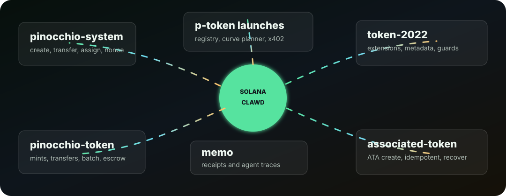
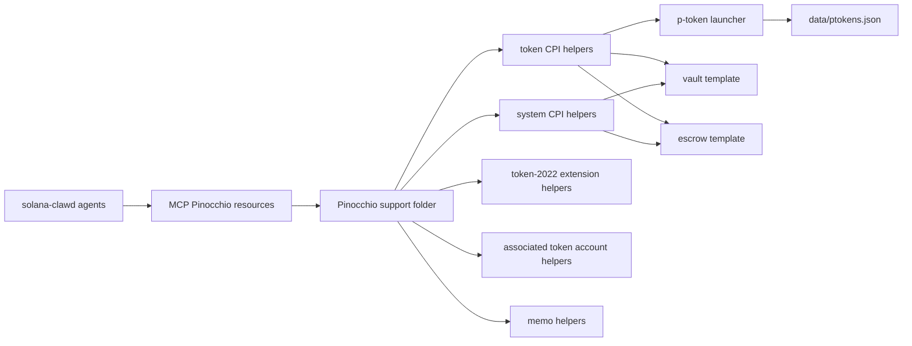

<div align="center">

# Pinocchio and p-token Support




</div>

This folder is the solana-clawd starting point for developers and agents building optimized native Solana programs with Pinocchio.

Pinocchio is a zero-dependency, `no_std` Solana program library from Anza that replaces most `solana-program` runtime overhead with zero-copy account access. It is useful when compute units and binary size matter more than framework convenience. It is not beginner-focused: developers must own account validation, instruction parsing, serialization, CPI safety, and tests.

solana-clawd uses this area for:

- p-token launch workflows and registry exploration.
- Pinocchio program templates for vaults and escrow applications.
- agent/MCP discovery so local agents can inspect templates, explain tradeoffs, and register launched p-tokens.
- x402 p-token payment support through the existing Solana payment rail.

## Quick Start

List available templates:

```bash
npm run pinocchio:templates
```

Scaffold a starter program:

```bash
npm run pinocchio:scaffold -- --template vault --name my-vault --out ./programs/my-vault
npm run pinocchio:scaffold -- --template escrow --name my-escrow --out ./programs/my-escrow
```

Inspect or register a p-token mint:

```bash
npm run ptoken:inspect -- --mint <mint>
npm run ptoken:add -- --mint <mint> --symbol PFOO --name "P Foo" --p-token-program-id <program>
npm run ptoken:list
npm run ptoken:launch-plan -- --symbol PFOO --name "P Foo"
npm run ptoken:curve-quote -- --virtual-sol 30 --virtual-token 1073000000 --sol 1
npm run pinocchio:programs
npm run pinocchio:program -- token
```

## Folder Map

| Path | Purpose |
| --- | --- |
| [`docs/PINOCCHIO_GUIDE.md`](./docs/PINOCCHIO_GUIDE.md) | Practical Pinocchio notes for solana-clawd developers and agents. |
| [`docs/AGENT_WORKFLOWS.md`](./docs/AGENT_WORKFLOWS.md) | MCP and agent workflows for p-token exploration and template use. |
| [`docs/P_TOKEN_LAUNCHES.md`](./docs/P_TOKEN_LAUNCHES.md) | Unsigned p-token launch planning and bonding curve workflow. |
| [`P_TOKEN.md`](./P_TOKEN.md) | p-token overview and compute-unit notes. |
| [`PROGRAMS.md`](./PROGRAMS.md) | Known Pinocchio and token program references. |
| [`PROGRAM_MAP.md`](./PROGRAM_MAP.md) | One-by-one local adaptation map for each Pinocchio helper program. |
| [`AGENT_HELPERS.md`](./AGENT_HELPERS.md) | Helper patterns for agents and the `/p/` page. |
| [`../data/pinocchio-programs.json`](../data/pinocchio-programs.json) | Machine-readable map of each Pinocchio helper program and how solana-clawd adapts it. |
| [`assets/program-map.svg`](./assets/program-map.svg) | Animated visual map for the Pinocchio program surface. |
| [`templates/vault/`](./templates/vault/) | Minimal Pinocchio vault starter. |
| [`templates/escrow/`](./templates/escrow/) | Make/take/refund escrow starter. |
| [`templates/p-token-launcher/`](./templates/p-token-launcher/) | p-token launch checklist, config shape, and bonding curve starter for site/MCP workflows. |
| [`pinocchio-main/programs/`](./pinocchio-main/programs/) | Vendored upstream Pinocchio helper program crates mapped one by one. |

## Program Map



| Program | Source | Codebase adaptation |
| --- | --- | --- |
| System Program helpers | [`pinocchio-main/programs/system/`](./pinocchio-main/programs/system/) | Used by templates for account creation, rent funding, PDA-owned state, and SOL movement. |
| SPL Token helpers | [`pinocchio-main/programs/token/`](./pinocchio-main/programs/token/) | Used for p-token/SPL-compatible mints, token accounts, transfers, mint/burn/close, and x402 p-token rails. |
| Token-2022 helpers | [`pinocchio-main/programs/token-2022/`](./pinocchio-main/programs/token-2022/) | Used for extension-aware launch paths: metadata pointer, transfer fee, transfer hook, pausable, scaled UI amount, and related extensions. |
| Associated Token Account helpers | [`pinocchio-main/programs/associated-token-account/`](./pinocchio-main/programs/associated-token-account/) | Used when launch/vault/escrow flows choose ATA creation or ATA validation. |
| Memo helpers | [`pinocchio-main/programs/memo/`](./pinocchio-main/programs/memo/) | Used for optional launch notes, transaction annotations, and agent-readable trace markers. |
| Vault starter | [`templates/vault/`](./templates/vault/) | Forkable starter for PDA vault state and deposit/withdraw instruction structure. |
| Escrow starter | [`templates/escrow/`](./templates/escrow/) | Forkable starter for make/take/refund token swap applications. |
| p-token launcher starter | [`templates/p-token-launcher/`](./templates/p-token-launcher/) | Forkable config contract for launches, bonding curve planning, mint verification, registry updates, and x402 routing. |

For the full upstream helper crate map, see [`pinocchio-main/programs/README.md`](./pinocchio-main/programs/README.md).

## Development Rules

- Treat p-token and Pinocchio programs as native Solana programs, not Anchor programs.
- Keep account validation in `TryFrom` implementations so instruction `process()` methods stay focused.
- Prefer field-by-field byte parsing unless you have measured and documented a safe zero-copy layout.
- Use `pinocchio-token`, `pinocchio-system`, and `pinocchio-associated-token-account` for CPIs where available.
- Add Mollusk or SBF tests before deploying or wiring real value.
- Assume generated templates are unaudited until a human review and test suite say otherwise.

## MCP Integration

The repo MCP server exposes these p-token and Pinocchio tools:

- `pinocchio_templates`
- `pinocchio_read_template`
- `ptoken_registry_list`
- `ptoken_inspect`
- `ptoken_registry_add`
- `ptoken_launch_plan`
- `ptoken_bonding_curve_quote`
- `pinocchio_program_map`

It also exposes resources for this README, the guide, launch docs, the one-by-one program map, and the p-token registry so agents can discover the support surface without scraping the filesystem.
